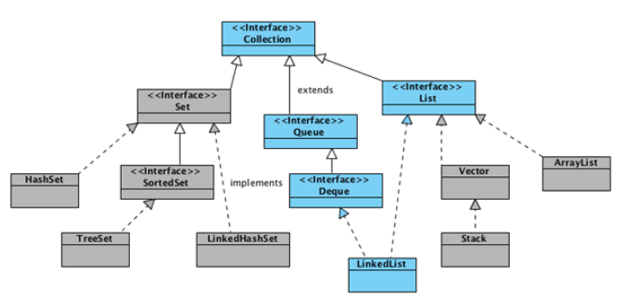
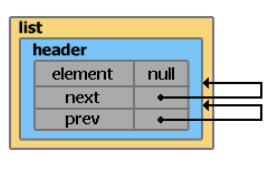
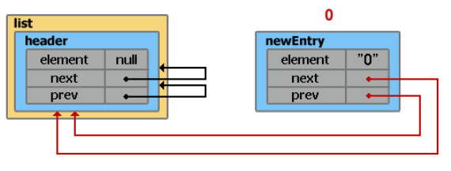
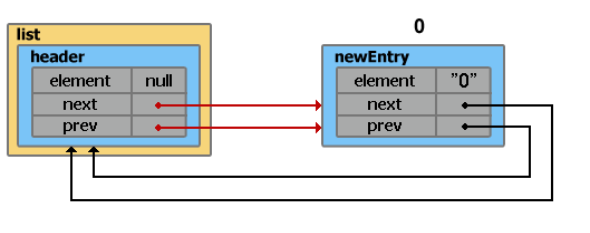
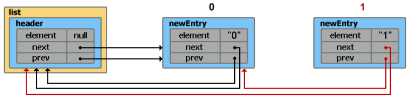
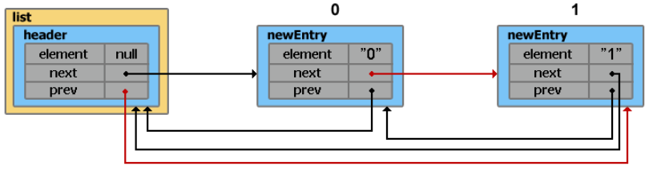

# LinkedList



`LinkedList` - _реализует интерфейс List. Является представителем двунаправленного списка, где каждый элемент структуры 
содержит указатели на предыдущий и следующий элементы. Итератор поддерживает обход в обе стороны. Реализует методы 
получения, удаления и вставки в начало, середину и конец списке. Позволяет добавлять любые элементы в том числе null._

## Создание объекта

```java
List<String> list = new LinkedList<String>();
```

Только что созданный объект `list`, содержит свойства **header** и **size**.

**header** - псевдо-элемент списка. Его значение всегда равно **null**, а свойства **next** и **prev** всегда указывают 
на первый и последний элемент списка соответственно. Так как на данный момент список ещё пуст, свойства **next** и 
**prev** указывают сами на себя (т.е. на элемент **header**). Размер списка **size** равен 0.

```java
header.next = header.prev = header;
```



## Добавление элементов

```java
list.add("0");
```

Добавление элемента в конец списка с помощью методов **add(value)**, **addLast(value)** и добавление в начало списка с 
помощью **addFirst(value)** выполняется за время `O(1)`.

Внутри класса **LinkedList** существует _static inner_ класс **Entry**, с помощью которого создаются новые элементы.

```java
private static class Entry<E> {
    E element;
    Entry<E> next;
    Entry<E> prev;
    
    Entry(E element, Entry<E> next, Entry<E> prev) {
        this.element = element;
        this.next = next;
        this.prev = prev;
    }
}
```

Каждый раз при добавлении нового элемента, по сути выполняется два шага:

1) создаётся новый экземпляр класса **Entry**

```java
Entry newEntry = new Entry("0", header, header.prev);
```



2) переопределяются указатели на предыдущий и следующий элемент

```java
newEntry.prev.next = newEntry;
newEntry.next.prev = newEntry;
size++;
```



Добавим ещё один элемент:

```java
list.add("1");
```

1) 
```java
// header.prev указывает на элемент с индексом 0
Entry newEntry = new Entry("1", header, header.prev);
```



2) 



