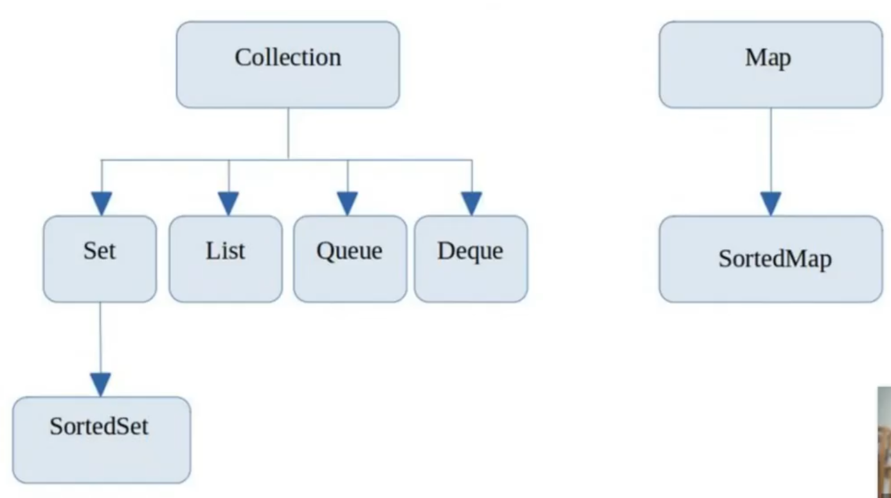
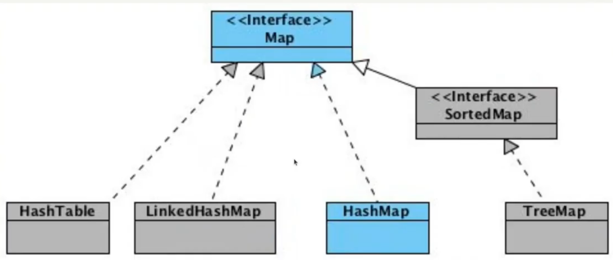
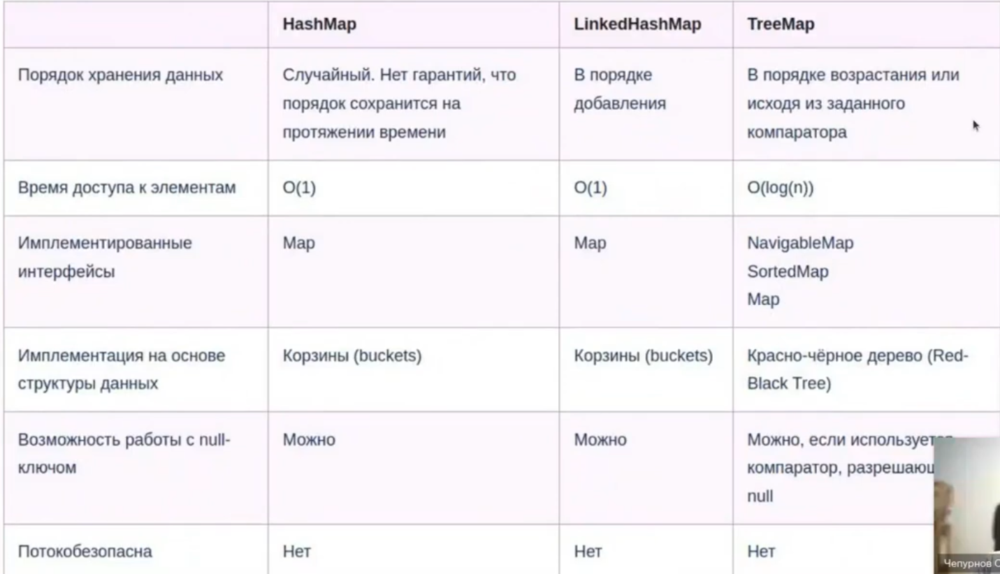
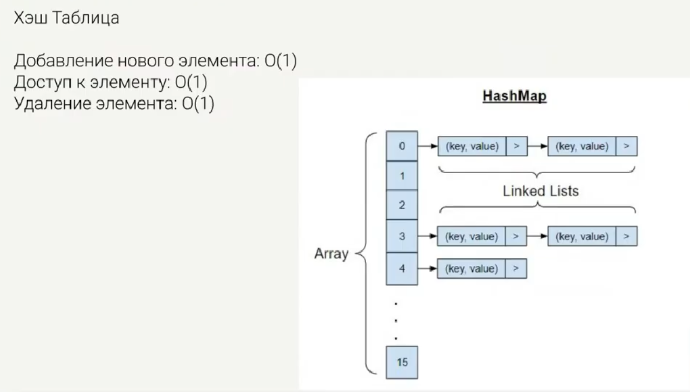
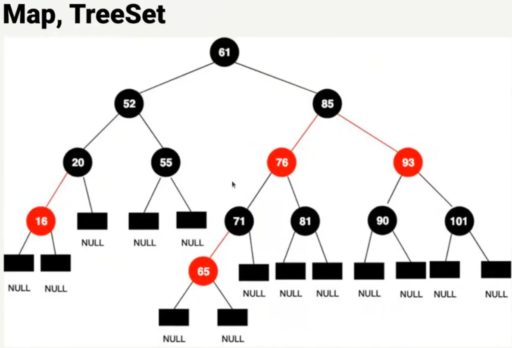

# Масскодинг "Map (HashMap, TreeMap, LinkedHashMap). Решение задач".

Map


Map




Map, HashMap


## Map, HashMap

```java
import java.util.HashMap;

public class Main {
    public static void main(String[] args) {
        Map<String, String> map = new HashMap<>();
        map.put("", "zero");
        map.put("key", "one");
        map.put("idx", "two");
        map.put(null, null);

        System.out.println(map.get("key")); // "one"
        
        for (Map.Entry<String, String> entry : map.entrySet()) {
            System.out.println(entry.getKey() + " " + entry.getValue());
        }
        //     zero
        // null null
        // idx two
        // key one
    }
}
```

Map, LinkedHashMap


```java
import java.util.LinkedHashMap;

        Map<Integer, Integer> map = LinkedHashMap<>();
        map.put(1, "one");
        map.put(2, "two");
        map.put(3, "three");
        map.put(4, "four");
        
        for (Map.Entry<Integer, Integer> entry : map.entrySet()) {
            System.out.println(entry.getKey() + " " + entry.getValue());
        }
        
        // 1 one
        // 2 two
        // 3 three
        // 4 four
```

## Map, TreeMap

Красно-черное дерево

Время доступа к элементу: log(n)



**SortedMap** - интерфейс, который расширяет Map и добавляет методы, актуальные для отсортированного набора данных:
- `firstKey()`: возвращет ключ первого элемента мапы
- `lastKey()`: возвращет ключ последнего элемента мапы

**NavigableMap** - интерфейс, который расширяет SortedMap и добавляет методы для навигации между элементами мапы

- `ceilingKey(K obj)`: возвращает наименьший ключ k, который больше или равен ключу `obj`.
    Если такого ключа нет, то возвращает `null`;
- `floorKey(K obj)`: возвращает самый большой ключ k, который меньше или равен ключу `obj`.
    Если такого ключа нет, то возвращает `null`;
- `lowerKey(K obj)`: возвращает наибольший ключ k, который меньше ключа `obj`.
    Если такого ключа нет, то возвращает `null`;
- `higherKey(K obj)`: возвращает наименьший ключ k, который больше ключа `obj`.
    Если такого ключа нет, то возвращает `null`;


