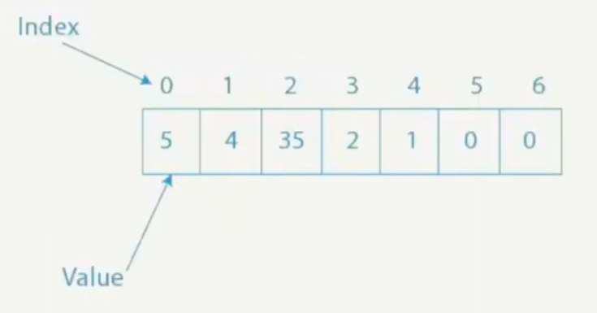
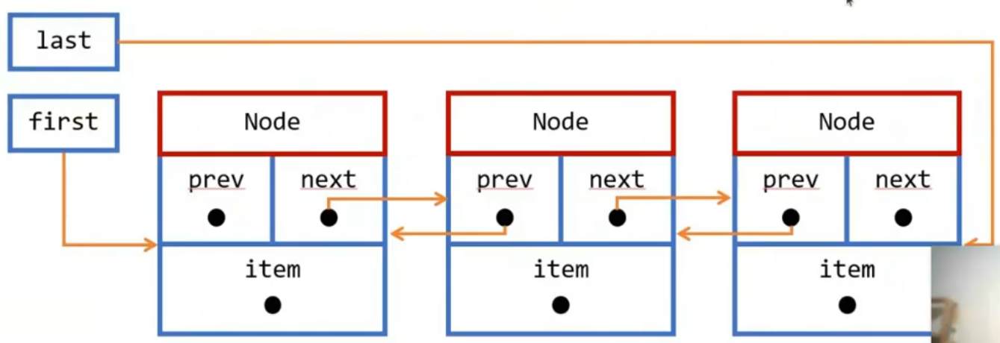
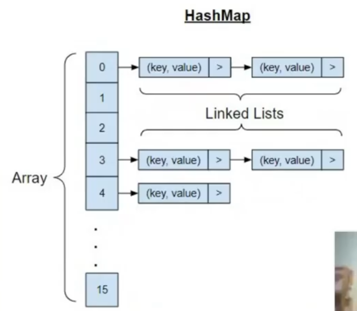

# List, ArrayList

Основан на массиве.

Добавление нового элемента. Лучшее: О(1), худшее: О(n)
Доступ к любому элементу: О(1)
Удаление элемента из начала списка: О(n).

# List, LinkedList

Основан на связанном списке объектов.

Добавление нового элемента: О(1)
Доступ к любому элементу: О(n)
Удаление элемента из начала списка: О(1)

# Map, HashMap

Хэш-таблица

Добавление нового элемента: О(1)
Доступ к элементу: О(1)
Удаление элемента: О(1)

