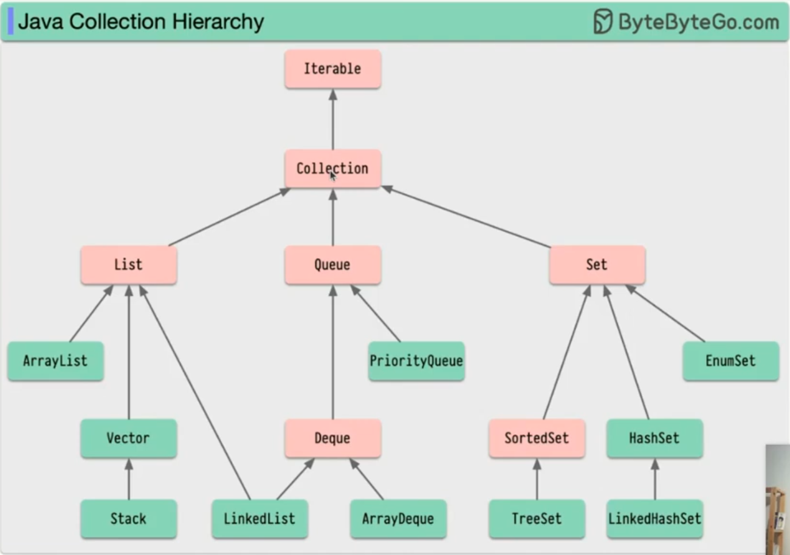
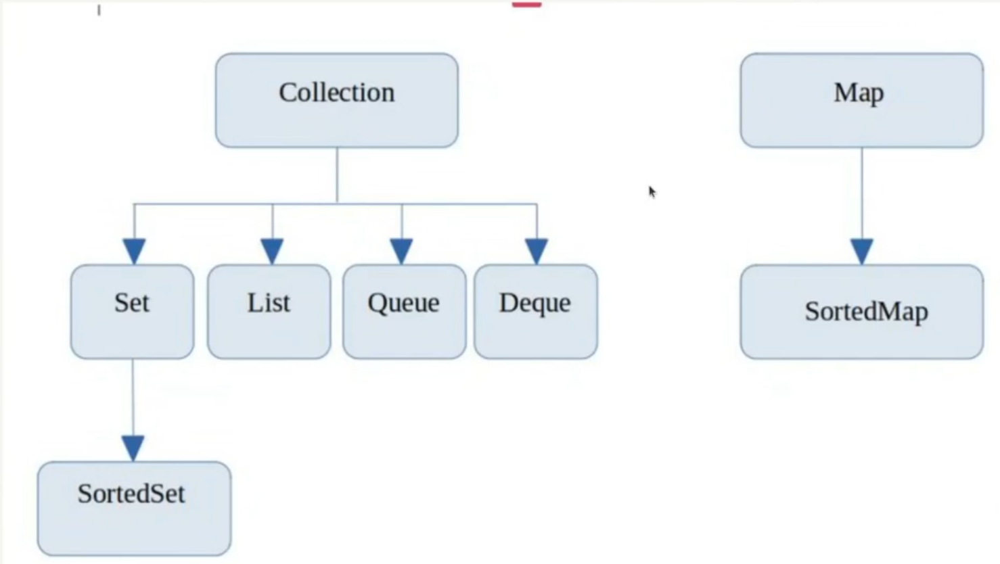
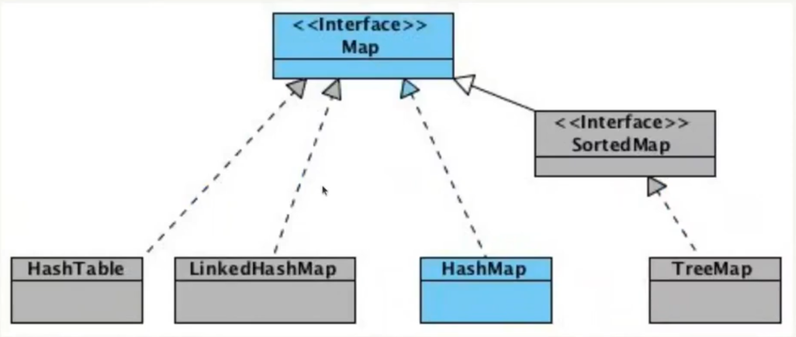
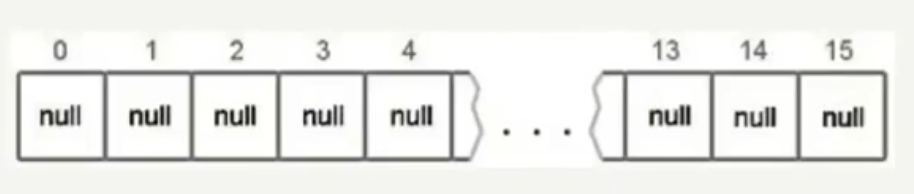

# HashMap







```java
import java.util.HashMap;

Map<String, String> map = new HashMap<String, String>();
```

`table` - Массив типа `Entry[]`, который является хранилищем ссылок на списки (цепочки) значений;

`loadFactor` - _Коэффициент_ загрузки. Значение по умолчанию `0.75` является хорошим компромиссом между временем доступа и 
объёмом хранимых данных; 

`threshold` - _Предельное_ количество элементов, при достижении которого, размер хэш-таблицы увеличивается **вдвое**.

Рассчитывается по формуле (`capacity * loadFactor`)

`size` - Количество элементов в HashMap.



```java
// Инициализация хранилища в конструкторе
// capacity - по умолчанию имеет значение 16
```
`table = new Entry[capacity];`


