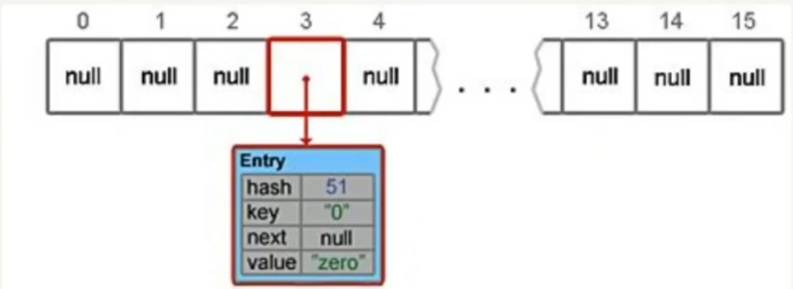
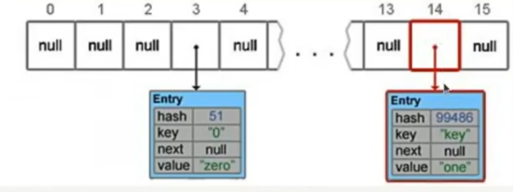
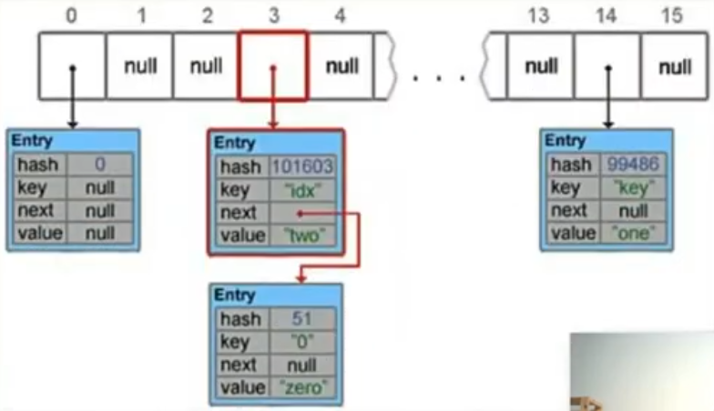

# HashMap


```java
import java.util.HashMap;

Map<String, String> map = new HashMap<String, String>();
```

`table` - Массив типа `Entry[]`, который является хранилищем ссылок на списки (цепочки) значений;

`loadFactor` - _Коэффициент_ загрузки. Значение по умолчанию `0.75` является хорошим компромиссом между временем доступа и 
объёмом хранимых данных; 

`capacity` - Значение по умолчанию (**16**)

`loadFactor` - Значение по умолчанию (**0.75**)

Максимальное заполнение рассчитывается `capacity * loadFactor (16 * 0.75 = 12)`

Когда 12ый элемент добавляется, то `HashMap` увеличивается _в 2 раза_, т.е. массив `table` увеличивается.

`threshold` - _Предельное_ количество элементов, при достижении которого, размер хэш-таблицы увеличивается **вдвое**.

Рассчитывается по формуле (`capacity * loadFactor`)

`size` - Количество элементов в HashMap.


```java
// Инициализация хранилища в конструкторе
// capacity - по умолчанию имеет значение 16
```

`table = new Entry[capacity];`

## Добавление ключа:

1) Проверка на `null`-ключ.

2) Вычисление _улучшенного_ хеша ключа. Это помогает избежать коллизиц при малом размере таблицы.

```java
public static final int hash(Object key) {
    int h;
    return (key == null) ? 0 : (h = key.hashCode()) ^ (h >>> 16);
}
```

3) С помощью метода `indexFor(hash, tableLength)`, определяется позиция в массиве, куда будет помещён элемент.

```java
hash & (length - 1)
```

 где `length` - длина массива 

При значении хэша 51 и размера таблице 16, мы получаем индекс в массиве:

```java
51 & (16 - 1) = 3
```

4) Поиск ключа в корзине

a) Если корзина `bucket[index]` пуста: Создаётся новая нода и сохраняется в корзину

b) Если корзина на пуста (_коллизия_):
    Проходим по цепочке и проверяем: совпадает ли хеш, ключ.
    Если ключ найден, его значение перезаписывается.
    Если ключ не найден, элемент добавляется в конец цепочки.

```java
if (e.hash == hash && (e.key == key || key.equals(e.key))) {
    V oldValue = e.value;
    e.value = value;
    
    return oldValue;
}
```

5) Если же предыдущий шаг не выявил совпадений, будет вызван метод `addEntry(hash, key, value, index)` для добавления 
нового элемента.

```java
vaoid addEntry(int hash, K key, V value, int index) {
    Entry<K, V> e = table[index];
    table[index] = new Entry<K, V>(hash, key, value, e);
    ...
}
```



## Добавление нового ключа:

```java
map.put("key", "one");
```

1) Пропускается, ключ не равен `null` (если null, то он записывается в самую первую ячейку)


2) Рассчитываем улучшенный хэш

```java
 h = "key".hashCode() = 106079
    h ^ (h >>> 20) ^ (h >>> 12) = 106054
    h ^ (h >>> 7) ^ (h >>> 4) = 99486
    // return 99486 - получается это значение
```

3) Определение позиции в массиве:

```java
h & (length - 1) = 99486 & (16 - 1) = 14 (ячейка, см. рисунок)
```

4) Подобные элементы не найдены

5) Добавление элемента



## Добавление ключа (случай с коллизией)

```java
map.put("idx", "two");
```

1) Пропускается, ключ не равен `null`

2) Рассчитываем улучшенный хэш

```java
"idx".hashCode() = 104125
    h ^ (h >>> 20) ^ (h >>> 12) = 104100
    h ^ (h >>> 7) ^ (h >>> 4) = 101603
    // return 101603
``` 

3) Определение позиции в массиве

```java
h & (length - 1) = 101603 & (16 - 1) = 3 (ячейка - совпал, см. рисунок)
```

4) Подобные элементы не найдены, т.е. ключом `idx` элементов не было

5) Добавление элемента в 3 ячейку (`bucket`) (получился связный список в ячейке 3)



# Коллизии

При возникновении коллизии, новые записи формируют связанный список.

При выполнении условий, список заменяется на _дерево_ для ускорения поиска за `O(log n)`.

Условия формирования дерева для разрешения коллизий:

1) Длина цепочки достигает `TREEIFY_THRESHOLD` (по умолчанию = `8`)
2) Размер HashMap превышает `MIN_TREEIFY_CAPACITY` (по умолчанию = `64`)


