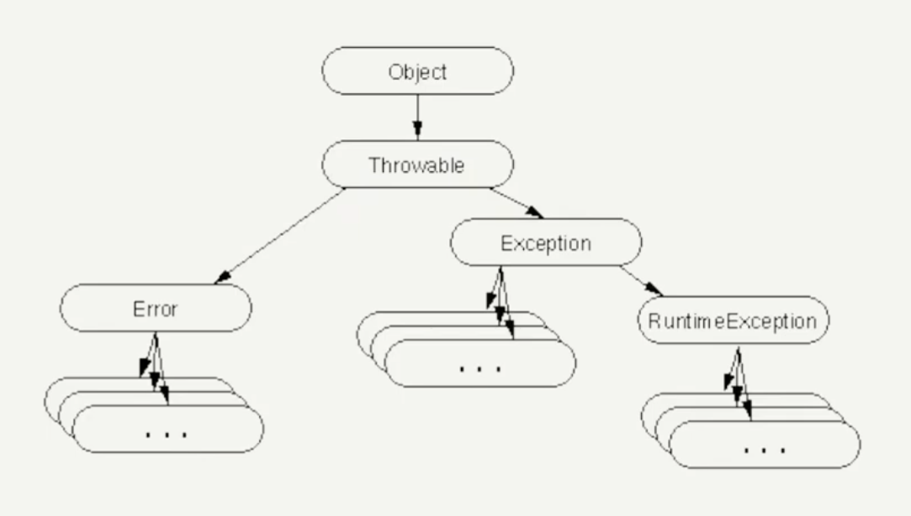

# Масскодинг "try with resources" для 3 модуля



## Проверяемые исключения (checked) 

```java
import java.io.IOException;

public class Main {
    public static void main(String[] args) throws IOException {
        System.out.println("checked exception");
        
        try {
            File.readString(Path.of("src/test/resources/file.txt"));
        } catch (IOException e) {
            // log, throw, nope. return
        }
    }
}
```

## Непроверяемые исключения (checked)

```java
public class Main {
    public static void main(String[] args) {
        System.out.println("unchecked exception");
        
        int a = 42 / 0; // java.lang.ArithmeticException
    }
}
```

## try-catch-finally

```java
import java.io.BufferedWriter;

BufferedWriter bw = null;

try {
    bw = new BufferedWriter(new FileWriter("test.txt"));
    bw.write("test");
    bw.flush();
    bw.close();
} catch (IOException e) {
    // error handling (e.g. on flushing
} finally {
    IOUtils.closeQuietly(bw);
}
```

## try-catch-with-resources

```java
import java.io.BufferedWriter;
import java.io.FileWriter;

try (BufferedWriter bw = new BufferedWriter(new FileWriter("test.txt"))) {
    bw.write("test");
}
```

## Closeable(IOException), AutoCloseable (Exception)

```java
public class TryWithResource {
    public static void main(String[] args) {
        try (TestMe r = new TestMe()) {
            r.generalTest();
        } catch (Exception e) {
            System.out.println("From Exception Block");
        } finally {
            System.out.println("From Final Block");
        }
    }
}

public class TestMe implements AutoCloseable {
    @Override
    public void close() throws Exception {
        System.out.println(" From Close - AutoCloseable ");
    }
    
    public void generalTest() {
        System.out.println(" GeneralTest ");
    }
}
```


