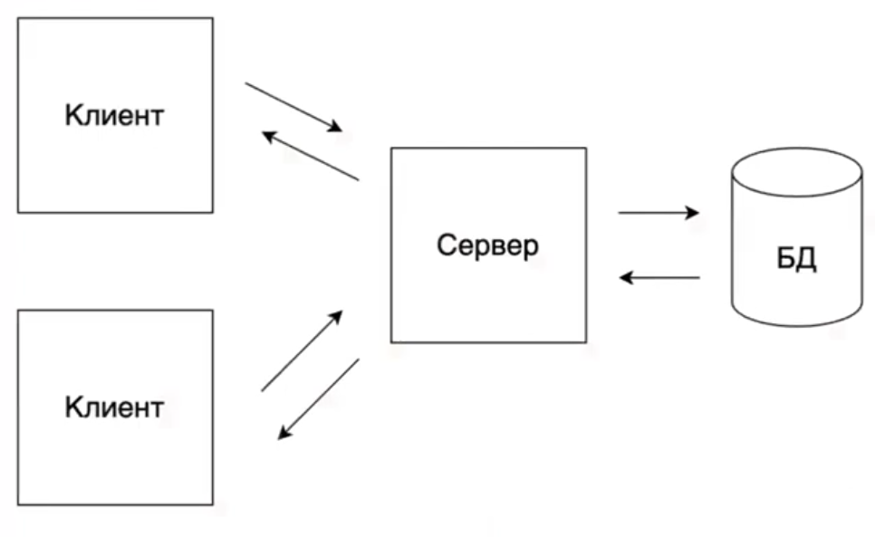

# Построение API: REST

Для студентов 4-5 модуля, планирующих заниматься web-разработкой.



HTTP (Hypertext Transfer Protocol) - протокол прикладного уровня.  Изначально использовался для передачи данных в виде 
гипертекста (HTML), сейчас используется для передачи произвольных данных в сети Интернет.

Базовой единицей этого протоколоа является HTTP-сообщение.

Оно состоит из:
- Стартовой строки (определяет _тип_ сообщения)
- Заголовков (предоставляют _дополнительные_ сведения)
- Тела сообщения (_данные_ сообщения)

Протокол HTTP:

Запрос клиента:

```bash
GET /wiki/страница HTTP/1.1
Host: ru.wikipedia.org
User-Agent: Mozilla/5.0 (X11; U; Linux i686; ru; rv:1.9b5) Gecko/2008050509 Firefox/3.0b5
Accept: text/html
Connection: close
(пустая строка)
```

Ответ сервера:

```bash
HTTP/1.1 200 OK 
Date: Wed, 11 Feb 2009 11:20:59 GMT
Server: Apache
X-Powered-By: PHP/5.2.4-2ubuntu5wml
Last-Modified: Web, 11 Feb 2009 11:20:59 GMT
Content-Language: ru
Content-Type: text/html; charset=utf-8
Content-Length: 1234
Connection: close
(пустая строка)
(запрошенная страница в HTML)
```

# Определение REST API

_REST (Representation State Transfer)_ - набор принципов для построения веб-приложений.

_API (Application Programming Interface)_ - описание способа взаимодействия приложения с внешним миром.

# REST API. Основные принципы

- Единый интерфейс
- Отсутствие сохранения состояния
- Многоуровневая система
- Емкость кэша
- Код по запросу
- Начало от нуля

# REST API. CRUD

В REST API есть 4 метода HTTP, которые используются для действий с объектами на серверах:
- **GET** (получение информации о данных)
- **POST** (создание данных)
- **PUT** (изменение данных)
- **DELETE** (удаление данных)


# Масскодинг "Проектирование REST API" для 4 модуля (14.10.2025)

А) Ticketmaster.com

это онлайн-платформа, позволяющая приобрести билеты на концерты, спортивные мероприятия,
театральные представления и другие развлекательные мероприятия

Функциональные требования:

1) Пользователи должны иметь возможность просматривать мероприятия
2) Пользователи должны иметь возможность искать мероприятия
3) Пользователи должны иметь возможность бронировать билеты на мероприятия
 
`Entities (сущности):` (определяем сущности)
User
Event
Performer
Venue
Ticket
Booking

REST API:

// 1 - даём возможность отправить запрос на просмотр
GET /events/:eventId -> Event, Venue, Performer, Ticket[]

// 2 - даём возможность искать мероприятия: наименования, дату начала, количество в многостраничном режиме
GET /events/search?keyword={keyword}&start={start_date}&end={end_date}&pageSize={pageSize}&page={page_number} -> Event

// 3 - даём возможность бронировать билеты
POST /booking/:eventId -> bookingId // номера/id броней, POST - более универсальный метод
{
    "ticketsIds" : string[] // билеты
    "paymentDetails" : ...  // данные об оплате
}


D) VK Live Comments

Функциональные требования

1) Зрители могут публиковать комментарии в прямом эфире
2) Зретели могут видеть все комментарии по мере их публикации
3) Зрители могут видеть комментарии, сделанные до того, как они присоединись к прямому эфиру

Entities
User
Comment
LiveVideo

REST API:

// 1 - даём возможность публиковать комментарии
POST /comment/
Authorization: JWT token
{
    "liveVideoId": "123",
    "message": "my Comment", 
}

// 2 - даём возможность видеть комментарии

GET /comments/:liveVideoId

// 3 - видеть комметарии до присоединения к эфиру
// используем поддерживаемый базой параметр cursor - время, который находит коммент по id и от него начинает отчитывать записи (50 шт)
GET /comments?liveVideoId="234"&cursor={last_comment_id}&pageSize="50"


E) VK News Feed

Функциональные требования

1) Пользователи могут создавать посты
2) Пользователи могут добавлять в друзья/подписываться на людей
3) Пользователи могут просматривать ленту постов от людей, на которых он подписаны, в хронологическом порядке
4) Пользователи могут постранично пролистывать свою ленту

Entities:
User
Post
Follow

REST API:

// 1 - даём возможность добавлять посты
POST /post
Authorization: JWT token
{
    "message": "text"
}

// 2 - даём возможность в друзья/подписываться на людей

POST /follows
Authorization: JWT token
{
    "targetUser": "id"
}

// 3 - даём возможность просматривать ленту: лента - массив постов

GET /feed -> Post[]

// 4 - даём возможность постранично пролистывать свою ленту от даты последнего посещения по 50 штук

GET /feed?cursor={last_time_stamp}&pageNumber=1&pageSize=50

H) Tinder

1) Пользователи могут задавать фильтры по данным профиля (возраст, интересы и т.д.) и местоположению (расстояние до пользователя)
2) Пользователь может листать вправо/влево фотографии других пользователей по одному, чтобы выразить своё "да" или "нет"
3) Пользователи получают уведомление о совпадении, если они выбирают друг друга ("вправо")

Entities:

User
Swipe
Match

REST API:

// 1 - по нашему токену и данным задаём фильтры кого показывать

POST /profile
Authorization: JWT token
{
    "age": 18,
    "hobby": "Text",
    "radius": 2
}

// 2 - по просматриваемому userId человека делаем swipe влево или вправо: право - true, а если не вправо - false 

// сначала загружаем этих людей, список пользователей
GET /feed?lat={}&long={}&distance{} -> User[]

POST /swipe/{userId}
Authorization: JWT token
{
    "swipe": "true" | "false"
}

// 3 - если совпал выбор друг друга

GET /match -> Match[]


