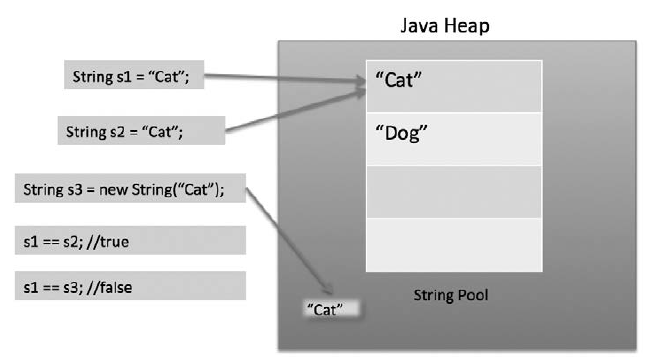

# Глава 11. Строки

Строки (`java.lang.String`) - это фрагменты текста, хранящиеся в вашей программе. Строка не являются примитивным типом данных в Java, однако они очень часто встречаются в процессе написания программ на Java.

В языке Java строки относятся к неизменяемым типам данных, то есть их нельзя изменить. (Более подробное объяснение понятия неизменяемости можно найти по адресу http://stackoverflow.com/questions/279507/what-is-meant-by-immutable).

## Раздел 11.1 Сравнение строк

Для сравнения строк на равенство следует использовать методы `equals` или `equalsIgnoreCase` объекта `String`. Например, следующий фрагмент программы определяет, равны ли два экземпляра `String` по всем входящим в них символам:

```java
String firstString = "Test123";
String secondString = "Test" + 123;

if (firstString.equals(secondString)) {
    // Обе строки имеют одинаковое содержимое.
}
```

Вы можете запустить эту программу онлайн на сайте ideone.com, перейдя по ссылке (https://ideone.com/TjaYMR).

В данном примере будет проведено сравнение строк, не зависящее от того, в каком регистре набраны символы:

```java
String firstString = "Test123";
String secondString = "TEST123";

if (firstString.equalsIgnoreCase(secondString)) {
    // Обе строки равны, без учета регистра отдельных символов.
}
```

Вы можете запустить эту программу онлайн на сайте ideone.com, перейдя по ссылке (https://ideone.com/XxKmM1).

Обратите внимание, что метод `equalsIgnoreCase` не позволяет задать параметр `Locale`. Например, если сравнить два слова "Taki" и "TAKI" в английском языке, то они будут одинаковыми, но в турецком языке они будут разными (в турецком языке строчная буква I - l). В подобных случаях решением является преобразование обеих строк в нижний (или верхний) регистр с применением возможностей класса `Locale` и последующее сравнение строк с помощью метода `equals`.

```java
import java.util.Locale;

String firstString = "Taki";
String secondString = "TAKI";

System.out.println(firstString.equalsIgnoreCase(secondString));     // выводит true

Locale locale = Locale.forLanguageTag("tr - TR");

System.out.println(firstString.toLowerCase(locale).equals(
                   secondString.toLowerCase(locale)));  // выводит false
```

Вы можете запустить эту программу онлайн на сайте ideone.com, перейдя по ссылке (https://ideone.com/uWc348).

**Не используйте оператор == для сравнения строк**

Не следует использовать операторы `==` или `!=` для сравнения строк, если вы не можете гарантировать, что все строки не были интернированы (см. ниже). Эти операторы фактически проверяют ссылки, а поскольку несколько объектов `String` могут представить одну и ту же строку, это может привести к неправильному результату.

Вместо этого следует использовать метод `String.equals(Object)`, который будет сравнивать объекты `String` на основе их значений. Более подробное объяснение приведено в разделе "Ловушка: использовать `==` для сравнения строк".

**Сравнение строк в операторе switch**

_Версия >= Java SE 7_

Начиная с версии Java 1.7, в операторе **switch** можно сравнивать переменную `String` с литералами. При этом необходимо убедиться, что `String` не является значением `null`, иначе всегда будет возникать исключение `NullPointerException`. Значения сравниваются с помощью метода `String.equals`, т.е. с учетом регистра.

```java
String stringToSwitch = "A";

switch (stringToSwitch) {
    case "a":
        System.out.println("a");
        break;
    case "A":
        System.out.println("A");    // код идет здесь
        break;
    case "B":
        System.out.println("B");
        break;
    deafault:
        break;    
}
```

Вы можете запустить эту программу онлайн на сайте ideone.com, перейдя по ссылке (https://ideone.com/fbWBUR).

**Сравнение строк с константами**

При сравнении строки со строками-константами можно поместить константное значение в левую часть метода `equals`, чтобы не получить исключение `NullPointerException`, если другая строка равна значению `null`.

```java
"baz".equals(foo);
```

В то время как `foo.equals("baz")` вызовет исключение `NullPointerException`, если `foo` будет равно `null`, значение `"baz".equals(foo)` не вызовет исключение, а будет равно `false`.

_Версия >= Java SE 7_

Более удобной альтернативой использование метода `Objects.equals()`, которая проверяет оба параметра на равенство значению `null`:

```java
Objects.equals(foo, "baz").
```

_Примечание_: спорным является вопрос о том, хорошо ли вообще избегать исключений `NullPointerException`, или лучше позволить им произойти, а затем устранить первопричину, их вызывающую. И само собой разумеется, назвать стратегию избегания "лучшей практикой" не вполне правомерно.

**Упорядочивание строк**

Класс `String` реализует интерфейс `Comparable<String>` с содержащимся в нем методом `String.compareTo()` (как описано в начале этого примера). Это делает естественное упорядочивание объектов `String` чувствительным к регистру. Класс `String` предоставляет константу `CASE_INTENSITIVE_ORDER`, которая принадлежит интерфейсу `Comparator<String>`, и предназначена для сортировки строк без учета регистра.

**Сравнение с интернированными строками**

В спецификации языка Java (JLS 3.10.6) говорится следующее:

"Более того, строковый литерал всегда ссылается на один и тот же экземпляр класса `String`. Это объясняется тем, что строковые литералы или, в более общем случае, строки являющиеся константами, _интернируются_ так, чтобы разделять между собой ссылку на уникальный экземпляр, с помощью метода `String.intern`".

Это означает, что можно сравнивать ссылки на два строковых литерала с помощью оператора `==`. Более того, что это справедливо и для ссылок на объекты `String`, созданные с помощью метода `String.intern()`. Например:

```java
String strObj = new String("Hello!");
String str = "Hello!";

// Две ссылки на объект String указывают на две одинаковые строки
if (strObj.equals(str)) {
    System.out.println("Строки равны");
}

// Две строковые ссылки не указывают на один и тот же объект
if (strObj != str) {
    System.out.println("Строки не являются одним и тем же объектом");
}

// Если мы интернируем строку, которая равна заданному литералу, то в результате
// получим строку, имеющую ту же ссылку, что и литерал.
String internedStr = strObj.intern();

if (internedStr == str) {
    System.out.println("Интернированная строка и литерал являются одним и тем же объектом");
}
```

За кулисами механизм интернирования ведёт хеш-таблицу, содержащую все интернированные строки, которые все ещё _достижимы_. Когда вы вызываете функцию `intern()` для строки `String`, метод ищет объект в хеш-таблице:
+ Если строка найдена, то это значение возвращается как интернированная строка.
+ В противном случае копия строки добавляется в хеш-таблицу и эта строка возвращается в качестве интернированной строки.

Можно использовать интернирование для сравнения строк с помощью оператора `==`. Однако при этом возникают серьёзные проблемы; подробнее об этом см. в разделе "Ловушка - применение оператора `==` для интернированных строк - плохое решение". В большинстве случаев такая реализация не рекомендуется.

[к оглавлению Глава 11](#глава-11-строки)

## Раздел 11.2. Изменение регистра символов в строке

Тип `String` предоставляет два метода преобразования строк к верхнему и нижнему регистру:
+ `toUpperCase` для преобразования всех символов в строке к верхнему регистру.
+ `toLowerCase` для преобразования всех символов в строке к нижнему регистру.

Оба этих метода возвращают преобразованные строки в виде новых экземпляров `String`: исходные объекты `String` не изменяются, поскольку `String` в Java принадлежит к неизменяемому типу данных. Подробнее можно ознакомиться здесь: (http://stackoverflow.com/questions/1552301/immutability-of-strings-in-java)

```java
String string = "This is a Random String";
String upper = string.toUpperCase();
String lower = string.toLowerCase();

System.out.println(string); // выводит сообщение "This is a Random String"  
System.out.println(lower); // выводит сообщение "this is a random string"
System.out.println(upper); // выводит сообщение "THIS IS A RANDOM STRING"
```

На неалфавитные символы, такие как цифры и знаки препинания, эти методы не влияют. Следует отметить, что при определённых условиях эти методы могут некорректно работать с некоторыми символами Unicode.

_Примечание_: эти методы _чувствительны к объектам Locale (отвечающих за локализацию программы)_ и могут привести к неожиданным результатам, если используются для строк, которые должны интерпретироваться независимо от локализации. Примерами могут служить идентификаторы языков программирования, ключи протоколов и HTML-теги.

Например, `"TITLE".toLowerCase()` в турецкой локализации возвращает `"tltle"`, где `l` `(\u0131)` - латинский малый буквенный символ I без точки. Чтобы получить корректные результаты для строк, нечувствительных к локализации, передайте параметр `Locale.ROOT` в качестве параметра соответствующему методы преобразования регистра (например, `toLowerCase(Locale.ROOT)` или `toUpperCase(Locale.ROOT`)). 

Хотя использование параметра `Locale.ENGLISH` будет корректно для большинства случаев, способом, инвариантным к языку, является использование параметра `Locale.ROOT`.

Подробный список символов Unicode, для которых требуется специальная обработка, можно найти на сайте Консорциума Unicode (http://unicode.org/Public/UNIDATA/SpecialCasing.txt)

**Изменение регистра заданного символа в строке ASCII**

Для изменения регистра определённого символа в ASCII-строке можно использовать следующий алгоритм:

Шаги:

1. Объявите строку.
2. Введите строку.
3. Преобразуйте строку в массив символов.
4. Введите символ, по которому будет производиться поиск.
5. Осуществите поиск символа в массиве символов.
6. Если символ не найден, проверьте, является ли он строчным или прописным.
   + Если символ прописной, то к его коду ASCII следует прибавить 32.
   + Если используется нижний регистр, то из кода ASCII символа вычитается 32.
7. Замените исходный символ из массива символов на требуемый.
8. Преобразуйте массив символов обратно в строку.

Вуаля, регистр символов изменён. Ниже приведён фрагмент кода, реализующий данные алгоритм:

```java
import java.util.Scanner;

Scanner scanner = new Scanner(System.in);
System.out.println("Введите строку");
String s = scanner.next();
char[] a = s.toCharArray();
System.out.println("Введите искомый символ");
System.out.println(s);
String c = scanner.next();
char d = c.charAt(0);

for (int i = 0; i <= s.length(); i++) {
    if (a[i] == d) {
        if (d >= 'a' && d <= 'z') {
            d -= 32;
        } else if (d >= 'A' && d <= 'Z') {
            d += 32;
        }
        a[i] = d;
        break;
   }
}
s = String.valueOf(a);
System.out.println(s);
```

[к оглавлению Глава 11](#глава-11-строки)

## Раздел 11.3. Проверка вхождения строки в состав другой строки

Для проверки того, содержится ли конкретная строка `a` в строке `b` или нет, можно воспользоваться методом `String.contains()` со следующим синтаксисом:

```java
b.contains(a);  // Возвращается true, если a содержится в b, false - в противном случае
```

Метод `String.contains()` может быть использован для проверки того, входит ли в строку заданная последовательность символов. Метод проверяет вхождение строки `a` в строку `b` с учетом регистра.

```java
String str1 = "Hello World";
String str2 = "Hello"; String str3 = "helLo";

System.out.println(str1.contains(str2));    // выведет true
System.out.println(str1.contains(str3));    // выведет false
```

Вы можете запустить эту программу онлайн на сайте ideone.com, перейдя по ссылке (https://ideone.com/Tdef6b).

Чтобы найти точное место, с которого начинается вхождение одной строки в другую строку, используйте метод `String.indexOf()`:

```java
String s = "this is a long sentence";
int i = s.indexOf('i');     // первая буква 'i' в строке находится по индексу 2
int j = s.indexOf("long");  // индекс первого вхождения слова "long" в строку s равен 10
int k = s.indexOf('z');     // k равен -1, так как 'z' не было найдено в строке s
int h = s.indexOf("LoNg");  // h равно -1, так как слово "LoNg" не было найдено в строке s 
```

Вы можете запустить эту программу онлайн на сайте ideone.com, перейдя по ссылке (https://ideone.com/RHHcF0).

Метод `String.indexOf()` возвращает индекс первого вхождения символа или строки в другую строку. Если символ или строка не входят в данную строку, метод возвращает значение `-1`. 

_Примечание_: метод `String.indexOf()` чувствителен к регистру. Пример поиска с игнорированием регистра:

```java
String str1 = "Hello World";
String str2 = "wOr";
str1.indexOf(str2);     //  -1
str1.toLowerCase().contains(str2.toLowerCase());    // true
str1.toLowerCasw().indexOf(str2.toLowerCase());     // 6
```

Вы можете запустить эту программу онлайн на сайте ideone.com, перейдя по ссылке (https://ideone.com/TQtcMf).

[к оглавлению Глава 11](#глава-11-строки)

## Раздел 11.4. Пул строк и область памяти Java Heap

Как и многие другие объекты Java, все экземпляры `String` и даже литералы создаются в области памяти, которая получила название `Java Heap` - куча. Когда JVM находит литерал `String`  в куче, а также сохраняет ссылку на вновь созданный экземпляр `String` в пуле строк. Все остальные ссылки на тот же литерал `String` заменяются в куче ранее созданным экземпляром `String`.

Рассмотрим следующий пример:

```java
class String {
    public static void main(String[] args) {
        String a = "alpha";
        String b = "alpha";
        String c = new String("alpha");
        
        // Все три строки эквивалентны
       System.out.println(a.equals(b) && b.equals(c));
       
       // Несмотря на то, что только a и b ссылаются на один и тот же объект кучи
       System.out.println(a == b);
       System.out.println(a != c);
       System.out.println(b != c);
    }
}
```

В результате программа выдаст следующий результат:

```java
true
true
true
true
```



Когда мы используем двойные кавычки для создания строки, то в пуле строк сначала ищется строка с таким же значение и если она найдена, то просто возвращается ссылка на нее, иначе в пуле создаётся новая строка, а затем возвращается ссылка на новую строку.

Используя же оператор `new`, мы заставляем класс `String` создать новый объект `String` в пространстве кучи. Мы можем использовать метод `intern()`, чтобы поместить его в пул, или обратиться к другому объекту `String` из пула строка с тем де значением.

Сам пул строк также создаётся в куче.

_Версия < Java SE 7_

До появления Java 7 литералы `String` хранились в пуле констант, создаваемых во время выполнения программы, который в свою очередь находился в области памяти методов. Это область памяти называлась `PermGen` и имела фиксированный размер. Пул строк также находился в `PermGen`.

_Версия >= Java SE 7_

RFC: 6962931

В JDK 7 интернированные строки больше не хранятся в области памяти методов `PermGen`, а располагаются в основной части общей кучи Java (известно как младшая и старшая модель распределения памяти) вместе с другими объектами, созданными приложением. Это изменение привело к тому, что в основной части кучи Java стало находиться больше данных, а в пространстве `PermGen` - меньше, и поэтому может потребоваться перераспределение размеров кучи. Для большинства приложений это изменение привело лишь к относительно небольшой разнице в использовании кучи, но в больших приложениях, в которых в память подгружается много классов или активно используется метод `String.intern()`, эта разница была более существенной.

[к оглавлению Глава 11](#глава-11-строки)

## Раздел 11.5. Разделение строк на подстроки

Разделить строку, используя в качестве разделителя символ или регулярное выражение, можно с помощью метода `String.split()`, имеющего следующую сигнатуру:

```java
public String[] split(String regex)
```

Обратите внимание на то, что из результирующего массива строк удаляется разделительный символ или регулярное выражение, по которым происходило разделение исходной строки.

Пример использования в качестве разделителя символа `";"`:

```java
String lineFromCsvFile = "Mickey;Bolton;12345;121216";
String[] dataCells = lineFromCsvFile.split(";");
// Результат - dataCells = {"Mickey", "Bolton", "12345", "121216"};
```

Пример использования в качестве разделителя регулярного выражения:

```java
String lineFromInput = "What do you need for me?";
String[] words = lineFromInput("\\\s+");
// один или несколько пробельных символов
// Результат - слова = {"What", "do", "you", "need", "from", "me?"};
```

Можно даже напрямую разделить строковый литерал:

```java
String[] firstNames = "Mickey, Frank, Alicia, Tom".split(", ");
// Результат - firstNames = {"Mickey", "Frank", "Alicia", "Tom"};
```

_Внимание:_ Не забывайте, что параметр в методе всегда рассматривается как регулярное выражение.

```java
"aaa.bbb".split(".");   // В этом случае метод вернёт пустой массив
```

В предыдущем примере `"."` рассматривается как знак шаблона для регулярного выражения, который соответствует любому символу, а так как каждый символ является разделителем, то результатом будет пустой массив.

**Разделение на основе разделителя, являющегося метасимволом в регулярном выражении**

В регулярном выражении используется ряд специальных символов, которые иначе называют мета-символами. Это:

` < > - = ! ( ) [ ] { } \ ^ $ | ? * + .`

Чтобы разделить строку на основе одного из указанных выше разделителей, необходимо _экранировать_ их с помощью `\\`, либо использовать метод `Pattern.quote()`:
+ Использование метода `Pattern.quote()`:

```java
import java.util.regex.Pattern;

String s = "a|b|c";
String regex = Pattern.quote("|");
String[] arr = s.split(regex);
```

+ Экранирование специальных символов:

```java
String s = "a|b|c";
String[] arr = s.split("\\|");
```

**Удаление пробелов или пустых строк с помощью метода split**

Метод `split` (разделитель) по умолчанию удаляет из результирующего массива строк завершающие пробелы. Чтобы отключить этот механизм, необходимо воспользоваться перегруженной версией метода `split (delimeter, limit)`, задав при этом в качестве дополнительного параметра `limit` отрицательное значение, например, следующим образом:

```java
String[] split = data.split("\\|", -1);
```

Метод `split(regex)` без второго параметра возвращает результат выполнения `split(regex, 0)`.

Параметр `limit` определяет, какое количество раз шаблон `regex` будет применяться к исходной строке и, следовательно, влияет на длину результирующего массива.

Если параметр `limit` установить равным числу `n > 0`, то шаблон будет применён по крайней мере `n - 1` раз, и длина результирующего массива не превысит `n`, а последний элемент массива будет содержать часть входной строки, расположенную за последним найденным разделителем.

Если `n` отрицательно, то шаблон будет применён столько раз, сколько это возможно, и выходной массив может иметь любую длину.

Если `n` равно нулю, то шаблон будет применен столько раз, сколько это возможно, выходной массив может иметь любую длину, а пустые строки, расположенные в конце исходной строки, будут отброшены.

**Разделение строки с помощью методов класса StringTokenizer**

Кроме метода `split()` строки могут быть разделены с помощью методов класса `StringTokenizer`.

Методы класса `StringTokenizer` ещё более строги, чем метод `String.split()`, а также несколько сложнее в использовании. По сути, этот класс предназначен для извлечения лексем, разделённых фиксированным набором символов (заданных в виде строки). Каждый символ будет выступать в роли разделителя. Из-за этого ограничения он работает примерно в два раза быстрее, чем метод `String.split()`.

Набор символов по умолчанию - символ пробела и управляющие символы `(\t\n\r\f)`. В следующем примере отдельно будет выведено каждое слово исходной строки.

```java
import java.util.StringTokenizer;

String str = "tha lazy fox jumped over the brown fence";
StringTokenizer tokenizer = new StringTokenizer(str);
while (tokenizer.hasMoreTokens()) {
    System.out.println(tokenizer.nextToken());
}
```

В результате работы программы на экран будет выведено:
```bash
the
lazy
foz
jumped
over
the 
brown
fence
```

Для разделения исходной строки можно использовать различные наборы символов:

```java
import java.util.StringTokenizer;

String str = "jumped over";
// В данном случае в качестве разделителей будут использоваться символы 'u' и 'e'
StringTokenizer tokenizer = new StringTokenizer(str, "ue");
while (tokenizer.hasMoreTokens()) {
    System.out.println(tokenizer.nextToken());
}
```

В результате будет выведено:

```bash
j
mp
d ov
r`
```

[к оглавлению Глава 11](#глава-11-строки)

## Раздел 11.6. Объединение строк с помощью разделителя


[к оглавлению Глава 11](#глава-11-строки)

[Раздел 11.1. Сравнение строк](#раздел-111-сравнение-строк)

[Раздел 11.2. Изменение регистра символов в строке](#раздел-112-изменение-регистра-символов-в-строке)

[Раздел 11.3. Проверка вхождения строки в состав другой строки](#раздел-113-проверка-вхождения-строки-в-состав-другой-строки)

[Раздел 11.4. Пул строк и область памяти Java Heap](#раздел-114-пул-строк-и-область-памяти-java-heap)

[Раздел 11.5. Разделение строк на подстроки](#раздел-115-разделение-строк-на-подстроки)


