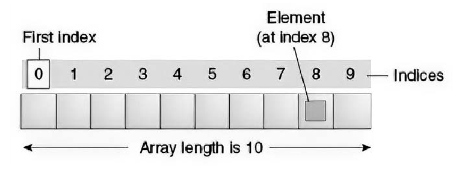

# Глава 23. Массивы

**Параметр**        **Описание**

`ArrayType`         Тип массива. Членами массива могут быть примитивы (`int, long, byte`) или объекты (`String, MyObject` и т.д.).

`index`             Индекс обозначает позицию некоторого объекта в массиве.

`length`            Каждый массив при создании требует указания заданной длины (то есть количества ячеек). Длина массива задаётся либо при создании пустого массива (`new int[3]`), либо подразумевается при указании значений элементов массива(`{1, 2, 3}`).

Массивы позволяют хранить и извлекать произвольное количество значений. В математике они аналогичны векторам. Массивы 
массивов аналогичны матрицам и выступают как многомерные массивы. В массивах могут храниться данные любого типа:  
примитивы типа `int` или ссылочные типы типа `Object`. 

## Раздел 23.1. Создание и инициализаци массива

**Основные случаи**

```java
int[] numbers1 = new int[3];    // Массив для 3-х значений типа int, значение элементов по умолчанию 0
int[] numbers2 = {1, 2, 3};     // Массив из 3-х литералов типа Int
int[] numbers3 = new int[] {1, 2, 3};   // Инициализация массива на основе 3-х значений типа int
int[][] numbers4 = { {1, 2}, {3, 4, 5} };   // Литерал зубчатый массив (массив массивов) на базе примитивов
int[][] numbers5 = new int[5][];  // Зубчатый массив, один из подмассивов имеет длинну 5
int[][] numbers6 = new int[5][4];   // Многомерный массив: 5х4
```

Массивы могут быть созданы с использованием любого примитивного или ссылочного типа данных.

```java
float[] boats = new float[5];       // Массив из пяти 32-х разрядных чисел с плавающей запятой
double[] header = new double[] {4.56, 332.267, 7.0, 0.3367, 10.0};  
                                // Массив из пяти 64-х разрядных чисел с плавающей запятой.
String[] theory = new String[] {"a", "b", "c"}; // Массив из трёх строк (ссылочный тип).
Object[] dArt = new Object[] {new Object(), "We love Stack Overflow.", new Integer(3) };
                                // Массив из трёх объектов (ссылочный тип)
```

Для последнего примера отметим, что в массиве допускаются подтипы объявленного типа массива. Массивы для типов, 
определяемых пользователем, также могут быть построены способами, аналогичными способам построения массивов с 
примитивными типа данных. 

```java
UserDefinedClass[] udType = new UserDefinedClass[5];
```

**Массивы, коллекции и потоки**

Версия >= Java SE 1.2

```java
// В качестве параметров используются объекты, а не примитивы

// Здесь происходит автоупковка целого числа int 127

import java.util.ArrayList;
import java.util.Arrays;
import java.util.List;

Integer[] initial = {127, Integer.valueOf(42)};
List<Integer> toList = Arrays.asList(initial);  // Фиксированный размер!

// Примечание: работает со всеми коллекциями
Integer[] fromCollection = toList.toArray(new Integer[toList.size()]);

// Java не позволяет создавать массив параметризированного типа
List<String>[] list = new ArrayList<String>[2]; // ошибка компиляции!
```

Версия >= Java SE 8

```java
// Потоки - JDK 8+

import java.util.Arrays;
import java.util.stream.Stream;

Stream<Integer> toStream = Arrays.stream(initial);
Integer[]     fromStream = toStream.toArray(Integer[]::new); 
```

**Краткая справка о массивах**

_Массив_ - это структура данных, в которой хранится фиксированное количество примитивных значений или ссылок на  
экземпляры объектов.

Каждый элемент массива назыывается _элементом_, а доступ к каждому элементу осуществляется по его числовому индексу 
(порядковому номеру элемента в массиве). Длина массива задаётся при его создании:

```java
int size = 42;
int[] array = new int[size];
```

Размер массива фиксируется при инициализации во ремя выполнения программы. После инициализации он не может быть изменен. 
Если размер массива должен быть изменяемым во время выполнения программы, то вместо него следует использовать класс 
`Collection`, например `ArrayList`. `ArrayList` хранит элементы в массиве и поддерживает изменение размера путем 
выделения нового массива и копирования элементов из старого массива в новый массив большего размера. 

Если массив имеет примитивный тип, т.е.

```java
int[] array1 = {1, 2, 3};
int[] array2 = new int[10];
```

значения элементов хранятся в самом массиве. При отсутствии начальных значений при инициализации массива (как при 
инициализации массива `array2`) каждому элементу по умолчанию присваивается значение 0 (ноль).

Если тип массива является ссылкой на объект, кака при следующей инициализации

```java
SomeClassOrInterface[] array = new SomeClassOrInterface[10];
```

то массив содержит ссылка на объекты типа `SomeClassOrInterface`. Эти ссылки могут относиться как к экземпляру 
`SomeClassOrInterface`, так и к любому подклассу (для классов) или классу реализации интерфейса (для интерфейсов) 
`SomeClassOrInterface`. При отсутствии начальных значений при инициализации массива, каждому элементу присваивается 
значение по умолчанию `null`.

Поскольку все массивы индексируются, размер массива должен быть задан в виде значения типа `int`. Размер массива не 
может быть задан величиной типа `long`:

```java
long size = 23L;
int[] array = new int[size];    // Ошибка времени компиляции: несовместимые типы:
                                // возможно преобразование с потерями из типа long в типа int.
```

В массивах используется система отсчета индексов от нуля, то есть инжексация начинается с 0 и заканчивается на элементе 
с номером `length - 1`, где `length` - длина массива.

Например, на следующем рисунке представлен массив размером 10. Здесь первый элемент имеет индекс 0, а последний - индекс 
9 (см. рисунок ниже).



Доступ к элементам массивов осуществляется за **постоянное время**. Это означает, что обращение к первому элементу 
массива имеет ту же стоимость (по времени), что и обращение ко второму элементу, третьему элементу и т.д. 

Java предлагает несколько способов определения и инициализации массивов, включая способы задания на основе **литералов** 
и при помощи **конструктора**. Если массивы были объявлены с помощью конструктора вида `new Type[length]`, каждый 
элемент будет инициализирован следующими значениями по умолчанию:
+ 0 для примитивных числовых типов данных: `byte, short, int, long, float` и `double`.
+ '`\u0000`' (нулевой символ) для типа `char`.
+ `false` для типа `boolean`
+ `null` для ссылочных типов

**Создание и инициализация массивов с примитивными типами данных**


[к оглавлению Глава 23](#глава-23-массивы)

[Раздел 23.1. Создание и инициализаци массива](#раздел-231-создание-и-инициализаци-массива)


