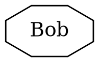
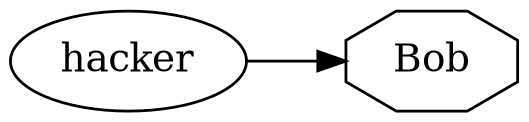
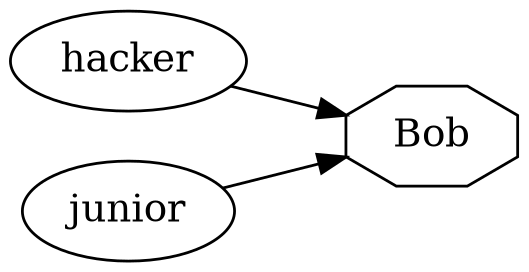
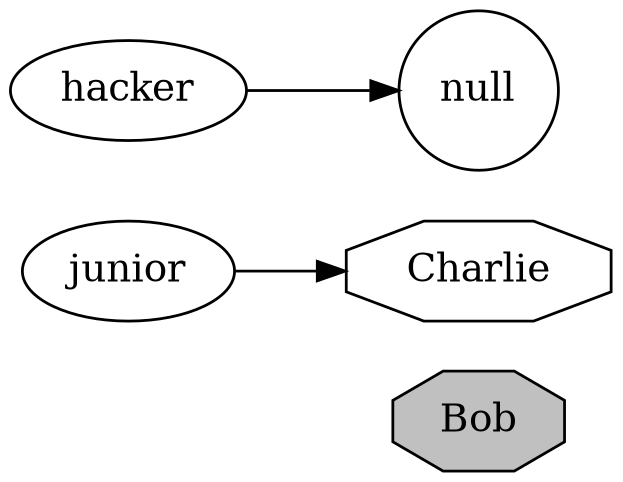
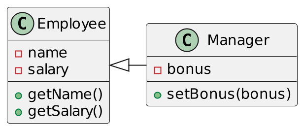
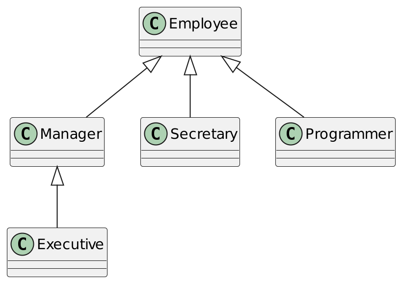
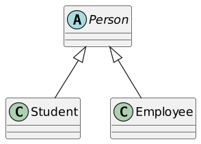
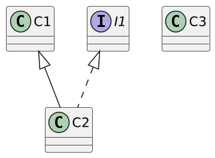
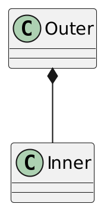
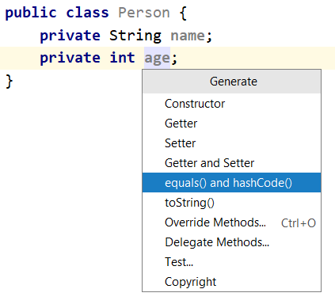

# Core Java. Лекция № 3
## Классы. Интерфейсы. Класс Object и его стандартные методы


## Все - это класс

Любой код — это метод какого-либо класса

Любые данные хранятся в полях какого-либо класса

Любой тип данных (кроме примитивных, но включая массивы) наследуется от Object

## Классы расположены в пакетах

+ `edu.phystech.foo`
+ `edu.phystech.foo.bar`
+ Каждый файл `.java` начинается с объявления пакета: `package edu.phystech.hello;`
+ В каталоге пакета может быть `package-info.java` без классов, но с `JavaDoc` над ключевым словом `package`.
+ `<Имя пакета>.<имя класса>` — это полный идентификатор любого класса, доступного в вашем исходном коде или в библиотеках (например, `edu.phystech.hello.App`)
+ Вложенные пакеты — это _разные_ пакеты в Java (классы с уровнем доступа package-private в одном пакете не будут видны в другом)

## Структура класса: переменные, конструкторы и методы

```java
class ClassName
{
   field1
   field2
   . . .
   constructor1
   constructor2
   . . .
   method1
   method2
   . . .
}
```

## Определение класса

```java
package org.megacompany.staff;
class Employee {
  // instance fields
  private String name;
  private double salary;
  private LocalDate hireDay;
  // constructor
  public Employee(String n, double s, int year, int month, int day) {
    name = n;
    salary = s;
    hireDay = LocalDate.of(year, month, day);
  }
  // a method
  public String getName() {
    return name;
  }
  // more methods
  . . .
}
```

## Создание и использование экземпляров класса

```java
//If necessary, we can import a class from another package
import org.megacompany.staff.Employee;

//somewhere in the body of the method
. . .
Employee hacker = new Employee("Harry Hacker", 50000, 1989, 10, 1);
Employee tester = new Employee("Tommy Tester", 40000, 1990, 3, 15);

hacker.getName(); //returns "Harry Hacker"
```

## Инициализация поля

+ В отличие от локальных переменных, поля могут не иметь явной инициализации.

+ В этом случае примитивным типам присваивается значение по умолчанию (0, false), а полям со ссылками — null.

+ Инициализировать поле в месте его определения не запрещено: `int a = 42` или даже `int a = getValue()`.

## this поле

```java
{ ...

  int value;

  setValue(int value) {
    // the field is hidden by an argument
    this.value = value;
  }

  registerMe(Registrator r) {
    // a link to oneself is needed
    r.register(this);
  }
}
```

## Объекты передаются по ссылке!

```java
public class Employee {
    int age = 18;

    public static void main(String[] args) {
        Employee e = new Employee();
        int a = 1;
        foo(e, a);
        System.out.printf("%d - %d", e.age, a);
        //prints 42 - 1
    }

    static void foo(Employee e, int a) {
        //e passed by reference, a passed by value
        e.age = 42;
        a = 5;
    }
}
```

## Рождение, жизнь и смерть объекта

`new Employee("Bob")`



## Назначение ссылки

`Employee hacker = new Employee("Bob");`



`Employee junior = hacker;`



## Потеря эталона

```java
hacker = null;
junior = new Employee("Charlie");
```



## Области применения

| **Область применения**   | **Видимость**                     |
|:-------------------------|:----------------------------------|
| private                  | только для класса                 |
| package-private          | только пакет (по умолчанию)       |
| protected                | класс, пакет и производные классы |
| public                   | повсюду                           |


## Файлы и классы исходного кода

+ В файле `.java` может быть только один открытый класс с тем же именем, что и у файла `.java` (`public class Foo` в файле `Foo.java`).

+ Вы можете создать столько приватных классов, сколько захотите, но это не лучшая практика.

## Наследование 



```java
public class Manager extends Employee {
  private double bonus;
  . . .
  public void setBonus(double bonus) {
    this.bonus = bonus;
  }
}
```

## Наследование

```java
// construct a Manager object
Manager boss = new Manager("Carl Cracker", 80000, 1987, 12, 15);
boss.setBonus(5000);
Employee[] staff = new Employee[3];
staff[0] = boss;
staff[1] = new Employee("Harry Hacker", 50000, 1989, 10, 1);
staff[2] = new Employee("Tommy Tester", 40000, 1990, 3, 15);

for (Employee e : staff)
  System.out.println("name=" + e.getName() + ",salary=" + e.getSalary());
```

## Наследование: класс с одним родителем



## Ссылочный тип и тип объекта


```java
 Executive ex = new Executive (...);
  // members declared in Manager, Employee, and Executive are available for ex
  Manager m = ex;
  // members declared in Employee and Manager are available for m
  Employee e = m;
 // members declared in Employee only are available for m
```

## Переопределяющие методы

```java
class Employee {
  private int salary;
  public int getSalary() {
    return salary;
  }
  public int getTotalPayout(){
    return getSalary();
  }
}

class Manager extends Employee {
  private int bonus;
  @Override //this is not mandatory, but highly desirable thing
  public int getTotalPayout() {
    return getSalary() + bonus;
  }
}
```

## Используя super

```java
class Manager extends Employee {
  private int bonus;
  @Override
  public int getTotalPayout() {
    return super.getTotalPayout() + bonus;
  }
}
```

В отличие от `this`, `super` не указывает на какой-либо объект (и не может быть передано в качестве аргумента). 
Он просто сообщает компилятору, что нужно вызвать метод суперкласса.

## Ковариантность возвращаемых типов 


+ Тип возвращаемого значения может быть того же типа или подтипа
+ Типы аргументов должны совпадать

## final классы и методы

+ final ключевое слово:

+ на уровне класса запрещено наследование классов

+ на уровне метода запретите наследование метода

Почему?

+ «Шаблонный метод»

+ Дж. Блох: «Продумайте и задокументируйте порядок наследования или запретите его»

## sealed типы (Java 15+)

Класс `sealed` может быть подклассом, но только для тех, кто явно разрешил это:

```java
public sealed class Pet
        permits
        //no others may inherit from Pet
        Cat, Dog, Fish {
}

public final Cat {...}

public sealed Dog permits Hound, Terrier, Toy {...}

public non-sealed Fish {...}
```

## Важный пример: sealed интерфейсы и `записи`

Мы пока не знаем, что это за интерфейс или запись, но просто помните:

```java
public sealed interface Expr
        permits Add, Subtract, Multiply, Divide, Literal {}

//implicitly final!
public record Add(Expr left, Expr right) implements Expr {}
public record Subtract(Expr left, Expr right) implements Expr {}
public record Multiply(Expr left, Expr right) implements Expr {}
public record Divide(Expr left, Expr right) implements Expr {}
public record Literal(int value) implements Expr {}
```

## Методы перегрузки

Сигнатура метода определяется его именем и типами аргументов:

```java
//org.junit.jupiter.api.Assertions
void assertEquals(short expected, short actual)
void assertEquals(short expected, short actual, String message)
void assertEquals(short expected, short actual, Supplier<String> messageSupplier)
void assertEquals(byte expected, byte actual)
void assertEquals(byte expected, byte actual, String message)
void assertEquals(byte expected, byte actual, Supplier<String> messageSupplier)
void assertEquals(int expected, int actual)
void assertEquals(int expected, int actual, String message)
void assertEquals(int expected, int actual, Supplier<String> messageSupplier)
. . .
```

## Статические поля и методы

Данные, общие для всех экземпляров класса:

```java
class Employee {
  /*WARNING: This example does not work in multi-threaded environment*/
  private static int nextId = 1;
  private int id;
  . . .
  public void setId() {
    id = nextId;
    nextId++;
  }
}
```

## Статические константы

```java
public class Math {
   . . .
   public static final double PI = 3.14159265358979323846;
   . . .
}


. . .

Math.PI // returns 3.14...
```

## Статические методы

Статическим методам доступны только статические переменные и другие статические методы

```java
class Employee {

  private static int nextId = 1;
  private int id;
  . . .
  public static int getNextId() {
    return nextId; // returns static field
  }
}

. . .
Employee.nextId() //class name instead of object
```

## псвм

Теперь мы понимаем: основной метод доступен везде и не требует создания экземпляра объекта.

```java
public class App {
  public static void main(String... args) {
     System.out.println("Hello, world!");
  }
}
```

## Конструктор

```java
public class Person {
    //public constructor without arguments
    public Person() {
       ....
    }

    //package-private constructor with argument
    Person(String name) {
        ....
    }
}
```

## Конструкторы

+ Конструктор должен существовать.
+ Если мы не 1) напишем конструктор явно, 2) в родительском классе будет конструктор без аргументов, то у класса неявно появится публичный конструктор без аргументов по умолчанию. 
+ Если мы явно укажем хотя бы один конструктор, конструктор по умолчанию исчезнет.
+ Если в родительском классе нет конструктора без аргументов, конструктор по умолчанию не создаётся.
+ Конструктор не обязательно должен быть публичным.

## Переопределение конструкторов при наследовании классов

+ Если у суперкласса нет конструктора без аргументов, первый вызов должен быть таким: 'super(…) `.

```java
public class Person {
    Person(String  name){
        ...
    }
}

class Employee extends Person{
    Employee(String name) {
        super(name);
        ...
    }
}
```

## Перегружающие конструкторы

`this(…)`  вызов

```java
public class Person {
    Person(String  name){
        ...
    }

    Person(){
        this("unknown");
    }
}
```

## Разделы инициализации

```java
class Employee {
  private static int nextId;
  private int id;

  // static initialization block
  static {
    nextId = ThreadLocalRandom.current().nextInt(10000);
  }

  // object initialization block
  {
    id = nextId;
    nextId++;
  }
}
```

## А что насчёт деструктора?

+ Деструкторов не существует!
+ Даже не пытайтесь использовать 'finalize'
+ Почему метод finalize был плохой идеей?

## Абстрактные классы и методы



```java
public abstract class Person
{
  public Person(String name) {
    this.name = name;
  }
  public String getName() {
    return name;
  }
  public abstract String getDescription();
}
```

## Реализация абстрактного класса

```java
public class Student extends Person
{
  private String major;
  public Student(String name, String major) {
    super(name);
    this.major = major;
  }
  @Override
  public String getDescription() {
    return "a student majoring in " + major;
  }
}
```

## Правила

+ Класс, в котором хотя бы один из методов не реализован, должен быть помечен как `abstract`
+ Нереализованные методы в классе могут возникать по двум причинам: 
+ явно заявленный как abstract
+ Наследуется от абстрактных классов или интерфейсов и не переопределяется.
+ Абстрактные классы нельзя создать с помощью оператора new для создания экземпляров.
+ `new Person('John Doe');` — ошибка компиляции: «Person является абстрактным типом, его нельзя создать».

## Интерфейсы

```java
// it can't be instantiated!
public interface Prism
{
   // it's a constant!
   double PI = 3.14;

   //these are public abstract methods!
   double getArea();
   double getHeight();

   //this method can call other methods and read constants
   default double getVolume() {
      return getArea() * getHeight();
   }
}
```

## Реализация интерфейса

```java
public class Parallelepiped implements Prism {
    private double a;
    private double b;
    private double h;
    @Override
    public double getArea() {
        return a * b;
    }

    @Override
    public double getHeight() {
        return h;
    }
}
```

Если какой-либо из методов интерфейса не переопределён, класс следует пометить как абстрактный.

## Чем интерфейсы отличаются от абстрактных классов?

+ Нет внутреннего состояния и конструкторов
+ Вы можете наследовать (через `extends`) только от одного класса, но реализовывать (через `implements`) столько интерфейсов, сколько захотите — `множественное наследование`.
+ Таким образом, в качестве абстракции предпочтительнее использовать интерфейс.

## instanceof оператор



```java
C1 c1; C2 c2; C3 c3; I1 i1;

x instanceof A // false if x == null
c1 instanceof C2 // true or false
i1 instanceof C2 // true or false
c2 instanceof C1 // always returns true
c3 instanceof C2 // won't compile
```

## Приведение типов (до Java 14)

```java
Person p = . . .;
if (p instanceof Student) {
    //if you do not protect with instanceof, ClassCastException is possible
    Student s = (Student) p;
    . . .
}
```

## Сопоставление с образцом для instanceof (Java 14+, JEP305)

```java
Person p = . . .;
if (p instanceof Student s) {
   //the Student s variable is visible here
    . . .
} else {
   //the Student s variable is NOT visible here
}

//Will compile
if (obj instanceof String s && s.length() > 5) {
   . . .
   s.contains(..)
}

//Won't compile
if (obj instanceof String s || s.length() > 5) {...}
```

## Все меньше и меньше избыточного кода

```java
//Before Java 10
if (obj instanceof Number) {
  Number n = (Number) obj;
  System.out.println(n.longValue());
}

//Java 10+
if (obj instanceof Number) {
  var n = (Number) obj;
  System.out.println(n.longValue());
}

//Java 14+
if (obj instanceof Number n) {
  System.out.println(n.longValue());
}
```

## Сопоставление с образцом для оператора switch (JEP406, предварительная версия в Java 17)

```java
public int calculate(Expr expr) {
  return switch (expr) {
    //Won't compile if we forgot some of the Expr implementations!
    case Literal l -> l.value();
    case Divide d -> calculate(d.left()) / calculate(d.right());
    case Multiply m -> calculate(m.left()) * calculate(m.right());
    case Add a -> calculate(a.left()) + calculate(a.right());
    case Subtract s -> calculate(s.left()) - calculate(s.right());
  };
}
```

## Вложенные классы

```java
class Outer {
   int field = 42;
   class Inner {
      public void show() {
           //there is an access to the external class's state!
           System.out.println(field);
           //prints 42
      }
   }
   void initInner(){
     // initialization of the nested class inside the outer class
     new Inner();
   }
}

//initialization of a nested outside the outer class
Outer.Inner in = new Outer().new Inner();
```

## Вложенные классы

Каждый экземпляр `Inner` имеет неявную ссылку на `Outer`.



```java
class Outer {
   int field = 42;
   class Inner {
      //nested class field hides external class field
      int field = 18;
      public void show() {
           System.out.println(field);
           //prints 18
      }
   }
}
```

```java
class Outer {
   int field = 42;
   class Inner {
      //nested class field hides external class field
      int field = 18;
      public void show() {
           System.out.println(Outer.this.field);
           //prints 42!
      }
   }
}
```

## Локальные вложенные классы

```java
class Outer {
   void outerMethod() {
      //final (or effectively final) here matters!
      final int x = 98;
      System.out.println("inside outerMethod");
      class Inner {
         void innerMethod() {
            System.out.println("x = " + x);
         }
      }
      Inner y = new Inner();
      y.innerMethod();
   }
}
```

## Java 15: локальные записи, перечисления и интерфейсы

```java
class Outer {
   void outerMethod() {
      //they do not capture the external state
      record Foo (int a, int b) {};
      enum Bar {A, B};
      interface Baz {};

      //NB:
      //static not allowed here!
      static class X {};
   }
}
```

## Вложенные статические классы

На самом деле они ничем не отличаются от обычных классов:

```java
class Outer {
   private static void outerMethod() {
     System.out.println("inside outerMethod");
   }
   static class Inner {
     public static void main(String[] args) {
        System.out.println("inside inner class Method");
        outerMethod();
     }
   }
}
. . .
Outer.Inner x = new Outer.Inner();
//unlike non-static new Outer().new Inner();
```

## Анонимные классы

```java
class Demo {
    void show() {
        System.out.println("superclass");
    }
}
class Flavor1Demo {
    public static void main(String[] args){
        Demo d = new Demo() {
            void show() {
                super.show();
                System.out.println("subclass");
            }
        };
        d.show();
    }
}
```

## Использование анонимных классов

+ Чаще всего — как реализация абстрактных классов и интерфейсов «на месте»

+ Анонимный класс — это вложенный класс, поэтому до появления лямбда-выражений и ссылок на методы это был единственный способ организовать обратный вызов

```java
. . .
button.onMouseClick(new EventListener(){
  void onClick(Event e) {
     //here we have access to all external fields
     //and effectively final-variables
  }
});
```

## Объект: Космический суперкласс

+ Любой класс в Java является потомком класса `Object`
+ Вам не нужно писать `class Employee extends Object`
+ В этом классе определены важные методы
+ `equals` и `hashCode` 
+ `toString`

## equals() и hashCode()

+ `boolean equals(Object other)` возвращает `true` только в том случае, если внутренние состояния совпадают

+ `int hashCode()` возвращает целочисленное значение, которое должно совпадать для объектов с одинаковым внутренним состоянием

+ Это необходимо для хеш-таблиц (и, вероятно, является негерметичной абстракцией)

## equals официальный контракт

1. Рефлексивность:
∀x≠null(x.equals(x))

2. Симметрия:
∀x≠null∀y≠null(x.equals(y)⟺y.equals(x))

3. Транзитивность:
∀x≠null∀y≠null∀z≠null(x.equals(y)&y.equals(z)⇒x.equals(z))

4. Согласованность: если сравниваемые объекты не изменились, каждый вызов equals должен возвращать одно и то же значение.

5. ∀x≠null(x.equals(null)=false)

## hashCode официальный контракт

1. Согласованность: если сравниваемые объекты не изменились, каждый вызов `hashCode()` должен возвращать одно и то же значение (но не обязательно одинаковое при разных запусках приложения)
2. Отношение к equals: `∀x∀y(x.equals(y)⇒x.hashCode()=y.hashCode())`
3. В то время как+ `x.hashCode()=y.hashCode()⇒x.equals(y)`. Это не обязательно, но в большинстве случаев желательно.

## Выводы

1. `equals` и `hashCode` должны переопределяться вместе и согласованно для выполнения контракта` x.equals(y)⇒x.hashCode()=y.hashCode()`
2. Правильно реализовать `equals` и `hashCode`, но, к счастью, вам не придётся делать это самостоятельно.
3. Для тестирования используется специальная библиотека `EqualsVerifier`.
4. Для создания `equals` и `hashCode` можно использовать возможности IDE или библиотеку `Lombok`.

## Генерация кода для методов equals и hashCode



```java
public class Person {
    private String name;
    private int age;
    @Override
    public boolean equals(Object o) {
       // NEVER EVER write this yourself!
        if (this == o) return true;
        if (o == null || getClass() != o.getClass()) return false;
        Person person = (Person) o;
        return age == person.age &&
                Objects.equals(name, person.name);
    }

    @Override
    public int hashCode() {
        return Objects.hash(name, age);
    }
}
```


## Или если бы у нас был Ломбок

```java
import lombok.EqualsAndHashCode;

@EqualsAndHashCode
public class Person {
    private  int age;
    private  String name;
}
```

## Переопределяющий toString

```java
public class Person {
    private String name;
    private int age;
    . . .
    @Override
    public String toString() {
        return "Person{" +
                "name='" + name + '\'' +
                ", age=" + age +
                '}';
    }
}
. . .
Person person = . . .
System.out.println(person);
```

## Или если бы у нас был Ломбок

```java
import lombok.ToString;

@ToString
public class Person {
    private  int age;
    private  String name;
}
```

## Полный список участников класса

```java
public class Point {
  private final int x;
  private final int y;

  /*Oh wait! We need:
   * constructor
   * getX() and getY()
   * equals and hashCode
   * toString
   * 40 lines of code for nothing!
   */

  public double distance(Point other) {
    ...
  }
}
```

## Или если бы у нас был Ломбок

```java
import lombok.Data;

@Data
public class Point {
  private final int x;
  private final int y;
  public double distance(Point other) {
    ...
  }
}
```

## Или если у нас Java 14+

```java
record Point(int x, int y) {
  public double distance(Point other) {
    ...
  }
}
```

+ `private` `final` поля
+` function Object()` { [машинный код] }
+ доступ с помощью `x()` и y`()`
+ `equals`, `hashCode` и `toString`
+ Нельзя унаследовать запись от класса или другой записи, но можно реализовать интерфейсы
