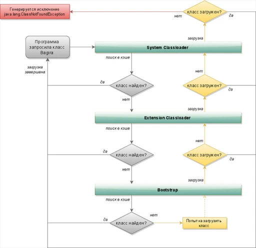

# Как происходит загрузка классов в JVM

После того, как самая сложная часть в работе программиста выполнена и приложение «Hello World 2.0» написано, осталось собрать дистрибутив и передать его заказчику, ну или хотя бы в службу тестирования. 
В дистрибутиве у нас все как полагается и, запуская нашу программу, на сцену выходит `Java Virtual Machine`. 
Ни для кого не секрет, что виртуальная машина считывает команды, представленные в `class`-файлах в виде байт-кода и транслирует их в виде инструкций процессору. 
Предлагаю немного разобраться в схеме попадания байт-кода в виртуальную машину.

## Загрузчик классов

Используется для поставки в JVM скомпилированного байт-кода, который, как правило, хранится в файлах с расширением `.class`, но может быть также получен из других источников, например, загружен по сети или же сгенерирован самим приложением.

Согласно спецификации `Java SE` для того, чтобы получить работающий в JVM код, необходимо выполнить три этапа:
+ **загрузка байт-кода из ресурсов и создание экземпляра класса `Class`**

сюда входит _поиск_ запрошенного класса среди загруженных ранее, _получение_ байт-кода для загрузки и проверка его корректности, _создание_ экземпляра класса `Class` (для работы с ним в runtime), _загрузка_ родительских классов. 
Если родительские классы и интерфейсы не были загружены, то и рассматриваемый класс считается не загруженным.

+ **связывание (или линковка)**

по спецификации этот этап разбивается еще на три стадии:

    + **Verification**, происходит проверка корректности полученного байт-кода.
    + **Preparation**, выделение оперативной памяти под статические поля и инициализация их значениями по умолчанию (при этом явная инициализация, если она есть, происходит уже на этапе инициализации).
    + **Resolution**, разрешение символьных ссылок типов, полей и методов.

+ инициализация полученного объекта

здесь, в отличие от предыдущих пунктов, вроде бы все понятно, что должно происходить. 
Было бы, конечно, интересно разобраться как именно это происходит.

### **Все эти этапы выполняются последовательно со следующими требованиями:**

+ Класс должен быть полностью загружен прежде, чем слинкован.
+ Класс должен быть полностью проверен и подготовлен прежде, чем проинициализирован.
+ Ошибки разрешения ссылок происходят во время выполнения программы, даже если были обнаружены на этапе линковки.

Как известно, в Java реализована отложенная (или ленивая) загрузка классов. 
А это значит, что загрузка классов ссылочных полей загружаемого класса не будет выполняться до тех пор, пока в приложении не встретится явное к ним обращение. 
Иными словами, разрешение символьных ссылок не обязательно и по умолчанию не происходит. 
Тем не менее, в реализации JVM может использоваться и энергичная загрузка классов, т.е. все символьные ссылки должны быть учтены сразу. 
Вот для этого пункта и действует последнее требование.

Еще стоит заметить, что разрешение символьных ссылок не привязано ни к какому из этапов загрузки класса. 
В общем каждый из этих этапов тянет на неплохое такое исследование, попробуем разобраться с первым, а именно загрузкой байт-кода.

## Типы загрузчиков Java

В Java существует три стандартных загрузчика, каждый из которых осуществляет загрузку класса из определенного места:

1. `Bootstrap` – базовый загрузчик, также называется `Primordial ClassLoader`.

загружает стандартные классы JDK из архива `rt.jar`

2. `Extension ClassLoader` – загрузчик расширений.

загружает классы расширений, которые по умолчанию находятся в каталоге `jre/lib/ext`, но могут быть заданы системным свойством `java.ext.dirs`

3. `System ClassLoader` – системный загрузчик.

загружает классы приложения, определенные в переменной среды окружения `CLASSPATH`

В Java используется иерархия загрузчиков классов, где корневым, разумеется, является базовый. 
Далее следует загрузчик расширений, а за ним уже системный. 
Естественно, каждый загрузчик хранит указатель на родительский для того, чтобы смочь делегировать ему загрузку в том случае, если сам будет не в состоянии этого сделать.

## Абстрактный класс ClassLoader

Каждый загрузчик, за исключением базового, является потомком абстрактного класса `java.lang.ClassLoader`. 
Например, реализацией загрузчика расширений является класс `sun.misc.Launcher$ExtClassLoader`, а системного загрузчика – `sun.misc.Launcher$AppClassLoader`. 
Базовый загрузчик является нативным и его реализация включена в JVM.

Любой класс, который расширяет `java.lang.ClassLoader`, может предоставить свой способ загрузки классов с блэк-джеком и этими самыми. 
Для этого необходимо переопределить соответствующие методы, которые на данный момент я могу рассмотреть только поверхностно, т.к. не разбирался детально в этом вопросе.

Вот они:

```java
package java.lang;
public abstract class ClassLoader {
    public Class<?> loadClass(String name);
    protected Class<?> loadClass(String name, boolean resolve);
    protected final Class<?> findLoadedClass(String name);
    public final ClassLoader getParent();
    protected Class<?> findClass(String name);
    protected final void resolveClass(Class<?> c);
}
```

`loadClass(String name)` один из немногих публичных методов, который и является точкой входа для загрузки классов. 
Его реализация сводится к вызову другого `protected` метода `loadClass(String name, boolean resolve)`, его и необходимо переопределить.

Если посмотреть `Javadoc` этого защищенного метода, то можно понять примерно следующее – на вход подаются два параметра. 
Один это _бинарное имя класса_ (или полностью определенное имя класса), который необходимо загрузить. 
Имя класса указывается с перечислением всех пакетов. 
Второй параметр – это _флаг_, определяющий, требуется ли выполнять процедуру разрешения символьных ссылок. 
По умолчанию он равен `false`, что означает использование _ленивой_ загрузки классов.

Далее, согласно документации, в реализации метода по умолчанию происходит вызов `findLoadedClass(String name)`, который проверяет был ли класс уже загружен ранее и если это так, вернет ссылку на этот класс. 
Иначе будет вызван метод загрузки класса у родительского загрузчика. 
Если ни один из загрузчиков не смог найти загруженный класс, каждый из них, следуя в обратном порядке, попытается этот класс найти и загрузить, переопределяя метод `findClass(String name)`.

И наконец, в последнюю очередь, после того как класс удалось загрузить, в зависимости от флага `resolve` будет решено стоит ли выполнять загрузку классов по символьным ссылкам. 
Явный пример того, что стадия `Resolution` может быть вызвана на этапе загрузки класса.

Соответственно, расширяя класс `ClassLoader` и переопределяя его методы, пользовательский загрузчик может осуществлять свою логику поставки байт-кода в виртуальную машину.

Также в Java поддерживается понятие _«текущего»_ загрузчика классов. 
Текущий загрузчик это тот, который загрузил класс, выполняющийся в данный момент. 
Каждый класс знает, каким загрузчиком он был загружен, и можно получить эту информацию, вызвав у него метод `String.class.getClassLoader()`. 
Для всех классов приложения «текущий» загрузчик, как правило, системный.

## Три принципа загрузки классов

+ Делегирование

Запрос на загрузку класса передается родительскому загрузчику, и попытка загрузить класс самостоятельно выполняется, только если родительский загрузчик не смог найти и загрузить класс. 
Такой подход позволяет загружать классы тем загрузчиком, который максимально близко находится к базовому. 
Так достигается максимальная область видимости классов. 
Каждый загрузчик ведет учет классов, которые были загружены именно им, помещая их в свой кэш. 
Множество этих классов и называется _областью видимости_.

+ Видимость

Загрузчик видит только «свои» классы и классы «родителя» и понятия не имеет о классах, которые были загружены его «потомком».

+ Уникальность

Класс может быть загружен только однажды. 
Механизм делегирования позволяет убедиться, что загрузчик, инициирующий загрузку класса, не перегрузит загруженный ранее в JVM класс.

Таким образом, при написании своего загрузчика разработчик должен руководствоваться этими тремя принципами.

## Схема загрузки классов

Когда происходит вызов загрузки какого-либо класса, происходит поиск этого класса в кэше уже загруженных классов текущего загрузчика.

Если желаемый класс еще не загружался ранее, по принципу делегирования управление передается родительскому загрузчику, который находится по иерархии на уровень выше. 
Родительский загрузчик также пытается найти желаемый класс у себя в кэше. 
Если класс уже был загружен и загрузчик знает о его местонахождении, то будет возвращен объект Class этого класса. 
Если нет, поиск будет продолжаться до тех пор, пока не дойдет до базового загрузчика. 
Если и в базовом загрузчике нет информации об искомом классе (т.е. он еще не был загружен), будет выполнен поиск байт-кода этого класса по расположению классов, о котором знает данный загрузчик, и, если загрузить класс не удастся, управление вернется обратно загрузчику-потомку, который будет пытаться выполнить загрузку из известных ему источников. 
Как уже упоминалось выше, расположение классов для базового загрузчика это библиотека `rt.jar`, для загрузчика расширений – каталог с расширениями `jre/lib/ext`, для системного – `CLASSPATH`, для пользовательского это может быть что-то свое.

Таким образом, ход загрузки классов идет в обратном направлении - _от корневого загрузчика до текущего_. 
Когда байт-код класса найден, происходит загрузка класса в JVM и получение экземпляра типа `Class`.

Как нетрудно заметить, описанная схема загрузки похожа на приведенную выше реализацию метода `loadClass(String name)`. Ниже можно рассмотреть эту схему на диаграмме.



**В качестве заключения**

На первых шагах изучения языка нет какой-то особой необходимости в понимании того, как происходит загрузка классов в Java, но знание этих базовых принципов позволит не впадать в отчаяние, встретив такие ошибки, как `ClassNotFoundException` или `NoClassDefFoundError`. 
Ну или хотя бы примерно понимать, в чем корень проблемы.

Так исключение `ClassNotFoundException` возникает при динамической загрузке класса во время выполнения программы, когда загрузчики не могут найти требуемый класс ни в кэше, ни по пути нахождения классов.

А вот ошибка `NoClassDefFoundError` является более критичной и возникает в том случае, когда во время компиляции искомый класс был доступен, но не виден во время выполнения программы. 
Это может произойти, если в поставку программы забыли включить библиотеку, которую она использует.

Ну и сам факт понимания принципов устройства того инструмента, которым пользуешься в работе (не обязательно четкое и детальное погружение в его недра), добавляет некоторую ясность в понимании протекающих внутри этого механизма процессов, что, в свою очередь, ведет к уверенному использованию этого инструмента.
