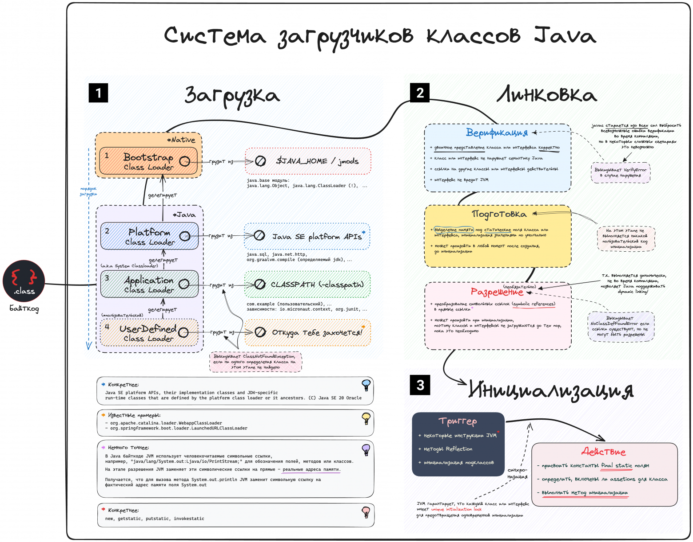
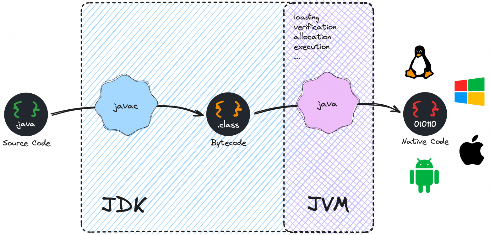
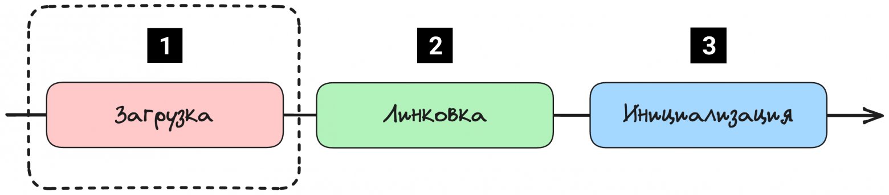
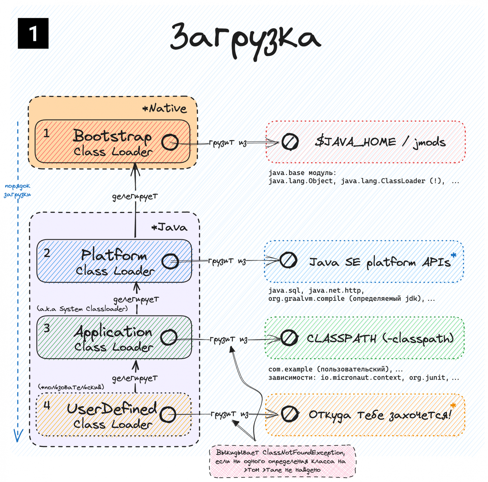
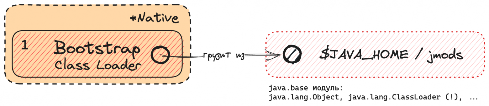
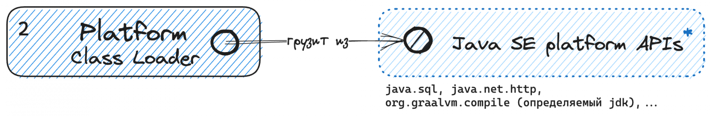
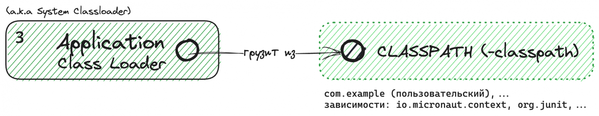

# Как на самом деле работает Java ClassLoader system? (с картинками) — Часть 1/3, Загрузка

Когда я впервые погрузился в мир загрузчиков классов Java, это было ответом на любопытный вопрос. 
Популярные источники (Wikipedia, Baeldung, DZone) содержат устаревшую, иногда противоречащую друг другу информацию, и это несоответствие послужило толчком для написания этой статьи — поиска ясности в лабиринте `ClassLoader System`.

Будучи разработчиком Java, вы наверняка сталкивались с `ClassNotFoundException` или `NoClassDefFoundError` — загадочными сообщениями, которые на мгновение останавливают наш процесс разработки. 
Класс не найден — понятно по названию, но не найден где? Кто и как его ищет, куда доставляет?

Попробуем погрузиться в эту тему вместе, отбросив сложности, в стиле небольших диаграмм. 
Полная картина того, о чем пойдет речь в этой серии статей:



Система загрузчиков классов Java

## Предложение

Прежде чем перейти к рассмотрению механизмов работы загрузчиков классов, важно подчеркнуть одну деталь:

`Не существует "универсальной" конструкции виртуальной машины Java.`

Спецификация JVM от компании Oracle, устанавливает ожидаемые компоненты и поведение для любой JVM. 
Однако, эта спецификация не предписывает конкретный подход к реализации этих компонентов, что приводит к тому, что на практике существует целый ряд уникальных реализаций, включая, но не ограничиваясь HotSpot/OpenJDK, Eclipse OpenJ9, GraalVM (основанной на OpenJDK). 
Каждая из реализаций следует спецификации, но при этом может отличаться по ряду аспектов, как производительность, стратегии сборки мусора и, как несложно предположить, детали процесса загрузки классов.

Отдельный момент, требующий внимания:

`Виртуальные машины Java платформо-зависимы.`

JVM для Windows OS не идентична JVM для Linux. 
"Но подождите", — скажете вы, — "я думал, что Java — это все о том, чтобы написать один раз, выполнить везде — независимость от платформы!". 
Совершенно верно. Однако независимость Java от платформы не означает, что JVM также независима от платформы. Совсем наоборот.

В большинстве статей на эту тему при описании не указывается ни конкретная версия Java, ни описанная реализация VM, что приводит к недопониманию, поскольку JVM развивается и изменяется с каждой версией. 
Сейчас лето 2023 года, и мир Java находится в предвкушении 21-й версии, но пока она не вышла, мы будем ориентироваться на Java 20, опираясь на саму спецификацию JVM от Oracle, и документацию Oracle Java SE для удобства.

Учитывая это, вернемся к нашей системе загрузчиков

## Начиная с основ

Говоря упрощенно, при запуске приложения **JVM загружает** в память необходимые классы, **проверяет** байткод, **выделяет** необходимые ресурсы и, наконец, **выполняет** код, преобразуя байткод в инструкции машинного языка, понятные конечной машине.



Упрощенный путь преобразования исходного кода Java в нативный код платформы

Но что на самом деле означает это _JVM загружает_? Спецификация Java SE приводит следующий комментарий:

    Loading refers to the process of finding the binary form of a class or interface with a particular name, perhaps by computing it on the fly, but more typically by retrieving a binary representation previously computed from source code by a Java compiler, and constructing, from that binary form, a Class object to represent the class or interface.

    **Загрузка** — это процесс поиска двоичной формы класса или интерфейса с определённым именем. Возможно, она вычисляется на лету, но чаще всего двоичное представление извлекается из исходного кода, ранее вычисленного компилятором Java, и на основе этого двоичного представления создаётся объект Class для представления класса или интерфейса.

Формулируя более простым языком, когда мы говорим о "загрузке класса", мы имеем в виду:

`Процесс **поиска** соответствующего файла .class на диске, **чтения** его содержимого и **передачи** его в среду выполнения JVM, которая представляет собой определенную часть памяти машины, предназначенную для выполнения вашего приложения.`

## Погружаясь глубже

В действительности, система загрузчиков классов не просто находит классы — она обеспечивает целостность и безопасность Java-приложения, соблюдая правила бинарной структуры и пространства имен среды выполнения Java.

Стоит добавить, что она обеспечивает гибкость загрузки классов из различных источников — не только из локальной файловой системы, но и по сети, из базы данных или даже сгенерированных налету.

В этой статье мы углубимся в процесс загрузки, но для полного понимания стоит упомянуть, что этапа всего 3:




Этапы системы загрузки классов Java

## Загрузка (Loading) — Начальная фаза

Процесс начинается с того, что загрузчик класса (далее, `ClassLoader`) получает задание найти определенный класс, что может быть инициировано самой JVM, или вызвано командой в вашем коде. 
Задача же здесь заключается в том, чтобы взять полное имя класса (например, `java.lang.String`) и получить соответствующий файл класса (например, `String.class`) из его местоположения на диске —> в память JVM.



Этап загрузки, начальный из этапов Системы Загрузчиков Классов Java

Здесь важно понимать, что _подсистема Загрузки_ — это не одиночный акт, а иерархическая эстафета. 
Каждый **ClassLoader**, родительский и дочерний, работает совместно, передавая эстафету ответственности до тех пор, пока нужный класс в конце концов не будет загружен.

Основополагающими **принципами**, определяющими этот скоординированный процесс загрузки классов, являются (полагайся на диаграмму для понимания):

+ **Видимость** (_Visibility_): Дочерний `ClassLoader` _может_ видеть классы, загруженные его родителем, но _не наоборот_, что обеспечивает инкапсуляцию;

+ **Уникальность** (_Uniqueness_): Класс, загруженный родителем, _не будет_ повторно загружен его дочерним классом, что повышает эффективность;

+ **Иерархия делегирования** (_Delegation Hierarchy_): `Application ClassLoader` (дочерний) передает запрос на загрузку класса родителям, загрузчикам `Platform` и `Bootstrap`. 
Если они не могут найти класс, то запрос передается обратно по цепочке, пока класс не будет найден, или не выкинут соответсвующий `ClassNotFoundException`.

Рассмотрим каждый загрузчик подробнее.

**Boostrap ClassLoader**



Bootstrap ClassLoader

Старейший представитель семейства, `Bootstrap ClassLoader`, отвечает за загрузку _основных библиотек_ Java, расположенных в `java.base` модуле (`java.lang`, `java.util` и т.д.), необходимых для старта JVM.

Обратя внимания на диаграмму можно заметить, что другие загрузчики классов написаны на Java (объекты `java.lang.ClassLoader`), что означает — их также необходимо загрузить в JVM! 
Эту задачу также выполняет `Bootstrap ClassLoader`.

Во многих ресурсах `Bootstrap ClassLoader` описывается как "родитель" остальных загрузчиков классов. 
В действительности, это означает лишь логическое наследование, а не наследование Java, поскольку `Bootstrap` загрузчик написан на `native` коде, и встроен в виртуальную машину.

Убедимся на практике, что никаких Java загрузчиков, выше самих `java.lang` загрузчиков нет:

`jshell> System.out.println(java.lang.ClassLoader.class.getClassLoader());
null`

`Bootstrap ClassLoader` также является единственным загрузчиком, явно описанным в спецификации Oracle. 
Остальные зовутся "`User-defined`", и оставляются на рассмотрение конкретных вендоров вирутальных машин.

## Platform ClassLoader

На мой взгляд, самый противоречивый.



Platform ClassLoader

Документация Java SE 20 говорит о нем следующее:

    The platform class loader is responsible for loading the platform classes. 
    Platform classes include Java SE platform APIs, their implementation classes, and JDK-specific run-time classes that are defined by the platform class loader or its ancestors. 
    The platform class loader can be used as the parent of a ClassLoader instance.

    Загрузчик классов платформы отвечает за загрузку классов платформы. 
    Классы платформы включают в себя API-интерфейсы платформы Java SE, классы их реализации и специфичные для JDK классы времени выполнения, которые определяются загрузчиком классов платформы или его предками. 
    Загрузчик классов платформы может использоваться в качестве родительского элемента для экземпляра ClassLoader.

Но что отличает _классы платформы от основных классов_, загружаемых `Bootstrap` загрузчиком? 
Посмотрим, что он на самом деле загружает:

    jshell> ClassLoader.getPlatformClassLoader().getDefinedPackages();
    $1 ==> Package[0] { } // empty

Получается, что в пустой Java-программе — абсолютно ничего! 
Теперь попробуем явно использовать класс из какого-нибудь стандартного пакета:

    jshell> java.sql.Connection.class.getClassLoader()
    $2 ==> jdk.internal.loader.ClassLoaders$PlatformClassLoader@27fa135a
    
    jshell> ClassLoader.getPlatformClassLoader().getDefinedPackages()
    $3 ==> Package[1] { package java.sql }

Получается, проще говоря, `Bootstrap` загружает основные классы необходимые для запуска JVM, а `Platform` — публичные типы системных модулей, которые могут понадобиться. 
Конкретного разделения необходимых/возможных модулей Java SE я не нашел.

В этом контексте также важно отметить, что во многих источниках (Wiki, Baeldung, последнее обновление 2022, 2023 соответственно) `Platform ClassLoader` обзывают `Extension ClassLoader`, что на деле не совсем так.

Правильнее было бы утверждать, что `Platform ClassLoader` пришел на смену `Extension ClassLoader`, который искал в `$JAVA_HOME/lib/ext`, и использовался в Java 8 и более ранних версиях. 
Это изменение произошло с появлением Системы Модулей (JEP-261):

    The extension class loader is no longer an instance of URLClassLoader but, rather, of an internal class. 
    It no longer loads classes via the extension mechanism, which was removed by JEP 220. 
    It does, however, define selected Java SE and JDK modules, about which more below. 
    In its new role this loader is known as the platform class loader, it is available via the newClassLoader::getPlatformClassLoader method, and it will be required by the Java SE Platform API Specification.

    Загрузчик классов расширений больше не является экземпляром `URLClassLoader`, а представляет собой внутренний класс. 
    Он больше не загружает классы с помощью механизма расширений, который был удалён в соответствии с JEP 220. 
    Однако он определяет выбранные модули Java SE и JDK, о чём подробнее будет сказано ниже. 
    В своей новой роли этот загрузчик известен как загрузчик классов платформы. 
    Он доступен через метод `newClassLoader::getPlatformClassLoader` и будет требоваться в соответствии со спецификацией `Java SE Platform API`.

## Application ClassLoader



Application (a.k.a. System) ClassLoader

`Application ClassLoader`, также известный как **системный загрузчик классов**, пожалуй, самый user-friendly из всех. 
Именно этот загрузчик подгружает ваши собственные реализации и библиотеки зависимостей, которые вы передали JVM (явно или неявно) при старте приложения в качестве -classpath (-cp) параметра.

```java
public class HabrTeller {

    public static void main(String[] args) {
        // jdk.internal.loader.ClassLoaders$AppClassLoader@251a69d7
        System.out.print(HabrTeller.class.getClassLoader());
    }
}
```

С точки зрения иерархии, _Application загрузчик_ является порождением _Platform загрузчика_, и в документации о нем говорится следующее:

    This is the default delegation parent for new java.lang.ClassLoader instances, and is typically the class loader used to start the application.
    ClassLoader.getSystemClassLoader() method is first invoked early in the runtime's startup sequence, at which point it creates the system class loader. This class loader will be the context class loader for the main application thread (for example, the thread that invokes the main method of the main class).

    Это родительский делегат по умолчанию для новых экземпляров `java.lang.ClassLoader`, который обычно используется для запуска приложения. 
    Метод `ClassLoader.getSystemClassLoader()` впервые вызывается на раннем этапе запуска среды выполнения, когда создается системный загрузчик классов. 
    Этот загрузчик классов будет контекстным загрузчиком классов для основного потока приложения (например, потока, который вызывает метод `main` класса `main`).

Резюмирая, именно этот загрузчик является _родителем основного потока приложения_, и будет являться `родителем ваших собственных загрузчиков классов`, если вы решите реализовать один.

В дополнение к трем рассмотренным, основным загрузчикам, вы можете создавать свои собственные, пользовательские загрузчики классов, непосредственно в своих Java программах, позволяя обеспечить независимость приложений (чему способствует модель делегирования загрузчиков):


Место пользовательского загрузчика классов в иерархии ClassLoader Loading System

В серверах типа `Tomcat`, этот подход используется для обеспечения _независимой_ работы различных Web-приложений и корпоративных решений, _даже если они размещены на одном сервере_. 
Из популярных открытых примеров, мне удалось найти несколько, для дополнительного ознакомления:

+ Tomcat's Catalina WebappLoader

+ Spring Boot's LaunchedURLClassLoader

Статей по созданию собственных загрузчиков классов написано уже немало, и целью этой статьи служит скорее теория, а не практика, но при должном интересе — можем написать обновленную, отдельную версию.

На этом этапе подпроцесс загрузки подходит к концу: результатом является двоичное представление класса или типа интерфейса в JVM. 
Однако на этом этапе класс еще не готов к использованию, и мы рассмотрим следующий этап — `Linking` — во второй части этой серии.

Спасибо, что дочитали до конца! Надеюсь, вы почерпнули что-то интересное. 
Данный материал не претендует на звание _single source of truth_, но мы действительно постарались ссылаться на официальную документацию и спецификацию языка, опуская субьективное и неофициальное.
