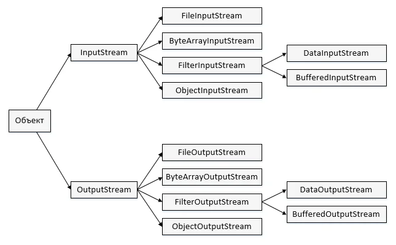

# Java – Потоки ввода/вывода и работа с файлами и каталогами

Пакет `java.io` содержит почти каждый класс, который может потребоваться Вам для совершения ввода и вывода в Java.  
Все данные потоки представлены потоком ввода и адресом вывода.  
Поток в пакете `java.io` осуществляет поддержку различных данных, таких как примитивы, объекты, локализованные символы и т.д. 

## Потоки

**Потоки в Java** определяются в качестве последовательности данных. Существует два типа потоков:

+ `InPutStream` – поток ввода используется для считывания данных с источника.
+ `OutPutStream` – поток вывода используется для записи данных по месту назначения.

Java предоставляет сильную, но гибкую поддержку в отношении ввода/вывода, связанных с файлами и сетями, однако в данном руководстве рассмотрены лишь базовые функции, связанные с потоками и вводом/выводом. 
Рассмотрим далее по порядку наиболее распространенные примеры. 

## Байтовый поток

Потоки байтов в Java используются для осуществления ввода и вывода 8-битных байтов. 
Несмотря на множество классов, связанных с потоками байтов, наиболее распространено использование следующих классов: `FileInputStream` и `FileOutputStream`. 
Ниже рассмотрен пример, иллюстрирующий использование данных двух классов для копирования из одного файла в другой.

**Примечание по примеру**: чтобы скопировать файл, необходимо в папке проекта создать файл `file.txt` с любым или пустым содержимым.

Пример

```java
import java.io.*;
public class FileCopy {

   public static void main(String args[]) throws IOException {  
      FileInputStream fileIn = null;
      FileOutputStream fileOut = null;

      try {
         fileIn = new FileInputStream("file.txt");
         fileOut = new FileOutputStream("copied_file.txt");
         
         int a;
	     // Копирование содержимого файла file.txt
         while ((a = fileIn.read()) != -1) {
            fileOut.write(a); // Чтение содержимого файла file.txt и запись в файл copied_file.txt
         }
      } finally {
         if (fileIn != null) {
            fileIn.close();
         }
         if (fileOut != null) {
            fileOut.close();
         }
      }
   }
}
```

Теперь рассмотрим файл `file.txt` со следующим содержимым:

`Содержимое файла file.txt`

В качестве следующего шага необходимо скомпилировать java-программу и выполнить ее, что позволит создать файл `copied_file.txt` с тем же содержимым, что имеется в `file.txt`. 
Таким образом, разместим обозначенный код в файле `FileCopy.java` и выполним следующее действие:

```bash
$javac FileCopy.java
$java FileCopy
```

## Символьные потоки

Потоки байтов в Java позволяют произвести ввод и вывод 8-битных байтов, в то время как потоки символов используются для ввода и вывода 16-битного юникода. 
Несмотря на множество классов, связанных с потоками символов, наиболее распространено использование следующих классов: `FileReader` и `FileWriter`. 
Несмотря на тот факт, что внутренний `FileReader` использует `FileInputStream`, и `FileWriter` использует `FileOutputStream`, основное различие состоит в том, что `FileReader` производит считывание двух байтов в конкретный момент времени, в то время как `FileWriter` производит запись двух байтов за то же время.

Мы можем переформулировать представленный выше пример, в котором два данных класса используются для копирования файла ввода (с символами юникода) в файл вывода.

**Примечание по примеру**: чтобы скопировать файл, необходимо в папке проекта создать файл `file.txt` с любым или пустым содержимым.

Пример

```java
import java.io.*;
public class FileCopy {

   public static void main(String args[]) throws IOException {
      FileReader fileIn = null;
      FileWriter fileOut = null;

      try {
         fileIn = new FileReader("file.txt");
         fileOut = new FileWriter("copied_file.txt");
         
         int a;
         while ((a = fileIn.read()) != -1) {
            fileOut.write(a);
         }
      } finally {
         if (fileIn != null) {
            fileIn.close();
         }
         if (fileOut != null) {
            fileOut.close();
         }
      }
   }
}
```

Теперь рассмотрим файл `file.txt` со следующим содержимым:

`Содержимое файла file.txt`

В качестве следующего шага необходимо скомпилировать программу и выполнить ее, что позволит создать файл `copied_file.txt` с тем же содержимым, что имеется в `file.txt`. 
Таким образом, разместим обозначенный код в файле `FileCopy.java` и выполним следующее действие:

```bash
$javac FileCopy.java
$java FileCopy
```

## Стандартные потоки

Все языки программирования обеспечивают поддержку стандартного ввода/вывода, где программа пользователя может произвести ввод посредством клавиатуры и осуществить вывод на экран компьютера. 
Если вы знакомы с языками программирования C либо C++, вам должны быть известны три стандартных устройства `STDIN`, `STDOUT` и `STDERR`. 
Аналогичным образом, Java предоставляет следующие три стандартных потока:

+ **Стандартный ввод** – используется для перевода данных в программу пользователя, клавиатура обычно используется в качестве стандартного потока ввода, представленного в виде `System.in`.
+ **Стандартный вывод** – производится для вывода данных, полученных в программе пользователя, и обычно экран компьютера используется в качестве стандартного потока вывода, представленного в виде `System.out`.
+ **Стандартная ошибка** – используется для вывода данных об ошибке, полученной в программе пользователя, чаще всего экран компьютера служит в качестве стандартного потока сообщений об ошибках, представленного в виде `System.err`.

Ниже представлена простая программа, которая создает `InputStreamReader` для чтения стандартного потока ввода, до введения пользователем "q":

Пример

```java


import java.io.*;
public class ReadConsole {

   public static void main(String args[]) throws IOException {
      InputStreamReader inStRe = null;

      try {
         inStRe = new InputStreamReader(System.in);
         System.out.println("Введите символы, символ 'q' для выхода.");
         char a;
         do {
            a = (char) inStRe.read();
            System.out.print(a);
         } while(a != 'q');
      }finally {
         if (inStRe != null) {
            inStRe.close();
         }
      }
   }
}
```

Разместим представленный выше код в файле `ReadConsole.java` и попробуем скомпилировать и выполнить его согласно тому, как это представлено в следующей программе. 
Данная программа продолжает чтение и вывод одного и того же символа до нажатия 'q':

```bash
$javac ReadConsole.java
$java ReadConsole
Введите символы, 'q' для выхода.
proglang.su
proglang.su
q
q
```

## Чтение и запись файла

Как было указано выше, поток представляет собой последовательность данных. 
`InputStream` используется для считывания данных с источника, `OutputStream` служит для записи данных по месту назначения.

Ниже представлена иерархия классов для управления потоками Ввода и Вывода.



## Поток `FileInputStream` – чтение из файла

Поток `FileInputStream` – это поток, который используется в Java для чтения данных из файла. 
Объекты могут быть созданы при использовании ключевого слова `new`, доступны несколько типов конструкторов.

Представленный конструктор использует имя файла в качестве потока с целью создания объекта входного потока для считывания файла:

`InputStream a = new FileInputStream("D:/myprogramm/java/test");`

Представленный ниже конструктор использует объектный файл с целью создания объекта входного потока для чтения файла. 
Сперва мы создаем объектный файл при использовании метода `File()` следующим образом:

```java
File a = new File("D:/myprogramm/java/test");`
InputStream a = new FileInputStream(a);
```

Теперь, получив объект `InputStream`, следует ознакомиться со следующим перечнем вспомогательных методов, которые могут быть использованы для считывания потока либо выполнения иных операций в потоке.

| **№** | **Метод и описание**                                                                                                                                                                                                                                               |
|:------|:-------------------------------------------------------------------------------------------------------------------------------------------------------------------------------------------------------------------------------------------------------------------|
| 1     | public void close() throws IOException{} <br/>Данный метод в Java закрывает выходной файловый поток. Освобождает какие-либо системные ресурсы, связанные с файлом. Выдает IOException.                                                                             |
| 2     | protected void finalize()throws IOException {}<br/>Данный метод выполняет очистку соединения с файлом. Позволяет удостовериться в вызове закрытого метода данного выходного файлового потока при отсутствии каких-либо ссылок на данный поток. Выдает IOException. |
| 3     | public int read(int r)throws IOException{}<br/> Данный метод осуществляет в Java считывание заданных байтов данных из InputStream. Возврат данных типа int. Возврат следующего байта данных, в конце файла будет произведен возврат к -1.                          |
| 4     | public int read(byte[] r) throws IOException{}<br/> Данный метод производит считывание байтов r.length из входного потока в массив. Возврат общего числа считанных байтов. В конце файла будет произведен возврат к -1.                                            |
| 5     | public int available() throws IOException{}<br/> Выдает число байтов, которые могут быть считаны из входного файлового потока. Возврат данных типа int.                                                                                                            |	

Существуют также другие доступные входные потоки:
+ `ByteArrayInputStream`
+ `DataInputStream`

## Поток FileOutputStream – создание и запись файла

Поток `FileOutputStream` – это поток, который используется в Java для создания файла и последующей записи в него. 
Поток создаст файл в случае его отсутствия перед его открытием для вывода.

Далее представлены два конструктора, которые могут быть задействованы при создании объекта `FileOutputStream`.

Представленный конструктор использует имя файла в качестве строки с целью создания объекта входного потока для записи файла в Java:

`OutputStream a = new FileOutputStream("D:/myprogramm/java/test")` 

Представленный ниже конструктор использует объектный файл с целью создания объекта выходного потока для записи файла. 
Сперва мы создаем объектный файл при использовании метода `File()` следующим образом:

```java
File a = new File("D:/myprogramm/java/test");
OutputStream a = new FileOutputStream(a);
```

Теперь, получив объект `OutputStream`, следует ознакомиться со следующим перечнем вспомогательных методов, которые могут быть использованы для записи потока либо выполнения иных операций в потоке.

| **№** | **Метод и описание**                                                                                                                                                                                                                                            |
|:------|:----------------------------------------------------------------------------------------------------------------------------------------------------------------------------------------------------------------------------------------------------------------|
| 1     | public void close() throws IOException{}<br/> Данный метод в Java закрывает выходной файловый поток. Освобождает какие-либо системные ресурсы, связанные с файлом. Выдает IOException                                                                           | 
| 2     | protected void finalize() throws IOException {} Данный метод выполняет очистку соединения с файлом. Позволяет удостовериться в вызове закрытого метода данного выходного файлового потока при отсутствии каких-либо ссылок на данный поток. Выдает IOException. |                                                                                                                                                                                            |
| 3     | public void write(int w)throws IOException{}<br/> Данный метод осуществляет запись заданного байта в выходной поток.                                                                                                                                            |
| 4     | public void write(byte[] w)<br/> Запись байтов w.length из указанного массива байтов в OutputStream.                                                                                                                                                            |

Существуют также другие доступные выходные потоки:
+ `ByteArrayOutputStream`
+ `DataOutputStream`

Пример

В следующем примере представлены `InputStream` и `OutputStream` – потоки для чтения, создания и записи файла:

```java
import java.io.*;
public class File {

   public static void main(String args[]) {
   
      try {
         char c[] = {'a','b','c'};
         OutputStream output = new FileOutputStream("file.txt"); // Создание текстового файла
         for(int i = 0; i < c.length; i++) {
            output.write(c[i]); // Запись каждого символа в текстовый файл
         }
         output.close();
     
         InputStream input = new FileInputStream("file.txt");
         int size = input.available();

         for(int j = 0; j < size; j++) {
            System.out.print((char)input.read() + " "); // Чтение текстового файла посимвольно
         }
         input.close();
      }catch(IOException e) {
         System.out.print("Exception");
      }	
   }
}
```

Представленный выше java-код создаст файл `file.txt` и пропишет заданные символы в формате `char`. 
То же самое будет выводиться на экран стандартного вывода.

## Навигация по файловой системе и вводу/выводу

Существует ряд других классов, которые нам предстоит рассмотреть с целью ознакомления с основами навигации в файловой системе и вводу/выводу.

+ File Class
+ FileReader Class
+ FileWriter Class

## Каталоги в Java

В Java каталог представлен Файлом, который может содержать список других файлов и каталогов. 
Используя объект `File`, вы можете создать каталог, прокрутить список файлов, представленных в каталоге. 
Для получения более детальных сведений, ознакомьтесь с перечнем всех методов, которые могут быть вызваны из объекта `File`, будучи связанными с каталогами.

##  Создание каталогов

Существуют два служебных метода `File`, которые могут быть использованы для создания каталогов:
+ Метод `mkdir()` позволяет создать папку в Java, возвращая значение `true` при успехе операции, и `false` в случае сбоя. Сбой свидетельствует о том, что путь указанный в объекте `File` уже существует, либо что каталог не может быть создан в связи с тем, что полный путь еще не существует.
+ Метод `mkdirs()` создает каталог и все вышестоящие каталоги.
+ 
В следующем примере представлено создание папки `"/java/proglang/newdir"`:

Пример

```java
import java.io.File;
public class CreateDirectory {

   public static void main(String args[]) {
      String nameDir = "/java/proglang/newdir";
      File a = new File(nameDir);
      
      // Создание на диске папки и всех вышестоящих каталогов
      a.mkdirs();
   }
}
```

Скомпилируйте и выполните следующий код для создания каталога `"/java/proglang/newdir"`.

Примечание: Java автоматически формирует разделители пути в UNIX и Windows с учетом соглашений. 
При использовании косой черты (`/`) при работе с Java в системе Windows, производится корректное разрешение пути.

## Список файлов в папке

Метод `list()`, представленный объектом `File`, может быть использован для предоставления перечня всех файлов и каталогов, имеющихся в заданной папке, в следующем виде:

Пример

```java
import java.io.File;
public class ReadDirectory {

   public static void main(String[] args) {
      File pathDir = null;
      String[] pathsFilesAndDir;
  
      try {      
         // Создание нового объекта file
         pathDir = new File("/NetBeans 8.2/Projects/ReadDirectory/ReadDirectory/"); // Обязательно должен существовать указанный каталог на диске, иначе программа выдаст ошибку

         // Массив файлов и папок
         pathsFilesAndDir = pathDir.list();

         for(String path : pathsFilesAndDir) {
            // Вывод списка файлов и каталогов
            System.out.println(path);
         }
      }catch(Exception e) {
         // Если произошла ошибка
         e.printStackTrace();
      }
   } 
}
```

Вследствие этого будет получен следующий результат, основанный на каталогах и файлах, доступных в вашем каталоге `/NetBeans 8.2/Projects/ReadDirectory/ReadDirectory/`:

```bash
build
build.xml
manifest.mf
nbproject
src
ReadDirectory
```