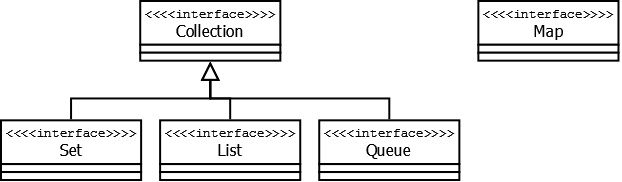
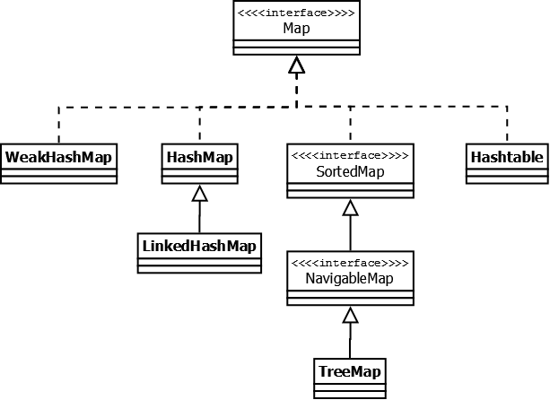
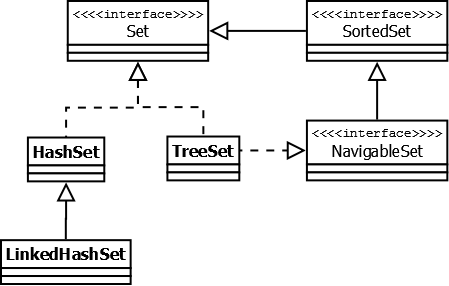
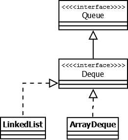

# Справочник по Java Collections Framework

Данная публикация не является полным разбором или анализом (не покрывает пакет `java.util.concurrent)`. 
Это, скорее, справочник, который поможет начинающим разработчикам понять ключевые отличия одних коллекций от других, а более опытным разработчикам просто освежить материал в памяти.

## Что такое `Java Collections Framework`?

`Java Collection Framework` — иерархия интерфейсов и их реализаций, которая является частью JDK и позволяет разработчику пользоваться большим количесвом структур данных из «коробки».

## Базовые понятия

На вершине иерархии в `Java Collection Framework` располагаются 2 интерфейса: `Collection` и `Map`. 
Эти интерфейсы разделяют все коллекции, входящие во фреймворк на две части по типу хранения данных: 
+ простые последовательные наборы элементов
+ наборы пар «ключ — значение» (словари).

**`Collection`** — этот интерфейс находится в составе JDK c версии 1.2 и определяет основные методы работы с простыми наборами элементов, которые будут общими для всех его реализаций (например `size()`, `isEmpty()`, `add(E e`) и др.). 
Интерфейс был слегка доработан с приходом дженериков в Java 1.5. 
Также, в версии Java 8, было добавлено несколько новых методов для работы с лямбдами (такие как `stream()`, `parallelStream()`, `removeIf(Predicate<? super E> filter)` и др.).

Важно также отметить, что эти методы были реализованы непосредственно в интерфейсе как `default`-методы.

**`Map`**. Данный интерфейс также находится в составе JDK c версии 1.2 и предоставляет разработчику базовые методы для работы с данными вида «ключ — значение». 
Также как и `Collection`, он был дополнен дженериками в версии Java 1.5 и в версии Java 8 появились дополнительные методы для работы с _лямбдами_, а также методы, которые зачастую реализовались в логике приложения (`getOrDefault(Object key, V defaultValue)`, `putIfAbsent(K key, V value)`)

**Интерфейс `Map`**

**`Hashtable`** — реализация такой структуры данных, как хэш-таблица. 
Она не позволяет использовать `null` в качестве значения или ключа. 
Эта коллекция была реализована раньше, чем `Java Collection Framework`, но в последствии была включена в его состав. 
Как и другие коллекции из Java 1.0, `Hashtable` является синхронизированной (почти все методы помечены как `synchronized`). 
Из-за этой особенности у неё имеются существенные проблемы с производительностью и, начиная с Java 1.2, в большинстве случаев рекомендуется использовать другие реализации интерфейса `Map` ввиду отсутствия у них синхронизации.

**`HashMap`** — коллекция является альтернативой `Hashtable`. 
Двумя основными отличиями от `Hashtable` являются то, что `HashMap` не синхронизирована и `HashMap` позволяет использовать `null` как в качестве ключа, так и значения. 
Так же как и `Hashtable`, данная коллекция н*е является упорядоченной*: порядок хранения элементов зависит от хэш-функции. 
_Добавление_ элемента выполняется за константное время `O(1)`, но время удаления, получения зависит от распределения хэш-функции. 
В идеале является константным, но может быть и линейным O(n).

**`LinkedHashMap`** — это упорядоченная реализация хэш-таблицы. 
Здесь, в отличии от `HashMap`, порядок итерирования равен порядку добавления элементов. 
Данная особенность достигается благодаря _двунаправленным_ связям между элементами (аналогично `LinkedList`). 
Но это преимущество имеет также и недостаток — увеличение памяти, которое занимет коллекция.

**`TreeMap`** — реализация `Map` основанная на _красно-чёрных деревьях_. 
Как и `LinkedHashMap` является _упорядоченной_. 
По-умолчанию, коллекция сортируется по ключам с использованием принципа _"natural ordering"_, но это поведение может быть настроено под конкретную задачу при помощи объекта `Comparator`, который указывается в качестве параметра при создании объекта `TreeMap`.

**`WeakHashMap`** — реализация хэш-таблицы, которая организована с использованием `weak references`. 
Другими словами, `Garbage Collector` автоматически удалит элемент из коллекции при следующей сборке мусора, если на ключ этого элеметна нет жёстких ссылок.

**Интерфейс `List`**

Реализации этого интерфейса представляют собой упорядоченные коллекции. 
Кроме того, разработчику предоставляется возможность доступа к элементам коллекции по индексу и по значению (так как реализации позволяют хранить дубликаты, результатом поиска по значению будет первое найденное вхождение).

**`Vector`** — реализация _динамического_ массива объектов. 
Позволяет хранить любые данные, включая `null` в качестве элемента. 
`Vector` появился в JDK версии Java 1.0, но как и `Hashtable`, эту коллекцию не рекомендуется использовать, если не требуется достижения потокобезопасности. 
Потому как в `Vector`, в отличии от других реализаций `List`, все операции с данными являются _синхронизированными_. 
В качестве альтернативы часто применяется аналог — `ArrayList`.

**`Stack`** — данная коллекция является _расширением_ коллекции `Vector`. 
Была добавлена в Java 1.0 как реализация стека `LIFO (last-in-first-out)`. 
Является _частично_ синхронизированной коллекцией (кроме метода добавления `push()`). 
После добавления в Java 1.6 интерфейса `Deque`, рекомендуется использовать именно реализации этого интерфейса, например `ArrayDeque`.

**`ArrayList`** — как и `Vector` является _реализацией_ динамического массива объектов. 
Позволяет хранить любые данные, включая `null` в качестве элемента. 
Как можно догадаться из названия, его реализация основана на обычном _массиве_. 
Данную реализацию следует применять, если в процессе работы с коллекцией предплагается _частое_ обращение к элементам по индексу. 
Из-за особенностей реализации поиндексное обращение к элементам выполняется за константное время `O(1)`. 
Но данную коллекцию рекомендуется _избегать_, если требуется частое удаление/добавление элементов в середину коллекции.

**`LinkedList`** — ещё одна реализация `List`. 
Позволяет хранить любые данные, включая `null`. 
Особенностью реализации данной коллекции является то, что в её основе лежит _двунаправленный_ связный список (каждый элемент имеет ссылку на предыдущий и следующий). 
Благодаря этому, добавление и удаление из середины, доступ по индексу, значению происходит за линейное время `O(n)`, а из начала и конца за константное `O(1)`. 
Так же, ввиду реализации, данную коллекцию можно использовать как стек или очередь. 
Для этого в ней реализованы соответствующие методы.

**Интерфейс `Set`**

Представляет собой неупорядоченную коллекцию, которая не может содержать дублирующиеся данные. 
Является программной моделью математического понятия «_множество_».

**`HashSet`** — реализация интерфейса `Set`, базирующаяся на `HashMap`. 
Внутри использует объект `HashMap` для хранения данных. 
В качестве _ключа_ используется _добавляемый элемент_, а в качестве _значения_ — _объект-пустышка_ (`new Object()`). 
Из-за особенностей реализации _порядок_ элементов _не гарантируется_ при добавлении.

**`LinkedHashSet`** — отличается от `HashSet` только тем, что в основе лежит `LinkedHashMap` вместо `HashMap`. 
Благодаря этому отличию порядок элементов при обходе коллекции является идентичным порядку добавления элементов.

**`TreeSet`** — аналогично другим классам-реализациям интерфейса `Set` содержит в себе объект `NavigableMap`, что и обуславливает его поведение. 
Предоставляет возможность _управлять_ порядком элементов в коллекции при помощи объекта _Comparator_, либо сохраняет элементы с использованием "n*atural ordering*".

**Интерфейс `Queue`**

Этот интерфейс описывает коллекции с предопределённым _способом_ вставки и извлечения элементов, а именно — очереди `FIFO (first-in-first-out)`. 
Помимо методов, определённых в интерфейсе `Collection`, определяет _дополнительные_ методы для извлечения и добавления элементов в очередь. 
Большинство реализаций данного интерфейса находится в пакете `java.util.concurrent` и подробно рассматриваются в данном обзоре.

**`PriorityQueue`** — является единственной прямой реализацией интерфейса `Queue` (была добавлена, как и интерфейс `Queue`, в Java 1.5), не считая класса `LinkedList`, который так же реализует этот интерфейс, но был реализован намного раньше. 
Особенностью данной очереди является возможность _управления_ порядком элементов. 
По-умолчанию, элементы сортируются с использованием «`natural ordering`», но это поведение может быть _переопределено_ при помощи объекта `Comparator`, который задаётся при создании очереди. 
Данная коллекция не поддерживает `null` в качестве элементов.

**`ArrayDeque`** — реализация интерфейса `Deque`, который _расширяет_ интерфейс `Queue` методами, позволяющими реализовать конструкцию вида `LIFO (last-in-first-out)`. 
Интерфейс `Deque` и реализация `ArrayDeque` были добавлены в Java 1.6. 
Эта коллекция представляет собой реализацию с использованием массивов, подобно `ArrayList`, но _не позволяет_ обращаться к элементам по индексу и хранение `null`. 
Как заявлено в документации, коллекция работает _быстрее_ чем `Stack`, если используется как `LIFO` коллекция, а также _быстрее_ чем `LinkedList`, если используется как `FIFO`.

## Заключение

`Java Collections Framework` содержит большое количество различных структур данных, доступных в JDK «из коробки», которые в большинстве случаев покрывают все потребности при реализации логики приложения. 
Сравнение временных характеристик основных коллекций, которые зачастую используются в разработке приложений приведено в таблице:

При необходимости, разработчик может создать собственную реализацию, расширив или переопределив существующую логику, либо создав свою собственную реализацию подходящего интерфейса с нуля. 
Также существует некоторое количество готовых решений, которые являются альтернативой или дополнением к `Java Collections Framework`. 
Наиболее популярными являются `Google Guava` и `Commons Collections`.
