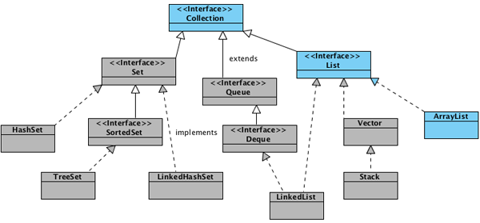
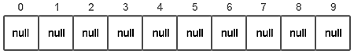
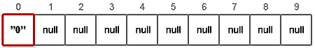
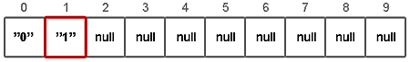
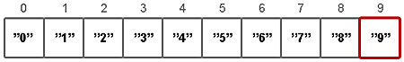
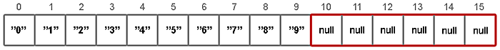
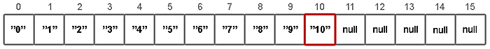
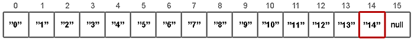

# Структуры данных в картинках. ArrayList

Приветствую вас, хабралюди!

Взбрело мне в голову написать несколько статей, о том как реализованы некоторые структуры данных в Java. 
Надеюсь, статьи будут полезны визуалам (картинки наше всё), начинающим java-визуалам, а также тем кто уже умеет писать `new ArrayList()`, но слабо представляет что же происходит внутри.



Сегодня поговорим о ArrayList-ах

`ArrayList` — реализует интерфейс `List`. 
Как известно, в Java массивы имеют фиксированную длину, и после того как массив создан, он не может расти или уменьшаться. 
`ArrayList` может менять свой размер во время исполнения программы, при этом не обязательно указывать размерность при создании объекта. 
Элементы `ArrayList` могут быть абсолютно любых типов в том числе и `null`.


## Создание объекта

```java
ArrayList<String> list = new ArrayList<String>();
```

Только что созданный объект `list`, содержит свойства `elementData` и `size`.

Хранилище значений `elementData` есть ни что иное как _массив_ определенного типа (указанного в _generic_), в нашем случае `String[]`. 
Если вызывается конструктор без параметров, то по умолчанию будет создан массив из 10-ти элементов типа `Object` (с приведением к типу, разумеется).

```java
elementData = (E[]) new Object[10];
```



Вы можете использовать конструктор **ArrayList(capacity)** и указать свою начальную емкость списка.


## Добавление элементов

```java
list.add("0");
```



Внутри метода **add(value)** происходят следующие вещи:

1) проверяется, достаточно ли места в массиве для вставки нового элемента;
```java
ensureCapacity(size + 1);
```
2) добавляется элемент в конец (согласно значению **size**) массива.
```java
elementData[size++] = element;
```

Весь метод **ensureCapacity(minCapacity)** рассматривать не будем, остановимся только на паре интересных мест. 
Если места в массиве не достаточно, новая емкость рассчитывается по формуле **(oldCapacity * 3) / 2 + 1**. 
Второй момент это копирование элементов. 
Оно осуществляется с помощью **native** метода **System.arraycopy()**, который написан не на Java.

```java
// newCapacity - новое значение емкости
elementData = (E[])new Object[newCapacity];

// oldData - временное хранилище текущего массива с данными
System.arraycopy(oldData, 0, elementData, 0, size);
```

Ниже продемонстрирован цикл, поочередно добавляющий 15 элементов:

```java
list.add("1");
```



...

```java
list.add("9");
```



```java
list.add("10");
```

При добавлении 11-го элемента, проверка показывает что места в массиве нет. 
Соответственно создается новый массив и вызывается **System.arraycopy()**.



После этого добавление элементов продолжается



...

```java
list.add("14");
```



## Добавление в «середину» списка


