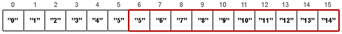
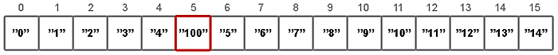

# Структуры данных в картинках. ArrayList

Приветствую вас, хабралюди!

Взбрело мне в голову написать несколько статей, о том как реализованы некоторые структуры данных в Java. 
Надеюсь, статьи будут полезны визуалам (картинки наше всё), начинающим java-визуалам, а также тем кто уже умеет писать `new ArrayList()`, но слабо представляет что же происходит внутри.


Сегодня поговорим о ArrayList-ах

`ArrayList` — реализует интерфейс `List`. 
Как известно, в Java массивы имеют фиксированную длину, и после того как массив создан, он не может расти или уменьшаться. 
`ArrayList` может менять свой размер во время исполнения программы, при этом не обязательно указывать размерность при создании объекта. 
Элементы `ArrayList` могут быть абсолютно любых типов в том числе и `null`.


## Создание объекта

```java
ArrayList<String> list = new ArrayList<String>();
```

Только что созданный объект `list`, содержит свойства `elementData` и `size`.

Хранилище значений `elementData` есть ни что иное как _массив_ определенного типа (указанного в _generic_), в нашем случае `String[]`. 
Если вызывается конструктор без параметров, то по умолчанию будет создан массив из 10-ти элементов типа `Object` (с приведением к типу, разумеется).

```java
elementData = (E[]) new Object[10];
```


Вы можете использовать конструктор **ArrayList(capacity)** и указать свою начальную емкость списка.


## Добавление элементов

```java
list.add("0");
```


Внутри метода **add(value)** происходят следующие вещи:

1) проверяется, достаточно ли места в массиве для вставки нового элемента;
```java
ensureCapacity(size + 1);
```
2) добавляется элемент в конец (согласно значению **size**) массива.
```java
elementData[size++] = element;
```

Весь метод **ensureCapacity(minCapacity)** рассматривать не будем, остановимся только на паре интересных мест. 
Если места в массиве не достаточно, новая емкость рассчитывается по формуле **(oldCapacity * 3) / 2 + 1**. 
Второй момент это копирование элементов. 
Оно осуществляется с помощью **native** метода **System.arraycopy()**, который написан не на Java.

```java
// newCapacity - новое значение емкости
elementData = (E[])new Object[newCapacity];

// oldData - временное хранилище текущего массива с данными
System.arraycopy(oldData, 0, elementData, 0, size);
```

Ниже продемонстрирован цикл, поочередно добавляющий 15 элементов:

```java
list.add("1");
```


...

```java
list.add("9");
```


```java
list.add("10");
```

При добавлении 11-го элемента, проверка показывает что места в массиве нет. 
Соответственно создается новый массив и вызывается **System.arraycopy()**.


После этого добавление элементов продолжается


```java
list.add("14");
```


## Добавление в «середину» списка

```java
list.add(5, "100");
```

Добавление элемента на позицию с определенным индексом происходит в три этапа:

1) проверяется, достаточно ли места в массиве для вставки нового элемента;

```java
ensureCapacity(size+1);
```

2) подготавливается место для нового элемента с помощью **System.arraycopy();**

```java
System.arraycopy(elementData, index, elementData, index + 1, size - index);
```



3) перезаписывается значение у элемента с указанным индексом.

```java
elementData[index] = element;
size++;
```



Как можно догадаться, в случаях, когда происходит вставка элемента по индексу и при этом в вашем массиве нет свободных мест, то вызов **System.arraycopy()** случится дважды: первый в **ensureCapacity()**, второй в самом методе **add(index, value)**, что явно скажется на скорости всей операции добавления.

В случаях, когда в исходный список необходимо добавить другую коллекцию, да еще и в «середину», стоит использовать метод **addAll(index, Collection)**. 
И хотя, данный метод скорее всего вызовет **System.arraycopy()** три раза, в итоге это будет гораздо быстрее поэлементного добавления.

## Удаление элементов

Удалять элементы можно двумя способами:
— по индексу **remove(index)**
— по значению **remove(value)**

С удалением элемента по индексу всё достаточно просто

```java
list.remove(5);
```

Сначала определяется какое количество элементов надо скопировать

```java
int numMoved = size - index - 1;
```

затем копируем элементы используя **System.arraycopy()**

```java
System.arraycopy(elementData, index + 1, elementData, index, numMoved);
```

уменьшаем размер массива и забываем про последний элемент

```java
elementData[--size] = null; // Let gc do its work
```

При удалении по значению, в цикле просматриваются все элементы списка, до тех пор пока не будет найдено соответствие. 
Удален будет лишь первый найденный элемент.

**Дополнение 1**: при удалении элементов текущая величина **capacity** не уменьшается, что может привести к своеобразным утечкам памяти. 
Поэтому не стоит пренебрегать методом **trimToSize()**.


**Итоги**

+ _Быстрый_ доступ к элементам по индексу за время `O(1)`;
+ Доступ к элементам по _значению_ за линейное время `O(n)`;
+ _Медленный_, когда вставляются и удаляются элементы из «_середины_» списка;
+ Позволяет _хранить_ любые значения в том числе и `null`;
+ _Не синхронизирован_.
