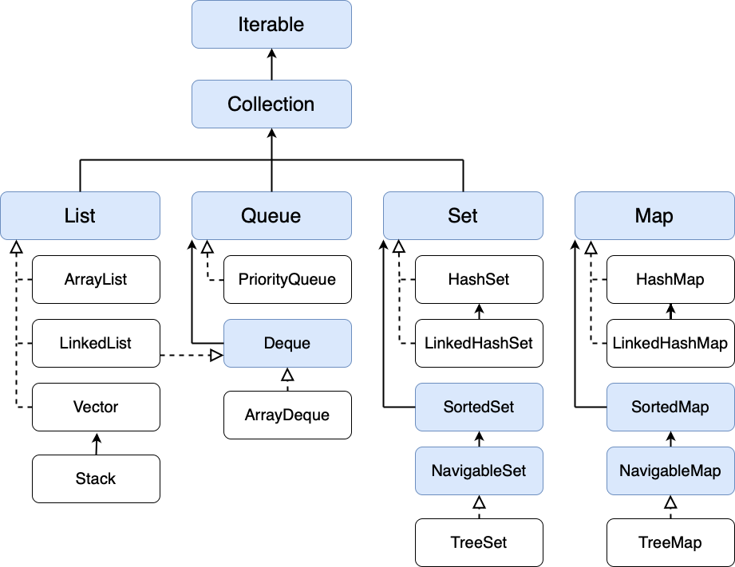

# Структуры данных Java #неОпятьАСнова #javaJunior

Эта статья, как и все последующие и предыдущие – моя попытка структурировать полученные знания в процессе изучения Java. 
Здесь тезисно собрана вся основная информация по теме и те формулировки, которые показались мне наиболее удачными и понятными. 
Это мой конспект, если хотите.

Статья будет полезна тем, кто изучает или повторяет основы Java Core.
И тем, кто готовится к техническому интервью.

## Основные понятия

**Структура данных** (англ. **Data Structure**) — программная единица, позволяющая хранить и обрабатывать **однотипные** и/или **логически связанные** данные.

Для **добавления**, **поиска**, **изменения** и **удаления** данных структура данных предоставляет некоторый набор функций, составляющих её интерфейс.

Структура данных – это **контейнер**, который хранит данные в **организованной форме**.

**Массив** – самая простая и наиболее широко используемая структура.

Коллекции `Java Сollections Framework` являются производными от массивов.

**`Java Collections Framework`** — это набор связанных классов и интерфейсов, реализующих широко используемые структуры данных — **Коллекции**.

Он был спроектирован и разработан, в первую очередь, Джошуа Блохом.

## Массивы

**Массив** – это структура данных, состоящая из **упорядоченных ячеек**, расположенных **друг за другом в памяти**, которые могут хранить в себе элементы **только одного**, заранее заданного **типа**.

**Может хранить** данные примитивных типов, строки (`String`) и **ссылки** на объекты класса.

**Размер массива задается при его создании.**

Тип данных и длину массива в дальнейшем **изменить нельзя**.

```java
int[] numbers = new int[100];         // массив чисел на 100 ячеек

String[] strings = new String[10];    // массив строк на 10 ячеек

Person[] people = new Person[5];      // массив объектов класса Person   
```

**Элементы массива** доступны по **индексу ячейки**.

**Значение по умолчанию** для ячеек – `null`, `0` или `false`

Отсчет индексов ведется от `0`.

**В памяти** элементы массива размещаются **в едином блоке**.

Это сделано для более эффективного и быстрого доступа к ним.

```java
String[] strings = new String[10];

strings[0] = "Hello";                 // присвоить значение первой ячейке
strings[1] = " world!";               // присвоить значение второй ячейке

System.out.println(strings[0] + strings[1]);    // получить значения по индексу
```

**Быстрая инициализация массива**

При быстрой инициализации **размер массива не задается** – размер будет определен автоматически в соответствии с **количеством переданных** в массив элементов.

```java
int[] numbers = new int[]{1, 2, 3, 4, 5};

int[] numbers = {1, 2, 3, 4, 5};      // без ключевого слова new

String[] strings = {"Hello", " world!"};
```

**Копирование массива** `System.arraycopy()`

Этот статический метод класса `System` создан специально для _копирования_ массива. 
Копирует массив из указанного исходного массива, начиная с указанной позиции, в указанную позицию целевого массива.

```java
System.arraycopy(array1, 0, array2, 0, array1.length);
```

**Массивы бывают двух типов:**

+ **Одномерные**
Массив хранит однотипные элементы

+ **Многомерные**
Массив хранит **ссылки** на **другие массивы**

```java
int[][] numbers = new int[3][];                    // двумерный массив

String[][][] threeDimArray = new String[3][][];    // трехмерный массив

String[][] strings = new String[3][5];	           // таблица 3 столбца 5 строк
```

**Инициализация двумерного массива**

Обязательно задать размер **только первого** массива.

Каждый из внутренних массивов может быть **своей длины** – указывается при добавлении.

```java
int[][] numbers = new int[3][];

numbers[0] = new int[2];
numbers[1] = new int[4];
numbers[2] = new int[3];
```

**Быстрая инициализация двухмерного массива**

```java
int[][] numbers = {{1, 2}, {1, 2, 3}, {1, 2, 3, 4, 5}};
```

**Добавить элемент в двухмерный массив**

Сначала указывается индекс ячейки многомерного массива `int[][]` numbers, а затем индекс ячейки **внутреннего** массива

```java
numbers[0][0] = 1;
numbers[1][0] = 2;
numbers[2][0] = 3;
```

## Класс Arrays

Класс **Arrays** содержит различные **статические методы** для работы с **Массивами** (например, сортировка и поиск).


```java
public final class Array extends Object
```

**Сортировка массива** `Arrays.sort()`

Отсортировать можно как весь массив, так его отдельную часть – диапазон индексов.

```java
int[] numbers = {3, 2, 5, 1, 4};

Arrays.sort(numbers);          // [1, 2, 3, 4, 5]

Arrays.sort(numbers, 0, 4);    // [1, 2, 3, 5, 4]
```

**Привести содержимое массива к строке** `Arrays.toString()`

Для строкового представления **многомерного массива** создан отдельный метод `Arrays.deepToString()`

```java
String str = Arrays.toString(strings);

String str = Arrays.deepToString(numbers);    // для многомерных массивов
```

**Сравнить два массива между собой** `Arrays.equals()`

Для сравнения содержимого массивов, а не ссылок, класс **Arrays** содержит **переопределенный** метод `equals()`

Для сравнения **многомерных массивов** используем метод `Arrays.deepEquals()`

```java
Arrays.equals(numbers, numbers2);

Arrays.deepEquals(numbers, numbers2)          // для многомерных массивов
```

**Заполнить массив одинаковыми значениями** `Arrays.fill()`

Заполнить можно как весь массив, так и его часть – диапазон индексов.

Последний индекс **не входит** в диапазон.

Работает **только с одномерными** массивами.

```java
Arrays.fill(numbers, 777);           // присвоить всем ячейкам значение 777

Arrays.fill(numbers, 3, 10, 777);    // заполнить ячейки с 3 по 9 индекс
```

**Перевести Массив в List** `Arrays.asList()`

```java
List<Integer> listNumbers = Arrays.asList(arrayNumbers);

List<Integer> listNumbers = Arrays.asList(1, 2, 3);
```

**Копирование массива** `Arrays.copyOf()`, `Arrays.copyOfRange()`

Если элементы не поместились в новый массив – лишние значения **игнорируются**
.
Если длина нового массива больше – ячейки заполняются **значениями по умолчанию**.

**Под капотом** используется метод System.arraycopy()

```java
int[] numbersCopy = Arrays.copyOf(numbers, numbers.length);

int[] numbersCopy = Arrays.copyOf(numbers, 4);          // начать с индекса 4

int[] numbersCopy = Arrays.copyOfRange(numbers, 2, 7);  // индекс 7 НЕ входит
```

**Бинарный поиск** `Arrays.binarySearch()`

Для этого массив предварительного нужно **отсортировать** `Arrays.sort()`

**Двоичный (бинарный) поиск** (также известен как **метод деления пополам** или **дихотомия**) — классический алгоритм поиска элемента в отсортированном массиве (векторе), использующий дробление массива на половины.

Возвращает **индекс** искомого элемента в массиве либо **отрицательное число** – точку вставки `(-(insertion point) - 1)`

**Точка вставки** определяется как точка, в которую ключ **будет вставлен** в массив.

```java
int[] numbers = {3, 2, 5, 1, 4};

Arrays.sort(numbers);                 // [1, 2, 3, 4, 5]

Arrays.binarySearch(numbers, 4);      // вернет индекс ячейки 3

Arrays.binarySearch(numbers, 6);      // вернет точку вставки -5 - 1 = -6
```

## Оценка сложности алгоритмов Big O

Сложность алгоритмов оценивают **по времени выполнения задачи** или по **используемой памяти**.

Сложность зависит от размеров входных данных: массив из 100 элементов будет обработан быстрее, чем аналогичный из 1000.

**Big O** показывает **верхнюю границу** (худший вариант) того, как **сложность алгоритма** растёт с увеличением **входных данных**.

**Сложность алгоритма может быть:**

**О(1)** – константная сложность. 
Например: получить элемент массива по индексу

**O(log n)** – логарифмическая сложность. 
Сложность алгоритма **растёт логарифмически** с увеличением входных данных.
Например: на каждой итерации берется половина элементов – бинарный поиск

**О(n)** – линейная сложность. 
Сложность алгоритма **растёт линейно** с увеличением входных данных.
Например: цикл по всем элементам массива, рекурсивная функция

**O(n2)** – квадратичная сложность. 
Например: вложенный цикл

При оценке сложности константы не играют роли – отбрасываем константы и берем только наибольшую сложность.

**Неважная сложность и отбрасывание констант**:

+ `O(n^2 + n^2) = O(n2)`
+ `O(n^2 + n) = O(n^2)`
+ `O(n + log n) = O(n)` _Сложность log n меньше чем n_
+ `O(2 * 2^n + 22 * n^2) = O(2^n)` _Отбрасываем константы 2 и 22, оставляем наибольшую сложность: 2n гораздо больше n2_
+ `O(n^2 + m) = O(n^2 + m)` _Выражение не может быть упрощено т.к. мы ничего не знаем про m_

## Java Collections Framework (JCF). Коллекции

Главным **ограничением массива** является его **фиксированная длина**.

Эту проблему решают **Коллекции** – набор **интерфейсов** и **классов** для работы с группой однотипных объектов – элементов коллекции.

**Коллекция** – это объект (**контейнер**), управляющий группой объектов (**элементов**).

В основе любой коллекции лежит использование того или иного **интерфейса**, который определяет ее **базовый функционал**.

+ **Примитивные типы нельзя** хранить в коллекции
+ Хранимые объекты называются **элементами**
+ Коллекции хранят **только ссылки на объекты**
+ Классы коллекций находятся в пакете `java. util`

### Иерархия коллекций JCF



Два главных интерфейса коллекций – **Collection** и **Map**

От них наследуют все другие интерфейсы и классы **Collection Framework**.

Интерфейс **Collection** наследует интерфейс **Iterable**, который имеет один метод `Iterator<T> iterator()`, позволяет последовательно обходить элементы.

```java
public interface Collection<E> extends Iterable<E>
```

**Map** не наследует интерфейс **Collection**, но входит в состав **Java Collections Framework**.

**Map** хранит данные в виде пары **ключ – значение**.

```java
public interface Map<K,V>
```

### Интерфейс Iterable. Iterator. ListIterator

Интерфейс **Iterable** – корневой интерфейс для всех классов коллекций **Collection**.

Метод этого интерфейса `iterator()` возвращает **Итератор** – объект, абстрагирующий за **единым интерфейсом** доступ к элементам коллекции.

```java
List<String> list = new ArrayList();

Iterator<String> iterator = list.iterator();
```

Интерфейс **Iterator** – это **поведенческий шаблон проектирования**.

Дает возможность **последовательно обходить** элементы **коллекций** при **сокрытии внутренней структуры** данных от пользователя.

Это свойство позволяет работать с **любой структурой данных** как с простой **последовательностью** или **списком**.

Итератор позволяет **перемещаться** по коллекции, **получать** или **удалять** элементы.

Одну и ту же коллекцию могут **одновременно** обходить **различные итераторы**.

### Методы Iterator

+ `forEachRemaining(Consumer<? super E> action)` - выполняет данное действие для **каждого оставшегося элемента** до тех пор, пока все элементы не будут обработаны или действие не выдаст исключение.
+ `boolean hasNext()` - возвращает `true`, если итерация содержит следующий элемент. Не передвигает указатель итератора.
+ `E next()` - передвигает указатель на следующий элемент и возвращает его. Если элемент отсутствует, бросает исключение `NoSuchElementException`
+ `void remove()` - удаляет из коллекции последний элемент, возвращенный методом `next()`

**Чтобы удалить элемент** - его **сначала нужно получить**.

```java
while (iterator.hasNext()) {
  
    Integer next = iterator.next();
  
    iterator.remove();
  
    iterator.forEachRemaining(System.out::println);
}
```

### Интерфейс **ListIterator**

Расширяет **Iterator**, позволяет обойти **List в обоих направлениях – двунаправленный** обход и **изменить элементы** списка.

Доступен только для коллекций, которые реализуют **List** – получаем его с помощью метода интерфейса `List listIterator()`

```java
List<String> list = Arrays.asList("A", "B", "C", "D", "E");

ListIterator<String> listIterator = list.listIterator();
```

**Методы ListIterator**

+ `void add(E e`) - вставляет указанный элемент в список **перед элементом**, который должен быть возвращен следующим вызовом **next()**
+ `boolean hasNext()` - возвращает `true`, если есть **следующий** элемент.
+ `boolean hasPrevious()` - возвращает `true`, если есть **предыдущий** элемент.
+ `E next()` - возвращает следующий элемент в списке и **перемещает положение курсора**.
+ `int nextIndex()` - возвращает индекс следующего элемента.
+ `E previous()` - возвращает **предыдущий** элемент в списке и перемещает положение курсора назад.
+ `int previousIndex()` - возвращает индекс предыдущего элемента.
+ `void remove()` - удаляет из списка последний элемент, который был возвращен `next()` или `previous()`. Если вызван до `next()` или `previous()`, бросает исключение **`IllegalStateException`**.
+ `void set(E e)` - заменяет последний элемент, возвращаемый методом `next()` или `previous()`, указанным элементом.

Изначально **курсор итератора** находится **в начале списка** и для того, чтобы сделать итерацию **назад** – нужно сделать хоть одну итерацию вперед.

Без этого вызов метода `hasPrevious()` будет возвращать `false`

```java
while (listIterator.hasNext()) {
    String element = listIterator.next();
    listIterator.set(element + ",");
}

while (listIterator.hasPrevious()) {
    String element = listIterator.previous();
    System.out.print(element + " ");
}
```

Работа с итераторами может пригодится **только в одном случае** – **удаление элементов**. В остальных случаях используем цикл `for-each`.

### Fail-fast и Fail-safe итераторы

Это характеристики разных реализаций интерфейса **Iterator**.

Они определяют, как поведет себя итератор при изменении перебираемой последовательности элементов.

**Fail-fast** – быстрый итератор.

Это итераторы коллекций пакета `java.util`.

Если после его создания коллекция изменилась – он бросит исключение `ConcurrentModificationException`

Коллекции поддерживают внутренний счетчик под названием **modCount**.

Каждый раз, когда элемент добавляется или удаляется из коллекции, этот счетчик увеличивается. 
При итерации при каждом вызове `next()` текущее значение **modCount** сравнивается с начальным значением.

Если во время итерации по коллекции элемент **удаляется с помощью метода итератора** `remove()` – это полностью **безопасно** и не вызывает исключения.

**Fail-safe** – умный итератор.

Это итераторы коллекций пакета `java.util.concurrent`.

Итератор работает с копией данных – он не бросит исключение при изменении коллекции, но и не увидит обновленных данных.

Другим недостатком являются накладные расходы на создание копии коллекции, как в отношении времени, так и в отношении памяти.

### Интерфейс Collection

Интерфейс `Collection` расширяет интерфейс **Iterable** – благодаря этому все классы наследники **Collection** могут получить **Итератор**.

    public interface Collection<E> extends Iterable<E>

Этот интерфейс содержит **основные методы**, для работы с коллекциями.

Поэтому **общие принципы работы** с коллекциями будут общие для всех его классов наследников.

**Основные методы Collection**:

`add(E item)` - Добавление элемента в коллекцию. При удачном добавлении возвращает **true**, при неудачном – **false**
`addAll(Collection<?> c)` - Добавляет все элементы указанной коллекции в эту коллекцию.
`clear()` - Удаляет все элементы из этой коллекции
`contains(Object item)` - Возвращает true, если эта коллекция содержит указанный элемент.
`containsAll(Collection<?> c)` - Возвращает true, если эта коллекция содержит все элементы указанной коллекции.
`isEmpty()` - Возвращает true, если эта коллекция не содержит элементов.
`remove(Object item)` - Удаляет один экземпляр указанного элемента из этой коллекции, если он присутствует.
`removeAll(Collection<?> c)` - Удаляет все элементы этой коллекции, которые содержатся в указанной коллекции.
`retainAll(Collection<?> c)` - Сохраняет только те элементы в этой коллекции, которые содержатся в указанной коллекции. Остальные элементы удаляются.
`size()` - Возвращает количество элементов в этой коллекции.
`stream()` - Возвращает последовательный поток с этой коллекцией в качестве источника.
`toArray()` - Возвращает массив, содержащий все элементы этой коллекции.

### Интерфейс List

Интерфейс **List** расширяет интерфейс **Collection**.

Используется для создания **простых списков**.

+ **Сохраняет последовательность** элементов.

+ Элементы могут быть доступны по **индексу**.

+ Может содержать **повторяющиеся элементы**.

`public interface List<E> extends Collection<E>`

Помимо **Iterator** списки также могут вернуть **ListIterator**, который позволяет вставку и замену элементов, а также двунаправленный доступ.

**Основные методы List**:

`get(int index)` - Возвращает элемент списка по указанному индексу.
`set(int index, object obj)` - **Заменяет** элемент по индексу в этом списке на указанный элемент.
`indexOf(Object obj)` - Возвращает индекс первого указанного элемента в списке или **-1**, если элемент отсутствует.
`lastindexOf(object obj)` - Возвращает индекс **последнего вхождения** указанного элемента или **-1**, если элемент отсутствует.
`listIterator()` - Возвращает итератор списка по элементам этого списка.
`listIterator(int index)` - Возвращает итератор списка по элементам этого списка, **начиная с указанного индекса**.
`of()` - Возвращает **неизменимый список**, содержащий ноль элементов.
`of(E e1)` - Возвращает **неизменимый список**, содержащий один элемент.
`of(E... elements)` - Возвращает **неизменимый список**, содержащий произвольное количество элементов.
`subList(int from, int to)` - Возвращает часть коллекции от позиции `from` включительно до позиции `to` исключительно
`trimToSize()` - Обрезает емкость `capacity` списка до реального **количества элементов** в нем

### Класс ArrayList

**ArrayList** поддерживает **динамические массивы**.

По мере добавления элементов в список, емкость внутреннего массива **автоматически увеличивается**.

+ Использует под капотом обычный массив **elementData**
+ Быстрый доступ к элементам по индексу за константное время `O(1)`
+ Быстрая вставка и удаление элементов с конца за константное время `O(1)`
+ Доступ к элементам по значению за линейное время `O(n)`
+ **Медленная вставка и удаление элементов из середины**
+ Хранит любые значения в том числе и `null`
+ **Не синхронизирован**
+ Автоматически увеличивается, но **не уменьшается**

```java
public class ArrayList<E>
extends AbstractList<E>
implements List<E>, RandomAccess, Cloneable, Serializable
```

**ArrayList** создается с начальной **емкостью** `capacity` **10 ячеек**
Переменная `size` хранит **количество добавленных элементов** и изначально равна `0`. 
Это **не емкость** внутреннего массива – емкость массива **недоступна**.

Если добавить в **ArrayList** больше элементов, чем его `capacity` – неявно для пользователя произойдет вызов метода `grow()` и **пересоздание внутреннего массива**.

**Алгоритм расширения внутреннего массива**:

+ Создается новый массив по формуле `(capacity * 3) / 2 + 1`
+ Все элементы старого массива копируются в новый методом `System.arraycopy()`
+ Новый массив присваивается внутренней переменной **elementData**. Старый массив объявляется мусором – на него больше нет ссылки. 

**Конструкторы ArrayList**

```java
ArrayList();

ArrayList(100);                             // задаем емкость capacity

ArrayList<>(collection);
```

```java
list.add(" world!");			            // добавить в конец списка
list.add(0, "Hello");				        // добавить по индексу

list.size();				                // количество элементов

list.remove("Hello");				        // удалить по значению
list.remove(1);					            // удалить по индексу
```

**Автоматически внутренний массив не уменьшается.**

Чтобы обрезать емкость списка до реального количества элементов в нем – используем метод `trimToSize()`. 
Этот метод есть только у **ArrayList** и отсутсвует у **List**.

```java
List<String> list = new ArrayList();

list.add("Hello");
list.add(" world!");
        
list.trimToSize();
```

**Вставка элемента в середину, когда ArrayList полон**:

+ Создается **новый массив размером по формуле** `(capacity * 3) / 2 + 1`
+ Все элементы из старого массива **копируются в новый массив**
+ Новый массив **сохраняется во внутренней переменной** объекта **ArrayList**, старый массив **объявляется мусором**.

**Класс LinkedList**

**LinkedList** использует для хранения **двусвязный список**.

Поэтому **Итератор** поддерживает **обход в обе стороны**.

Помимо интерфейса **List** реализует интерфейсы **Dequeue** и **Queue**.

**Соединяет** функциональность работы со **списком** и фукциональность **очереди**.

+ Каждый элемент содержит **ссылки** на **предыдущий** и **следующий** элементы
+ Позволяет хранить повторяющиеся объекты, в том числе `null`
+ **Быстрая вставка** и **удаление** первого, последнего и элемента из середины списка за константное время `O(1)`
+ **Долгое время поиска позиции элемента** за линейное время `O(n)`
+ Операции поиска элемента по значению выполняются за линейное время `O(n)`
+ **Не синхронизирован**

```java
public class LinkedList<E>
extends AbstractSequentialList<E>
implements List<E>, Deque<E>, Cloneable, Serializable
```

**Используется когда** необходимо часто добавлять или удалять элементы, особенно в начало списка. 
Либо когда нужна вставка элемента в конец **за гарантированное время**.

```java
List<String> list = new LinkedList<>();

list.add(" world!");			            // добавить в конец списка
list.add(0, "Hello");				        // добавить по индексу

list.size();				                // количество элементов в списке

list.remove("Hello");				        // удалить по значению
list.remove(1);					            // удалить по индексу
```

Для установки ссылок на предыдущий и следующий элементы **LinkedList** использует **ноды** – **объекты** своего вложенного класса **Node**.

Если предыдущий или следующий элемент отсутствует – значение ссылки `null`

```java
private static class Node<E> {
    E item;
    Node<E> next;
    Node<E> prev;

    Node(Node<E> prev, E element, Node<E> next) {
        this.item = element;
        this.next = next;
        this.prev = prev;
    }
}
```

У **LinkedList** есть методы для работы с **началом** и **концом** списка, которых нет в **ArrayList**:

+ `addFirst()` - Вставляет элемент в начало списка.
+ `addLast()` - Вставляет элемент в конец списка.
+ `removeFirst()` - Удаляет и возвращает первый элемент из этого списка.
+ `removeLast()` - Удаляет и возвращает последний элемент из этого списка.

Выгода использования **LinkedList** в работе с **серединой и началом списка**. 

Вставка и удаление в **LinkedList** устроены гораздо проще, чем в **ArrayList** – просто **переопределятся ссылки** на соседние элементы.

**НО!** Все элементы массива **ArrayList** находятся **в одном блоке памяти**, и операция по сдвигу элементов массива выполняются быстрым низкоуровневым методом `System.arraycopy()`. 
Обычно весь внутренний массив попадает в **кэш процессора**, поэтому элементы массива сдвигаются даже не в памяти, а в кэше.

Все это делает использование **LinkedList не частым случаем**.

### Классы Vector и Stack

Класс **Vector** является реализацией **динамического массива** – похож на **ArrayList**.

Но в отличие от **ArrayList**, класс **Vector синхронизирован**, а размер его внутреннего массива **увеличивается в 2 раза**.

+ **Синхронизирован**
+ **Deprecated**. Устаревший класс

На смену **Vector** пришел класс пакета `java.util.concurrent` **СopyOnWriteArrayList**

```java
public class Vector<E> extends AbstractList<E>
implements List<E>, RandomAccess, Cloneable, Serializable
```

Класс **Stack** является подклассом **Vector**.

Представляет собой **стек** объектов **last-in-first-out (LIFO)**.

**Расширяет класс Vector** пятью методами, которые позволяют рассматривать вектор как стек. 
Предусмотрены обычные операции `push()` и `pop()`, а также метод просмотра верхнего элемент в стеке, метод проверки пуст ли стек, и метод поиска элемента в стеке и определения того, как далеко он находится сверху.

```java
public class Stack<E> extends Vector<E>
```

### Методы Stack:

+ `empty()` - Проверяет, пуст ли этот стек.
+ `peek()` - Смотрит на объект в верхней части этого стека, не удаляя его из стека.
+ `pop()` - Удаляет объект в верхней части этого стека и возвращает этот объект.
+ `push(E item)` - Кладет элемент в стек сверху.
+ `search(Object o)` - Ищет элемент в стеке. Если найден, возвращается его смещение от вершины стека. В противном случае возвращается 1.

### Интерфейс Queue

Интерфейс **Queue** расширяет **Collection**.

Определяет поведение класса в качестве **однонаправленной очереди**.
Работает по принципу **first-in-first-out (FIFO)**.

+ Не может хранить значение `null`

```java
public interface Queue<E> extends Collection<E>
```

Определяет **основные методы** для работы с **однонаправленными** очередями:

+ `add(E e)` - Добавляет указанный элемент в эту очередь, если это возможно сделать **не нарушая ограничения емкости**, возвращая true в случае успеха и выдавая исключение `IllegalStateException`, если в настоящее время нет свободного места.
+ `element()` - Получает, но не удаляет верхний элемент этой очереди. Если очередь пуста, бросает исключение `NoSuchElementException`
+ `offer(E e)` - Вставляет указанный элемент в очередь, если это возможно сделать не нарушая ограничений пропускной способности.
+ `peek()` - Получает, но **не удаляет** верхний элемент очереди или возвращает `null`, если эта пуста.
+ `poll()` - Получает и удаляет верхний элемент очереди или возвращает `null`, если эта пуста.
+`remove()` - **Удаляет** верхний элемент очереди. Если очередь пуста, бросает исключение `NoSuchElementException`

### Класс PriorityQueue

Класс **PriorityQueue** – очередь с приоритетами.

По умолчанию размещает элементы согласно естественному порядку сортировки используя **Comparable**: элементу с наименьшим значением присваивается наибольший **приоритет**.

+ Не хранит значение `null`
+ Не хранит `non-comparable` объекты
+ **Не потокобезопасен**

```java
public class PriorityQueue<E> extends AbstractQueue<E> implements Serializable
```

Если несколько элементов имеют одинаковый **приоритет** – связь определяется **произвольно**.

Можно указать порядок размещения, используя **Comparator**.

**Интерфейс Deque**

Интерфейс **Deque** расширяет интерфейс **Queue** – появился в **Java 6**.

Определяет поведение **двунаправленной очереди**.

**Двунаправленная очередь** может функционировать как стандартная очередь **FIFO** либо как стек **LIFO**. 

```java
public interface Deque<E> extends Queue<E>
```

Определяет **основные методы** для работы с **двунаправленными** очередями:

+ `addFirst(E e)` - Добавляет элемент в начало очереди. Бросит **IllegalStateException** если в очереди ограниченной емкости нет места.
+ `addLast(E e)` - Добавляет элемент в конец очереди. Бросит **IllegalStateException** если в очереди ограниченной емкости нет места.
+ `getFirst()` - Возвращает **без удаления** первый элемент очереди. Если очередь пуста, бросит **NoSuchElementException**.
+ `getLast()` - Возвращает **без удаления** последний элемент очереди. Если очередь пуста, бросит **NoSuchElementException**.
+ `offerFirst(E e)` - Добавляет элемент в начало очереди. Если элемент удачно добавлен, возвращает `true`, иначе - `false`
+ `offerLast(E e)` - Добавляет элемент в конец очереди. Если элемент удачно добавлен, возвращает `true`, иначе - `false`
+ `peekFirst()` - Возвращает **без удаления** элемент из начала очереди. Если очередь пуста, возвращает значение `null`
+ `peekLast()` - Возвращает **без удаления** элемент из конца очереди. Если очередь пуста, возвращает значение `null`
+ `pollFirst()` - Возвращает **с удалением** элемент из начала очереди. Если очередь пуста, возвращает значение `null`
+ `pollLast()` - Возвращает **с удалением** элемент из конца очереди. Если очередь пуста, возвращает значение `null`
+ `pop() `- Возвращает **с удалением** элемент из начала очереди. Если очередь пуста, генерирует исключение `NoSuchElementException`
+ `push(E e)` - Добавляет элемент в начало очереди. Если в очереди фиксированного объема нет места, бросит исключение `IllegalStateException`.
+ `removeFirst()` - Удаляет элемент из начала очереди. Если очередь пуста, генерирует исключение `NoSuchElementException`
+ `removeFirstOccurrence(Object o)` - Удаляет первый встреченный элемент из очереди. Если удаление произшло, то возвращает true, иначе возвращает `false`
+ `removeLast()` - Удаляет элемент из конца очереди. Если очередь пуста, генерирует исключение `NoSuchElementException`
+ `removeLastOccurrence(Object o)` - Удаляет последний встреченный элемент из очереди. Если удаление произшло, то возвращает true, иначе возвращает `false`

### Класс ArrayDeque

Класс **ArrayDeque** представляет обобщенную двунаправленную очередь, наследуя функционал от класса **AbstractCollection** и реализуя интерфейс **Deque**.

+ Не имеет ограничений по емкости. Растет по мере необходимости для поддержки использования.
+ Не может хранить элемент null
+ Не потокобезопасен

```java
public class ArrayDeque<E> extends AbstractCollection<E> implements Deque<E>, Cloneable, Serializable
```

### Интерфейс Set

**Set** – это **множество** однотипных элементов.

Добавляет ограничение, которое **запрещает повторяющиеся элементы**.

+ Хранит **только уникальные** элементы
+ Уникальность определяется за счет контракта `hashcode()` и `equals()`
+ **Нет индексов**

```java
public interface Set<E> extends Collection<E>
```

Можно делать три типа операций: **добавлять**, **удалять** и **проверять**, есть ли во множестве элемент.

Методов `get()` и `set()` нет.

### Класс HashSet

Класс **HashSet** реализует интерфейс **Set**.

+ Основан на **хэш таблице**
+ Элементы не упорядочены, порядок элементов может меняться
+ Операции `add()`, `remove()`, `contains()` и `size()` за константное время **O(1)**
+ Под капотом HashMap с заглушками значений

```java
public class HashSet<E> extends AbstractSet<E>  implements Set<E>, Cloneable, Serializable
```

Название **Hash** происходит от понятия **хэш-функции**.

**Хэш-функция** сужает множество значений объекта до некоторого подмножества целых чисел.

Класс **Object** имеет метод `hashCode()`, который используется классом **HashSet** для эффективного размещения объектов, заносимых в коллекцию.

В классах объектов, заносимых в `HashSet`, этот метод должен быть **переопределен**.

Не имеет собственной реализации – под капотом использует **HashMap**.

В качестве значения **value** `HashMap` используется **заглушка**.

Значения **HashSet** – это **ключи внутренней HashMap**.

### Класс LinkedHashSet

**LinkedHashSet** поддерживает **связанный список** элементов множества, в том **порядке**, в котором они были **добавлены**.

Это позволяет выполнять **упорядоченную итерацию** по множеству.

+ Элементы в порядке добавления
+ За счет этой особенности - работает дольше чем **HashSet**

```java
public class LinkedHashSet<E> extends HashSet<E> implements Set<E>, Cloneable, Serializable
```

### Интерфейс SortedSet

Интерфейс **SortedSet** расширяет интерфейс **Set**.

Описывает упорядоченное множество, отсортированное в возрастающем порядке или по порядку, заданному реализацией интерфейса **Comparator**.

+ Обеспечивает **отсортированный порядок элементов**
+ Элементы упорядочены с использованием их **естественного порядка** или с помощью **компаратора**

```java
public interface SortedSet<E> extends Set<E>
```

**Методы SortedSet:**

+ `comparator()` - Возвращает **Компаратор**, используемый для упорядочения элементов в этом множестве, или `null`, если множество использует естественный порядок сортировки
+ `first()` - Возвращает первый элемент множества
+ `headSet(E toElement)` - Возвращает часть множества, элементы которого строго меньше переданного элемента
+ `last()` - Возвращает последний элемент множества
+ `spliterator()` - Создает **Spliterator** (разделитель) над элементами в этом отсортированном множестве.
+ `subSet(E fromElement, E toElement)` - Возвращает часть множества, элементы которой варьируются от `fromElement` включительно, до `toElement` исключительно.
+`tailSet(E fromElement)` - Возвращает часть множества, элементы которого больше или равны `fromElement`.

**Интерфейс NavigableSet**

Интерфейс **NavigableSet** появился в **Java 6**.

Расширяет **SortedSet** и добавляет методы для более удобного поиска по коллекции.

```java
public interface NavigableSet<E> extends SortedSet<E>
```

**Методы NavigableSet:**

+ `ceiling(E e)` - Возвращает **наименьший** элемент множества, который будет **больше или равен** указанному элементу, или `null`, если такого элемента нет
+ `descendingIterator()` - Возвращает **итератор** по элементам в этом множестве **в порядке убывания**
+ `descendingSet()` - Возвращает элементы множества в обратном порядке. **Результирующий набор поддерживается вызывающим набором** (это называется **backed-collection**)
+ `floor(E e)` - Возвращает **наибольший** элемент в этом наборе, который будет **меньше** или **равен** указанному элементу, или `null`, если такого элемента нет
+ `headSet(E toElement)` - Возвращает часть множества, элементы которого **строго меньше**, чем `toElement`
+ `headSet(E toElement, boolean inclusive)` - Возвращает `NavigableSet`, включающий все элементы вызывающего набора, меньшие `toElement`. **Результирующий набор поддерживается вызывающим набором** (это называется **backed-collection**)
+ `higher(E e)` - Возвращает наименьший элемент в этом множестве, **строго больший**, чем данный элемент, или `null`, если такого элемента нет
+ `iterator()` - Возвращает итератор по элементам в этом множестве в порядке возрастания.
+ `lower(E e)` - Возвращает наибольший элемент в этом множестве **строго меньше**, чем данный элемент, или `null`, если такого элемента нет
+ `pollFirst()` - **Получает и удаляет первый** элемент или возвращает `null`, если это множество пустое
+ `pollLast() `- **Получает и удаляет последний** элемент или возвращает `null`, если это множество пустое
+ `subSet(E fromElement, boolean fromInclusive, E toElement, boolean toInclusive)` - Возвращает `NavigableSet`, включающий все элементы вызывающего набора, которые больше `fromElement` и меньше `toElement`. Если `fromInclusive` равно `true`, то элемент, равный `fromElement`, включается. Если `toInclusive` равно `true`, также включается элемент, равный `toInclusive`
+ `subSet(E fromElement, E toElement)` - Возвращает представление части этого множества, элементы которого варьируются от `fromElement` включительно, до `toElement` исключительно
+ `tailSet(E fromElement)` - Возвращает представление части этого множества, элементы которого **больше или равны** `fromElement`
+`tailSet(E fromElement, boolean inclusive)` - Возвращает представление части этого множества, элементы которого больше `fromElement` (или равны, если `inclusive` равно `true`). **Результирующий набор поддерживается вызывающим набором** (это называется **backed-collection**)

### Класс TreeSet

Класс **TreeSet** реализует интерфейс **NavigableSet**, который поддерживает элементы в отсортированном по возрастанию порядке.

+ Элементы хранятся в отсортированном порядке по возрастанию
+ Под капотом использует **TreeMap**
+ Для хранения объектов использует **бинарное красно-черное дерево**
+ Сортировка происходит благодаря тому, что все добавляемые элементы реализуют интерфейсы **Comparator** и **Comparable**
+ Временная сложность базовых операций `add()`, `remove()`, `contains`() медленнее, чем в хэш-множествах, но быстрее, чем в списках: `O(log(n))`

```java
public class TreeSet<E> extends AbstractSet<E> implements NavigableSet<E>, Cloneable, Serializable
```

**Если TreeSet пустой** – можно положить единственное значение `null`. 
При этом все операции кроме `size()` и `clear()` перестанут работать. 
**В непустой TreeSet** положить `null` уже **нельзя** из-за вызова` compareTo()`. 

### Интерфейс Map

Интерфейс **Map** не имеет отношения к интерфейсу **Collection**, но тоже является частью **Collections Framework**.

Это объект, который сопоставляет ключи со значениями. 
Каждый ключ может сопоставляться не более одного значения.

+ Хранит данные парами: **key – value**
+ **Ключ** всегда является **уникальным**. Уникальность определяется за счет **контракта** `hashcode()` `equals()`
+ Значения **могут дублироваться**
+ Доступ к **значениям** осуществляется по **ключу**. Ключ по значению получить нельзя

```java
public interface Map<K,V>
```

По умолчанию под капотом **Map** массив на **16 buckets** (корзин)

**Внутри каждого бакета** данные хранятся в **LinkedList**

Массив автоматически расширяется: **16 – 32 – 64**

**Худший результат работы Map – Коллизия**:

Когда все элементы попадают в один **bucket** и их приходится перебирать итерацией по внутреннему **LinkedList**.

**В таком случае происходит оптимизация хранения данных в этом бакете**:

Если размер внутреннего **LinkedList** бакета становится равен **8 элементам** и размер внутреннего массива **Map** равен **64 бакетам** – происходит **преобразование структуры данных** внутри этого бакета в **RB-дерево** (**red-black tree**).

Для объектов-**ключей** важно переопределить методы `equals()` и `hashCode()`.

Допускается добавление объектов без переопределения этих методов, но **найти их в Map будет невозможно**.

**Основные методы Map**:

+ `clear()` - Удаляет все пары ключ-значение из этой мапы.
+ `containsKey(Object key)` - Возвращает `true`, если эта мапа содержит значение для указанного ключа.
+ `containsValue(Object value)` - Возвращает `true`, если эта мапа сопоставляет один или несколько ключей с указанным значением.
+ `entrySet()` - Возвращает **Set** сопоставлений (пар ключ-значение), содержащихся на этой карте.
+ `get(Object key)` - Возвращает значение, с которым сопоставлен указанный ключ, или `null`
+ `getOrDefault(Object key, V defaultValue)` - Возвращает значение, с которым сопоставлен указанный ключ, или `defaultValue`, если эта мапа не содержит значения для ключа.
+ `of()` - Возвращает **неизменимую map**, содержащий ноль сопоставлений.
+ `of(K k1, V v1)` - Возвращает **неизменимую map**, содержащий один элемент.
+ `ofEntries(Map.Entry<? extends K,? extends V>... entries)` - Возвращает **неизменяемую map**, содержащую ключи и значения, извлеченные из данных записей.
+ `isEmpty() `- Возвращает `true`, если эта мапа пустая (не содержит пар ключ-значение).
+ `keySet()` - Возвращает **Set** из ключей, содержащихся в этой маме.
+ `put(K key, V value)` - Связывает указанное значение с указанным ключом и кладет это сопоставление в мапу.
+ `putAll(Map<? extends K,? extends V> m)` - Копирует все сопоставления с указанной мапы на эту мапу.
+ `putIfAbsent(K key, V value)` - Если указанный ключ отсутствует в мапе (или сопоставлен с нулевым значением), связывает его с заданным значением, кладет пару в мапу и возвращает `null`, в противном случае возвращает текущее значение.
+ `remove(Object key)` - Удаляет значение по ключу из этой мапы, если оно присутствует.
+ `remove(Object key, Object value`) - Удаляет запись для указанного ключа только в том случае, если она в настоящее время сопоставлена с указанным значением.
+ `replace(K key, V value)` - Заменяет значение для указанного ключа только в том случае, если он в настоящее время уже сопоставлен с каким-либо значением.
+ `size() `- Возвращает количество сопоставлений ключ-значение в этой мапе.
+ `values()` - Возвращает **Collection** значений, содержащихся на этой карте.

### Интерфейс **Map.Entry**

Вложенный **nested** интерфейс **Map**.

Это структура внутри **Map**, которая хранит все **пары ключ-значение**.

Возвращает множество **Set** пар, которое можно перебрать **Итератором**.

```java
public static interface Map.Entry<K,V>
```

Объекты **Map.Entry** действительны только во время итерации.

```java
Map<String, String> map = new HashMap<>();

Set set = map.entrySet();    // множество сопосталений ключ-значение
```

### **Класс HashMap**

**HashMap** использует **хэш - таблицу**, в которой ключи отсортированы относительно значений их хэш-кодов.

**Bucket** – это элемент (ячейка) внутреннего массива `HashMap`.

В нем хранятся узлы **Nodes**.

+ Хранит значения в **произвольном порядке**
+ Структура хранения данных: **bucket** (корзина)
+ Ключ и значение могут быть `null` 
+ Объекты с `null` ключами всегда записываются в нулевую ячейку массива.

```java
public class HashMap<K,V> extends AbstractMap<K,V> implements Map<K,V>, Cloneable, Serializable
```

**Хеш-таблица** – структура данных, реализующая интерфейс **ассоциативного массива** (сопоставления ключ–значение или **entry**), которая обеспечивает быструю **вставку** и **поиск элементов.**

**Хеш-функция** получает **ключ**, а на выходе возвращает целое число – **хеш-код**.
По полученному хэш-коду **ключ** помещается по определенному **индексу** хеш-таблицы.
За **хеш-функцию** отвечает метод `hashCode()`.

По этой причине **важно, чтобы хеш-функция вела себя последовательно** и выводила один и тот же **хэш-код** для одинаковых входных данных. 
Поэтому в качестве ключей рекомендуется использовать только неизменяемые **immutable** типы, например класс **String** или **Integer**.

Хеш-отображение **не гарантирует порядок** расположения своих элементов.
Порядок, в котором элементы вводятся в хеш-отображение, не обязательно соответствует тому порядку, в котором они извлекаются итератором.

**HashMap содержит следующие свойства:**

+ **table** – внутренний массив типа **Entry**
+ **size** — размер, количество добавленных элементов
+ **capacity** – емкость, количество бакетов в хэш-таблице
+ **loadFactor** – коэффициент загрузки, по умолчанию равен 0.75. 
Показатель насколько хэш-таблица может быть заполнена до того, как ее **capacity** будет автоматически увеличена
+ **threshold** – количество элементов, при достижении которого, размер хэш-таблицы увеличится в два раза. Рассчитывается по формуле `(capacity * loadFactor)`

**Алгоритм добавления элемента в HashMap:**

+ Высчитывается `hashCode()` ключа
+ **Определяется бакет** (ячейка массива) в которую будет добавлен новый элемент. Номер определяется по **остатку от деления хэшкода на кол-во ячеек**.
В более новых версиях Java с помощью **бинарного сдвига**.
+ **Если бакет пустой** - элемент просто добавляется.
+ **Если бакет не пустой** – элемент добавляется в **LinkedList** внутри бакета:
+ Ключ добавляемого элемента сравнивается с ключами в **LinkedList** по хэшкодам.
+ **Если хэшкоды неравны** – переход к следующему элементу
+ **Если хэшкоды равны** – ключи дополнительно сравниваются по `equals() `
+ **Если ключи равны** по `equals()` – перезаписывается `value` найденного ключа
+ **Если ключи не равны по** `equals()` – переход к следующему элементу
+ **Если ключ не найден в LinkedList** – элемент добавляется в конец списка

### **Класс LinkedHashMap**

**LinkedHashMap** расширяет **HashMap**.

Поддерживает связанный список записей **в том порядке, в котором они добавлены.**
Это позволяет организовать итерацию по карте в порядке вставки.
+ Элементы хранятся в порядке добавления

```java
public class LinkedHashMap<K,V> extends HashMap<K,V> implements Map<K,V>
```

### **Класс Hashtable**

**Hashtable** – это синхронизированный аналог **HashMap**
+ Синхронизирован 
+ **Deprecated**. На смену пришел **ConcurrentHashMap**
+ Не хранит **null**

### **Класс WeakHashMap**

Реализация интерфейса **Map** со **слабыми ключами**.

Запись в **WeakHashMap** будет автоматически удалена **GK** по ключу, **ссылка на который** вышла из области видимости приложения (ключ со **слабой ссылкой**).
+ Записи автоматически удаляются **GK**

```java
public class WeakHashMap<K,V> extends AbstractMap<K,V> implements Map<K,V>
```

### **Интерфейс SortedMap**

Интерфейс **SortedМap** расширяет интерфейс **Мар**
+ Элементы размещаются в возрастающем порядке значений ключей

**Методы SortedMap:**

+ `comparator()` - Возвращает компаратор, используемый для упорядочения ключей этой мапы, или `null`, если мапа использует естественный порядок своих ключей
+ `entrySet()` - Возвращает набор сопоставлений, содержащихся на этой мапе
+ `firstKey()` - Возвращает первый ключ этой мапы
+ `headMap(K toKey)` - Возвращает часть элементов этой мапы, ключи которой **строго меньше**, чем `toKey`
+ `keySet()` - Возвращает `Set` ключей этой мапы
+ `lastKey()` - Возвращает последний ключ этой мапы
+ `subMap(K fromKey, K toKey)` - Возвращает часть этой мапы, ключи которой варьируются от `fromKey` включая, до `toKey` не включая
+ `tailMap(K fromKey)` - Возвращает часть этой мапы, ключи которой больше или равны fromKey
+ `values()` - Возвращает Collection значений, содержащихся в этой маке

### **Интерфейс NavigableMap**

Интерфейс **NavigableMap** был добавлен в Java 6.

Расширяет **SortedМap** и определяет поведение **Map**, поддерживающей извлечение элементов на основе ближайшего соответствия заданному ключу или ключам.

**SortedMap** расширена методами навигации, возвращающими ближайшие совпадения для заданных целей поиска:
+ `lowerEntry(K)`, `floorEntry(K)`, `ceilingEntry(K)` и `higherEntry(K)` возвращают объекты `Map.Entry`, связанные с ключами соответственно меньше, меньше или равны, больше или равно и больше, чем данный ключ, возвращая `null`, если такого ключа нет.
+ `lowerKey(K)`, `floorKey(K)`, `ceilingKey(K)` и `higherKey(K)` возвращают ключ соответственно меньше, меньше или равно, больше или равно и больше, чем данный ключ, возвращая `null`, если такого ключа нет.
+ `descendingMap()` возвращает `NavigableMap` в обратном порядке
+ `subMap(K, boolean, K, boolean)`, `headMap(K, boolean)` и `tailMap(K, boolean)` отличаются от аналогичных методов **SortedMap** принятием дополнительных аргументов, описывающих, являются ли нижняя и верхняя границы инклюзивными по сравнению с эксклюзивными
+ `firstEntry()`, `pollFirstEntry()`, `lastEntry()` и `pollLastEntry()` возвращают и/или удаляют наименьшие и наибольшие отображения, если таковые имеются, в противном случае возвращая `null`
+ `subMap(K, K)`, `headMap(K)` и `tailMap(K)` предназначены для возврата части **NavigableMap**

### **Класс TreeMap**

Структура хранения данных **красно-черное сбалансированное дерево**.

По-умолчанию **TreeMap** сортируется по **ключам** с использованием принципа натуральной сортировки, но это поведение может быть настроено под конкретную задачу при помощи объекта класса **Comparator**.
+ **Красно-черное сбалансированное дерево**
+ Все элементы **отсортированы в порядке возрастания ключа**
+ Порядок сортировки может быть задан **Comparator** и **Comparable**

```java
public class TreeMap<K,V> extends AbstractMap<K,V> implements NavigableMap<K,V>, Cloneable, Serializable
```

**Если TreeMap пустой** – можно положить единственный ключ `null`. 

При этом все операции кроме `size()` и `clear()` перестанут работать.

**В непустой TreeMap** положить `null` ключ уже **нельзя** из-за вызова `compareTo()`.

## Класс Collections

Класс **Collections** содержит различные **статические методы** для работы с **Коллекциями**.

**Основные методы Collections**:

+ `addAll(Collection<? super T> c, T... elements)` - Добавляет все указанные элементы в указанную коллекцию.
+ `binarySearch(List<? extends Comparable<? super T>> list, T key)` - Поиск указанного объекта в указанном List с помощью алгоритма двоичного поиска.
+ `copy(List<? super T> dest, List<? extends T> src)` - Копирует все элементы из одного List в другой.
+ `disjoint(Collection<?> c1, Collection<?> c2)` - Возвращает true, если две указанные коллекции не имеют общих элементов.
+ `emptyList()` - Возвращает пустой List.
+ `emptyMap()` - Возвращает пустую Map.
+ `emptySet()` - Возвращает пустой Set.
+ `fill(List<? super T> list, T obj)` - Заменяет все элементы указанного списка указанным элементом.
+ `frequency(Collection<?> c, Object o)` - Возвращает количество элементов в указанной коллекции, которые равны указанному объекту.
+ `max(Collection<? extends T> coll)` - Возвращает максимальный элемент данной коллекции в соответствии с естественным упорядочением ее элементов.
+ `min(Collection<? extends T> coll)` - Возвращает минимальный элемент данной коллекции в соответствии с естественным порядком ее элементов.
+ `nCopies(int n, T o)` - Возвращает неизменяемый List, состоящий из n копий указанного объекта.
+ `newSetFromMap(Map<E,Boolean> map)` - Возвращает Set из указанной Map.
+ `replaceAll(List<T> list, T oldVal, T newVal)` - Заменяет все указанные значения в List другим значением.
+ `reverse(List<?> list)` - Изменяет порядок элементов в указанном List в обратном порядке.
+ `reverseOrder()` - Возвращает Компаратор, который накладывает обратный естественный порядок на коллекцию объектов, реализующих сопоставимый интерфейс.
+ `rotate(List<?> list, int distance)` - Изменяет очередь элементов в указанном List на указанном промежутке.
+ `shuffle(List<?> list)` - Случайным образом переставляет указанный List, используя источник случайности по умолчанию.
+ `singleton(T o)` - Возвращает неизменяемый Set, содержащий только один указанный объект.
+ `singletonList(T o)` - Возвращает неизменяемый List, содержащий только один указанный объект.
+ `singletonMap(K key, V value)` - Возвращает неизменяемую Map, содержащую только одно сопоставление ключ - значение.
+ `sort(List<T> list)` - Сортирует указанный List по возрастанию в соответствии с естественным порядком его элементов.
+ `swap(List<?> list, int i, int j)` - Замена местами двух элементов в указанных позициях в указанном List.
+ `synchronizedCollection(Collection<T> c)` - Возвращает синхронизированную коллекцию, поддерживаемую указанной коллекцией.
+ `unmodifiableCollection(Collection<? extends T> c)` - Возвращает неизменяемую указанную коллекцию.

### **Red-Black Tree**

**Красно-черное дерево** – **самобалансирующаяся** версия **двоичного поиска**.

Обеспечивает логарифмическую сложность `О(log(n))` операций добавления, удаления и поиска.

**Верхний элемент** – это **корень** дерева (**чёрный** цвет).

Все остальные элементы распределяются налево или направо в зависимости от **значения хешей**:
+ Все левые потомки должны быть **меньше** корневого узла (или равны ему)
+ Все правые потомки должны **быть больше**
+ Оба потомка каждого красного узла — **черные** 
+ Все листья дерева (нижние элементы не содержащие данных) – **черные**
+ Любой простой путь от узла-предка до листового узла-потомка содержит одинаковое число чёрных узлов. 

**Простой путь** – это тот в котором каждый узел входит ровно по одному разу.

### Потокобезопасные `Concurrent` коллекции

**Concurrent Collections** – это набор коллекций, более эффективно работающих в **многопоточной среде** чем стандартные коллекции из пакета `java.util`

Вместо базового враппера (обертки) `Collections.synchronizedCollection` с блокированием доступа **ко всей коллекции** используются **блокировки по сегментам данных** или же оптимизируется работа для параллельного чтения данных по **wait-free** алгоритмам.

Пакет `java.util.concurrent` предоставляет реализации **Конкурентных коллекций**:
+ **ConcurrentHashMap** – вместо **HashMap**
+ **ConcurrentSkipListMap** – вместо **TreeMap**
+ **ConcurrentSkipListSet**
+ **CopyOnWriteArrayList** – вместо **ArrayList**
+ **CopyOnWriteArraySet**

### Блокирующие очереди пакета **сoncurrent**

Блокирующие очереди реализуют интерфейсы: **BlockingQueue**, **BlockingDeque**, **TransferQueue**
+ **ArrayBlockingQueue** — очередь, реализующая классический кольцевой буфер;
+ **LinkedBlockingQueue** — односторонняя очередь на связанных узлах;
+ **LinkedBlockingDeque** — двунаправленная очередь на связанных узлах;
+ **SynchronousQueue** — блокирующую очередь без емкости (операция добавления одного потока находится в ожидании соответствующей операции удаления в другом потоке);
+ **LinkedTransferQueue** — реализация очереди на основе интерфейса **TransferQueue**;
+ **DelayQueue** — неограниченная блокирующая очередь, реализующая интерфейс **Delayed**; 
+ **PriorityBlockingQueue** — реализация очереди на основе интерфейса **PriorityQueue**.

### Сортировка коллекций

Чтобы сортировать **объекты в коллекции** – нужно прописать **правила** их **сравнения**.

Для этого в классе, чьи объекты будут сортированы, должен быть интерфейс **Comparable** или **Comparator**.
+ **Comparable** – естественная сортировка класса
+ **Comparator** – используется, когда в классе **не реализован Comparable**, либо реализован, но с неподходящей нам логикой сравнения объектов.

**Три важных свойства сравнивающей функции**

Если сравнивающая функция не удовлетворяет этим свойствам, алгоритм может выдать совершенно непредсказуемый результат.

1. **Рефлексивность** – сравнение элемента с самим собой всегда возвращает `0`
2. **Антисимметричность** – сравнение `A` с `B`, и `B` с `A` должны дать разный знак.
3. **Транзитивность** – если сравнение `A` с `B`, и `B` с `C` выдает одинаковый знак, то и сравнение `A` с `C` должно выдать такой же знак.

### Интерфейс Comparable

Интерфейс **Comparable** накладывает **полный порядок** на объекты каждого класса, который его **реализует**.

Этот порядок называется **естественный порядок** класса, а метод compareTo() класса называется его **естественным методом сравнения**.

```java
public interface Comparable<T>
```

**Списки** и **массивы** объектов, реализующих этот интерфейс, могут быть **автоматически отсортированы** методами `Collections.sort()` и `Arrays.sort()`.

Объекты, реализующие этот интерфейс, могут использоваться в качестве ключей в **SortedMap** или как элементы в **SortedSet** без необходимости указания **Компаратора**.

Чтобы задать **свой способ сравнения** объектов, нужно **переопределить** метод `compareTo()`, где прописать **логику сравнения**.

```java
class Person implements Comparable<Person> {
	private String fullName;
	private Integer uuid;  
  
    @Override
    public int compareTo(Person person) {
        return uuid - person.uuid;
    }
}
```

Метод `compareTo(Object o)` сравнивает этот объект с указанным объектом. 
Возвращает **отрицательное** целое число, **ноль** или **положительное** целое число, если этот объект меньше, равен или больше указанного объекта.
В предопределенном методе **вместо выражения** можно использовать его:

```java
    @Override
    public int compareTo(Person person) {     
        return uuid.compareTo(person.uuid);
    }
```

Рекомендуется чтобы `(x.compareTo(y)==0)` был равен `(x.equals(y))`

Можно сравнивать по нескольким полям класса. 
Например, если `fullName` совпадают – тогда сравнить по `uuid`

```java
@Override
    public int compareTo(Person person) {
        int fullNameComparator = fullName.compareTo(person.fullName);
        int uuidComparator = uuid.compareTo(person.uuid);
      
        return (fullNameComparator != 0 ? fullNameComparator : uuidComparator);
    }
```

### Интерфейс Comparator

**Comparator** используется, когда в классе **не реализован**, либо реализован с неподходящей логикой интерфейс **Comparable**, от чего нельзя сравнить объекты нужным образом.

```java
@FunctionalInterface
public interface Comparator<T>

```
Можно создать отдельный **класс компаратор**, реализовав в нем **Comparator**.

Такой класс будет содержать нужную логику сравнения и его можно будет использовать в аргументах методов, которые требуют Компаратор.

Cравнение чисел делаем через `Integer.compare` Или метод `Comparator.comparingInt`

```java
public class PersonUuidComparator implements Comparator<Person> {

    @Override
    public int compare(Person p1, Person p2) {
        return Integer.compare(p1.uuid - p2.uuid);
    }
}
```

**Можно создать несколько Компараторов** для класса и использовать нужный.

```java
public class PersonNameComparator implements Comparator<Person> {

    @Override
    public int compare(Person p1, Person p2) {
        return p1.name.compareTo(p2.uuid);
    }
}
```

Можно применять **сразу несколько компараторов** по принципу **приоритета** `thenComparing()`

```java
var comparator = Comparator.comparing(Person::getName)
        .thenComparingInt(Person::getUuid);

Comparator<Person> personComparator = new PersonNameComparator()
        .thenComparing(new PersonUuidComparator());
```

**Comparator – функциональный интерфейс**, его можно задать **лямбда выражением**.

Статический метод `Comparator.comparing` принимает функцию ключа сортировки и возвращает компаратор для типа, содержащего ключ сортировки.

```java
Comparator<Person> personUuidComparator = Comparator.comparing(Person::getUuid);

List<Person> people = new ArrayList<Person>();

people.sort((person1, person2) -> person1.uuid - person2.uuid());

people.sort((person1, person2) -> person1.uuid.compareTo(person2.uuid()));
```

**Для сортировки в обратном** порядке `reversed()`

```java
Comparator<Person> uuidComparator = 
  (person1, person2) -> person1.getUuid().compareTo(person2.getUuid());

people.sort(uuidComparator.reversed());
```
