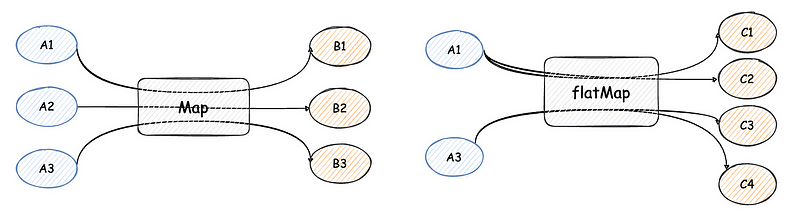
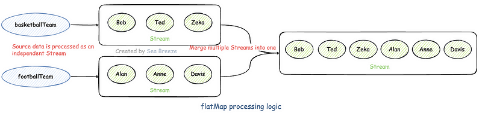
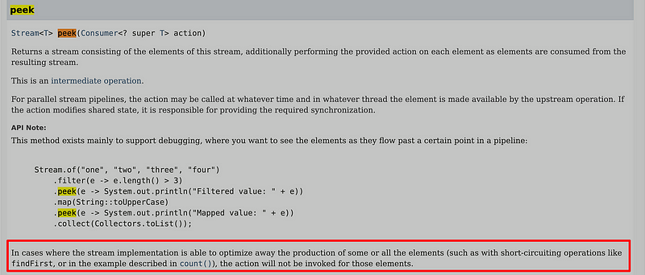
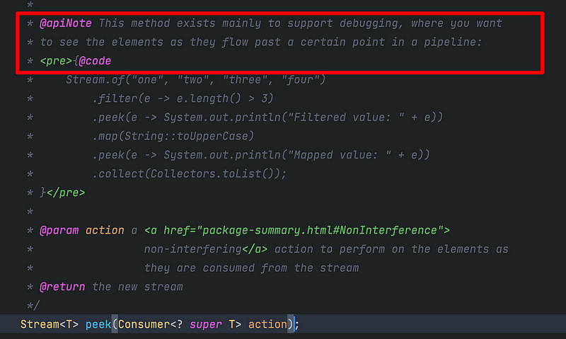
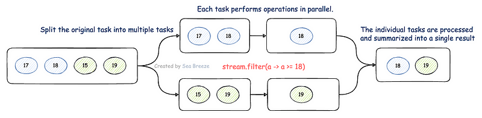
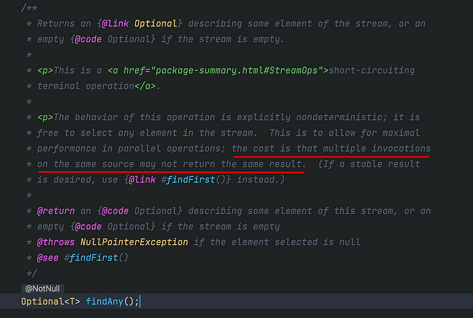

# Мастерство работы с Java Stream

В этой статье мы постараемся подробно рассмотреть **Java Stream**. Без долгих предисловий сразу приступим к делу. 
Для начала возьмём знакомый класс _Student_. Представим, что у нас есть группа студентов:

```java
@Getter
@AllArgsConstructor
public static class Student {
    private String name;
    private Integer age;
}

List<Student> students = Lists.newArrayList(
    new Student("Bob", 18),
    new Student("Ted", 17),
    new Student("Zeka", 19));
```

Задача следующая:

_Необходимо вернуть студентов в возрасте 18 лет и старше из заданного списка, отсортированных по убыванию возраста, 
не более двух человек._

В коде на Java7 и более ранних версий мы реализуем это следующим образом:

```java
public List<Student> getTwoOldestStudents(List<Student> students) {
    List<Student> result = new ArrayList<>();
    // 1. Цикл для определения возраста студентов, сначала отфильтровываем студентов, соответствующих критериям возраста
    for (Student student : students) {
      if (student.getAge() >= 18) {
        result.add(student);
      }
    }
    // 2. Сортируем список подходящих студентов по возрасту
    result.sort((s1, s2) -> s2.getAge() - s1.getAge());
    // 3. Проверяем размер результата. Если он больше 2, обрезаем подсписок до первых двух записей и возвращаем его.
    if (result.size() > 2) {
      result = result.subList(0, 2);
    }
    return result;
}
```

В Java 8 и более поздних версиях с использованием Stream код можно написать более элегантно:

```java
public List<Student> getTwoOldestStudentsByStream(List<Student> students) {
        return students.stream()
                .filter(s -> s.getAge() >= 18)
                .sorted((s1, s2) -> s2.getAge() - s1.getAge())
                .limit(2)
                .collect(Collectors.toList());
    }
```

Различия между двумя подходами:

С точки зрения функционального подхода, реализация процедурного кода связывает элементы коллекции, итерации цикла и 
различные логические проверки, раскрывая чрезмерное количество деталей. По мере усложнения требований процедурный код 
становится сложным для понимания и поддержки.

Функциональный подход отделяет детали реализации от бизнес-логики. Подобно SQL-запросам, он описывает, _что_ нужно
сделать, а не _как_ это сделать, что позволяет программистам сосредоточиться на бизнес-логике и создавать более чистый,
понятный и легко поддерживаемый код.

Опираясь на свой повседневный опыт разработки, я составил подробное резюме основных моментов, сложных аспектов
использования, типичных сценариев и других важных аспектов работы со Stream. Надеюсь, это поможет вам лучше понять
Stream и применять его в разработке проектов более эффективно.

## Первое знакомство со Stream

В Java 8 был добавлен функционал Stream, который позволяет пользователям работать с такими структурами данных, как 
List и Collection в функциональном и более простом стиле, а также использовать параллельные вычисления без явного 
участия пользователя.

Говоря вкратце, выполнение вычислений с помощью Stream включает составление _конвейера потока_. Конвейер потока состоит
из следующих трёх частей:

1. **Создание Stream**: создаётся из исходных данных, которыми могут быть массивы, коллекции, функции-генераторы, каналы 
ввода-вывода и др.

2. **Промежуточные операции**: их может быть ноль или более, они преобразуют поток в новый поток, например, 
`filter(Predicate)`.

3. **Терминальная операция**: возвращает результат или побочный эффект, например, `count()` или `forEach(Consumer)`

Следующая диаграмма иллюстрирует эти процессы:


Каждому типу операций в конвейере потока соответствует несколько методов API. Давайте для начала перечислим функции 
каждого метода API.

**1. Начало конвейера**

Этап отвечает за создание нового потока (Stream) напрямую или на основе существующих объектов типа массивов, _List_, 
_Set_, _Map_ и других коллекций.

| **API**          | **Описание**                                                                            |
|:-----------------|:----------------------------------------------------------------------------------------|
| stream()         | Создаёт новый объект последовательного потока                                           |
| parallelStream() | Создаёт объект потока, который может выполняться параллельно                            |
| Stream.of()      | Создаёт новый объект последовательного потока из заданной последовательности элементов  |

Помимо обычного Stream, который является потоком ссылок на объекты, существуют примитивные специализации: _IntStream_, 
_LongStream_ и _DoubleStream_. Все они называются «потоками» и соответствуют описанным здесь характеристикам и 
ограничениям.

**2. Промежуточный конвейер**

Этот этап отвечает за обработку потока и возвращение нового объекта Stream. Операции промежуточного конвейера могут 
накладываться друг на друга.

| **API**    | **Описание**                                                                                                                                                                            |
|:-----------|:----------------------------------------------------------------------------------------------------------------------------------------------------------------------------------------|
| filter()   | Фильтрует элементы, которые соответствуют критериям, и возвращает новый поток                                                                                                           |
| sorted()   | Возвращает новый поток, отсортировав все элементы потока в соответствии с заданными правилами                                                                                           |
| skip()     | Пропускает указанное количество элементов в начале коллекции и возвращает новый поток                                                                                                   |
| distinct() | Убирает дубликаты из потока и возвращает новый поток                                                                                                                                    |
| limit()    | Сохраняет указанное количество элементов в начале коллекции и возвращает новый поток                                                                                                    |
| concat()   | Объединяет данные из двух потоков в новый поток и возвращает его                                                                                                                        |
| peek()     | Обходит и обрабатывает каждый элемент потока по одному и возвращает обработанный поток                                                                                                  |
| map()      | Преобразует существующий элемент в объект другого типа (один-к-одному) и возвращает новый поток                                                                                         |
| flatMap()  | Преобразует существующие элементы в объекты другого типа (один-ко-многим), то есть один элемент может быть преобразован в один или несколько новых элементов, и возвращает новый поток  |

**3. Завершение конвейера**

Как следует из названия, после завершения операции конвеера поток заканчивается. На этом этапе могут быть выполнены 
логические операции или возвращены данные с результатами выполнения, в зависимости от требований.


| **API**     | **Описание**                                                                                                                              |
|:------------|:------------------------------------------------------------------------------------------------------------------------------------------|
| findFirst() | Обработка потока завершается, когда найден первый элемент, соответствующий критериям                                                      |
| findAny()   | Завершает обработку потока, когда найден любой элемент, соответствующий условиям                                                          |
| anyMatch()  | Возвращает логическое значение (boolean), аналогичное isContains(), используется для проверки наличия элементов, соответствующих условиям |
| allMatch()  | Возвращает логическое значение, используется для проверки, соответствуют ли все элементы условиям                                         |
| noneMatch() | Возвращает логическое значение, используется для проверки, не соответствует ли ни один элемент условиям                                   |
| min()       | Возвращает минимальное значение после обработки потока                                                                                    |
| max()       | Возвращает максимальное значение после обработки потока                                                                                   |
| count()     | Возвращает итоговое количество элементов после обработки потока                                                                           |
| collect()   | Преобразует поток в указанный тип, используя Collectors                                                                                   |
| toArray()   | Преобразует поток в массив                                                                                                                |
| iterator()  | Преобразует поток в объект типа Iterator                                                                                                  |
| forEach()   | Не возвращает значение, обходит элементы по одному и выполняет заданную логику обработки                                                  |

## Stream API: Детальное использование

**1. Создание Stream**

```java
//Stream.of, IntStream.of...
Stream nameStream = Stream.of("Bob", "Ted", "Zeka");
IntStream ageStream = IntStream.of(18, 17, 19);

//stream, parallelStream
Stream studentStream = students.stream();
Stream studentParallelStream = students.parallelStream();
```

**2. Промежуточные операции**

**2.1 map**

`map` и `flatMap` используются для преобразования существующих элементов в элементы других типов. Различие между ними:
+ `map` предполагает преобразование «один-к-одному», то есть каждый элемент может быть преобразован только в один новый
элемент.
+ `flatMap` допускает преобразование «один-ко-многим», то есть каждый элемент может быть преобразован в один или 
несколько новых элементов.



Рассмотрим метод `map`. Текущая задача:

_Преобразовать предыдущий список объектов студентов в список их имён и вывести результат_:

```java
/**
     * Использование map: один-к-одному   
     * @param students
     * @return
     */
    public List<String> objectToString(List<Student> students) {
        return students.stream()
                .map(Student::getName)
                .collect(Collectors.toList());
    }
```

Вывод:

`[Bob, Ted, Zeka]`

Как видно, на входе три объекта `Student`, а на выходе три имени студентов.

**2.2 flatMap**

Теперь давайте расширим задачу.

В соответствии с правилами школы каждый учащийся должен присоединиться к какой-либо команде. Допустим:
+ Боб, Тед и Зека присоединяются к баскетбольной команде.
+ Алан, Энн и Дэвис присоединяются к футбольной команде.

```java
@Getter
@AllArgsConstructor
public static class Team {
    private String type;
    private List<Student> students;
}

List<Student> basketballStudents = Lists.newArrayList(
                new Student("Bob", 18),
                new Student("Ted", 17),
                new Student("Zeka", 19));

List<Student> footballStudent = Lists.newArrayList(
                new Student("Alan", 19),
                new Student("Anne", 21),
                new Student("Davis", 21));

Team basketballTeam = new Team("basketball", basketballStudents);
Team footballTeam = new Team("football", footballStudent);
List<Team> teams = Lists.newArrayList(basketballTeam, footballTeam);    // Объект Lists зависит от com.google.common.collect
```

Теперь нужно посчитать всех учащихся во всех командах и вернуть их в объединённом списке. Как это можно реализовать?

Попробуем использовать метод `map`:

```java
List<List<Student>> allStudents = teams.stream()
    .map(Team::getStudents)
    .collect(Collectors.toList());
```

Мы видим, что если это не удаётся, возвращаемый тип результата — `List<List>`, тогда как нам нужен именно `List`.

Тем не менее, в Java 7 и более ранних версиях мы могли бы легко решить эту задачу следующим образом:

```java
List<Student> allStudents = new ArrayList<>();
for (Team team : teams) {
    for (Student student : team.getStudents()) {
      allStudents.add(student);
    }
}
```

Однако код с двумя вложенными циклами выглядит неэлегантно. В этом случае на помощь приходит метод `flatMap`

```java
List<Student> allStudents = teams.stream()
    .flatMap(t -> t.getStudents().stream())
    .collect(Collectors.toList());
```

Разве это не круто? Всё реализуется в одну строку кода. Метод `flatMap` принимает лямбда-функцию. Возвращаемое значение
этой функции должно быть типа Stream. В итоге метод `flatMap` объединяет все возвращаемые потоки, создавая новый Stream,
чего метод `map` сделать не может.

Следующая диаграмма наглядно иллюстрирует логику обработки метода `flatMap`:



**2.3 filter, distinct, sorted, limit**

Это часто используемые методы промежуточных операций Stream, их часто применяют вместе. Описания их функций 
представлены в предыдущей таблице. Сейчас давайте сразу перейдём к задаче:

_Для списка учащихся из всех команд нам нужно узнать возраст второго и третьего самых старших из них. Они должны быть 
не младше 18 лет. Кроме того, если есть повторяющиеся значения, их следует учитывать только один раз._

```java
List<Integer> topTwoAges = allStudents.stream() /
      .map(Student::getAge) //[18, 17, 19, 19, 21, 21]
      .filter(a -> a >= 18) //[18, 19, 19, 21, 21]
      .distinct()   //[18, 19, 21]
      .sorted((a1, a2) -> a2 - a1)  //
      .skip(1)  //[19, 18]
      .limit(2) //[19, 18]
      .collect(Collectors.toList());
    
System.out.println(topTwoAges);
```

Вывод:

`[19, 18]`

Примечание: так как после выполнения метода `skip` остаётся только два элемента, шаг `limit` можно было бы опустить.

Думаю, вы легко поймёте функции этих методов без дополнительных пояснений. Настоятельно рекомендую попробовать 
реализовать их самостоятельно, чтобы закрепить знания.

**2.4 peek, forEach**

Оба метода `peek` и `forEach` можно использовать для обхода элементов и их поочерёдной обработки, поэтому мы разберём
их вместе для сравнения. Однако стоит отметить, что `peek` является методом _промежуточной_ операции, а `forEach` — 
_терминальной_.

Как описывалось ранее, промежуточная операция может использоваться только в качестве шага обработки в середине 
конвейера потока. Её нельзя выполнить напрямую для получения результата. Для выполнения промежуточной операции 
потребуется терминальная операция.

Как метод терминальной операции, не возвращающий значения, `forEach` может выполнять соответствующую операцию напрямую.

Например, давайте поприветствуем каждого студента из баскетбольной команды, используя `peek` и `forEach` соответственно:

```java
//peak
System.out.println("------start peek------");
basketballTeam.getStudents().stream()
    .peek(s -> System.out.println("Hello, " + s.getName()));
System.out.println("------end peek------");

System.out.println();
//foreach
System.out.println("------start foreach------");
basketballTeam.getStudents().stream()
    .forEach(s -> System.out.println("Hello, " + s.getName()));
System.out.println("------end foreach------");
```

Как видно из вывода, метод `peek` не выполняется, если вызывается самостоятельно, в то время как `forEach` может быть 
выполнен напрямую:

```java
------start peek------
------end peek------

------start foreach------
Hello, Bob
Hello, Ted
Hello, Zeka
------end foreach------
```

Если добавить терминальную операцию после `peek`, он будет выполнен.

```java
System.out.println("------start peek------");
basketballTeam.getStudents().stream()
        .peek(s -> System.out.println("Hello, " + s.getName()))
        .count();
System.out.println("------end peek------");

//output
------start peek------
Hello, Bob
Hello, Ted
Hello, Zeka
------end peek------
```

Стоит отметить, что метод `peek` следует использовать с осторожностью для выполнения бизнес-логики обработки. Подумайте:
если есть терминальный метод, будет ли выполнен `peek`? Ответ: неопределённо! Всё зависит от версии Java и конкретной
ситуации.

Например, в версии _Java 8_ метод `peek` из предыдущего примера выполнится нормально, но в Java 17 он будет 
автоматически оптимизирован, и логика внутри peek может не выполниться. Причины этого поведения можно найти в 
официальной документации API JDK 17.



Для таких методов, как `findFirst` и `count`, метод `peek` рассматривается как операция, не влияющая результат, поэтому
он оптимизируется и не выполняется.

Из комментариев к исходному коду `peek` можно увидеть, что рекомендованный сценарий его использования — это отладка. 
Вы можете использовать `peek` для вывода информации о каждом элементе, чтобы упростить отладку и анализ проблем в 
процессе разработки. Как и следует из названия, `peek` служит для «подглядывания» за изменениями данных во время 
выполнения.



**3. Терминальная операция**

Терминальные операции делятся на две категории.

_Первая категория_ — получение простых результатов. Сюда относятся методы `max`, `min`, `count`, `findAny`, `findFirst`,
`anyMatch`, `allMatch` и другие. Под «простыми» понимаются результаты в форме _чисел_, логических значений (_Boolean_) 
или объектов типа `Optional`.

_Вторая категория_ — сбор элементов в _коллекцию_. Большинство сценариев связано с получением объекта результата класса 
коллекций, таких как `List`, `Set` или `HashMap`. Это реализуется с помощью метода `collect`.

**3.1 Простые типы результатов**

**(1) max, min**

Методы `max()` и `min()` используются для возврата максимального/минимального значения элемента после обработки потока. 
Результат возвращается в обёртке `Optional`. 

Пример:

_Скажите, кто самый старший и самый младший в футбольной команде?_

```java
//max
footballTeam.getStudents().stream()
    .map(Student::getAge)
    .max(Comparator.comparing(a -> a))
    .ifPresent(a -> System.out.println("The maximum age for a football team is " + a));
```

```java
//min
footballTeam.getStudents().stream()
    .map(Student::getAge)
    .min(Comparator.comparing(a -> a))
    .ifPresent(a -> System.out.println("The minimum age for a football team is " + a));
```

Вывод:

```java
The maximum age for a football team is 21
The minimum age for a football team is 19
```

**2. findAny, findFirst**

Методы `findAny()` и `findFirst()` в основном используются для _завершения_ обработки потока, когда _найден_ элемент, 
удовлетворяющий заданным условиям. Для _последовательных_ потоков (serial Stream) `findAny()` работает так же, как 
`findFirst`, однако для _параллельных_ потоков (parallel Stream) `findAny()` более эффективен.

Предположим, в баскетбольной команде появился новый студент, Том, которому 19 лет.

```java
List<Student> basketballStudents = Lists.newArrayList(
                new Student("Bob", 18),
                new Student("Ted", 17),
                new Student("Zeka", 19),
	            new Student("Tom", 19));
```

Рассмотрим результаты следующих двух задач:
+ Вернуть имя _первого_ студента в баскетбольной команде, возраст которого равен 19;
+ Вернуть имя _любого_ студента в баскетбольной команде, возраст которого равен 19.

```java
//findFirst
basketballStudents.stream()
    .filter(s -> s.getAge() == 19)
    .findFirst()
    .map(Student::getName)
    .ifPresent(name -> System.out.println("findFirst: " + name));
```

```java
//findAny
basketballStudents.stream()
    .filter(s -> s.getAge() == 19)
    .findAny()
    .map(Student::getName)
    .ifPresent(name -> System.out.println("findAny: " + name));
```

Вывод:

```java
findFirst: Zeka
findAny: Zeka
```

Как видно, при использовании последовательного потока между этими методами нет разницы. Различия в параллельной 
обработке будут рассмотрены позже.

**3. count**

Так как к баскетбольной команде присоеднилися новый студент, сколько студентов теперь в команде?

```java
System.out.println("The number of students on the basketball team: " + basketballStudents.stream().count());
```

Вывод:

```java
The number of students on the basketball team: 4
```

**4. anyMatch, allMatch, noneMatch**

Как следует из названий, эти три метода используются для проверки, удовлетворяют ли элементы заданным условиям, и 
возвращают логическое значение (`boolean`). Рассмотрим три примера:
+ Есть ли в футбольной команде студент по имени Алан?
+ Все ли студенты в футбольной команде моложе 22 лет?
+ Нет ли в футбольной команде студентов старше 20 лет?

```java
// соответствие хотя бы одного элемента
System.out.println("anymatch: " + footballStudent.stream().anyMatch(s -> s.getName().equals("Alan")));
```

```java
// соответствие всех элементов
System.out.println("allmatch: " + footballStudent.stream().allMatch(s -> s.getAge() < 22));//nonematch
System.out.println("noneMatch: " + footballStudent.stream().noneMatch(s -> s.getAge() > 20));
```

**3.2 Типы результатов для коллекций**

**(1) Создание коллекции**

Создание коллекций — это, вероятно, самый распространённый сценарий использования метода `collect`. Помимо `List`, 
упомянутого ранее, также можно создавать `Set`, `Map` и другие коллекции. Пример:

```java
// Получить актуальное распределение возрастов студентов в баскетбольной команде, без дубликатов.
Set<Integer> ageSet = basketballStudents.stream()
                .map(Student::getAge)
                .collect(Collectors.toSet());
System.out.println("set: " + ageSet);
```

```java
// Получить карту (отображение) имён и возрастов всех студентов в баскетбольной команде.
Map<String, Integer> nameAndAgeMap = basketballStudents.stream()
                .collect(Collectors.toMap(Student::getName, Student::getAge));
System.out.println("map: " + nameAndAgeMap);
```

**(2) Генерация объединённой строки**

Помимо создания коллекций, `collect` также может использоваться для объединения строк.

Например, после получения имён всех студентов в баскетбольной команде, мы хотим объединить их через запятую и вернуть 
строку:

```java
System.out.println(basketballStudents.stream()
    .map(Student::getName)
    .collect(Collectors.joining(",")));
```

Вывод:

```java
Bob,Ted,Zeka,Tom
```

Вы можете сказать: «Разве для этого нельзя использовать `String.join()`? Нет необходимости применять Stream в этой 
ситуации». Но стоит отметить, что прелесть Stream заключается в его способности сочетаться с другой бизнес-логикой, что
делает код более естественным и последовательным. Если ваша задача — только объединение строк, то, действительно, 
использование Stream не обязательно. Зачем стрелять из пушки по воробьям?

Кроме того, метод `Collectors.joining()` поддерживает добавление префиксов и суффиксов, что делает его ещё более мощным.

```java
System.out.println(basketballStudents.stream()
    .map(Student::getName)
    .collect(Collectors.joining(",", "(",")")));
```

Вывод:

```java
(Bob,Ted,Zeka)
```

**(3) Генерация статистических результатов**

Ещё один сценарий, который редко используется на практике, — это применение `collect` для подсчёта суммы числовых 
данных. Рассмотрим это вкратце.

```java
// Вычислить среднее
System.out.println("average age: " + basketballStudents.stream()
        .map(Student::getAge)
        .collect(Collectors.averagingInt(a -> a)));
```

```java
// Сводная статистика
IntSummaryStatistics summary = basketballStudents.stream()
    .map(Student::getAge)
    .collect(Collectors.summarizingInt(a -> a));
System.out.println("summary: " + summary);
```

В приведённом выше примере используется `collect` для выполнения математических операций над возрастами студентов. 
Результаты следующие:

```java
average age: 18.0
summary: IntSummaryStatistics{count=3, sum=54, min=17, average=18.000000, max=19}
```

## Параллельные потоки

**Описание механизма**

Использование параллельных потоков позволяет эффективно задействовать ресурсы компьютера и ускорить выполнение задач. 
Параллельный поток делит весь поток на несколько фрагментов, затем выполняет обработку каждого фрагмента параллельно и,
в конце, объединяет результаты в единый поток.

Как показано на диаграмме ниже, происходит фильтрация чисел, которые больше или равны 18:



**Эффективное использование findAny()**

Как уже упоминалось, метод `findAny()` более эффективен при работе с параллельными потоками. В документации API также
указано, что результаты выполнения этого метода могут различаться при каждом запуске.



Попробуем выполнить `findAny()` 10 раз, используя `parallelStream`, чтобы найти любое имя студента, соответствующее 
критериям (например, Bob, Tom или Zeka):

```java
for (int i = 0; i < 10; i++) {
    basketballStudents.parallelStream()
        .filter(s -> s.getAge() >= 18)
        .findAny()
        .map(Student::getName)
        .ifPresent(name -> System.out.println("findAny in parallel stream: " + name));
}
```

Вывод:

```java
findAny in parallel stream: Zeka
findAny in parallel stream: Zeka
findAny in parallel stream: Tom
findAny in parallel stream: Zeka
findAny in parallel stream: Zeka
findAny in parallel stream: Bob
findAny in parallel stream: Zeka
findAny in parallel stream: Zeka
findAny in parallel stream: Zeka
findAny in parallel stream: Zeka
```

Этот результат подтверждает _нестабильность_ метода `findAny()`.

Чтобы лучше раскрыть тему параллельных потоков, я проведу дополнительный анализ в следующей статье.

**Дополнительная информация**

**1. Отложенное выполнение**

Потоки являются ленивыми; вычисления выполняются только при вызове терминальной операции, а исходные элементы 
потребляются по мере необходимости. Например, метод `peek`, упомянутый ранее, является хорошим примером.

**2. Избегайте повторного выполнения терминальных операций** 

Важно помнить, что после завершения потока его _нельзя_ использовать для выполнения других операций. Попытка сделать это
приведёт к ошибке. Рассмотрим следующий пример:

```java
Stream<Student> studentStream = basketballStudents.stream()
        .filter(s -> s.getAge() == 19);
    // Вычислить количество студентов
System.out.println("Количество студентов: " + studentStream.count());
    // Если попытаться снова, будет выдана ошибка
try {
    System.out.println("Количество студентов: " + studentStream.count());
} catch (Exception e) {
    e.printStackTrace();
}
```

Вывод:

```java
the number of students: 2
java.lang.IllegalStateException: stream has already been operated upon or closed
			at java.util.stream.AbstractPipeline.<init>(AbstractPipeline.java:203)
			...
```

**Заключение**

В этой статье мы рассмотрели, как использовать Stream для написания более элегантного кода на Java на основе нескольких
примеров, а также кратко описали фактическую роль каждого API. 

Ввиду ограниченного объёма статьи, использование методов `collect` и параллельных потоков было рассмотрено лишь 
поверхностно.

Для полного освоения Stream недостаточно изучить материал теоретически — нужно обязательно практиковаться на реальных
проектах.


