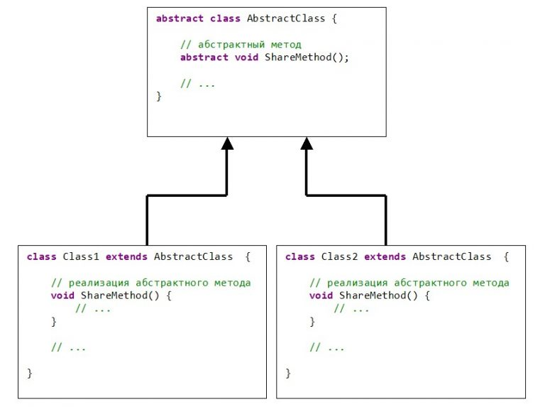

# Абстрактные классы. Абстрактные методы. Ключевое слово abstract. Примеры

## 1. Что такое абстрактный класс? Назначение абстрактных классов. Общая форма. Ключевое слово **abstract**

_Абстрактный класс_ – это класс, содержащий методы, которые не имеют реализации. Абстрактный класс создается с целью 
создания общего интерфейса между разными реализациями классов, которые будут производными от абстрактного класса. 
Абстрактный класс создается для определения некоторых общих черт производных от него классов, которые определяют 
конкретную его реализацию.

Запрещено (нет смысла) создавать объект абстрактного класса.

Класс считается _абстрактным_, если в классе объявлен хотя бы один абстрактный метод. Перед объявлением абстрактного 
класса размещается ключевое слово _`abstract`_.

Общая форма объявления абстрактного класса следующая:

```java
abstract class ClassName {
    // class methods and variables
    //...
    abstract type AbstractMethod1(parameters1);
    abstract type AbstractMethod2(parameters2);
    //...
    abstract type AbstractMethodN(parametersN);
}
```

здесь
+ `ClassName` – имя абстрактного класса, который объявляется;
+ `AbstractMethod1`, `AbstractMethod2`, `AbstractMethodN` – имена абстрактных методов, объявляемых в абстрактном классе;
+ `type` – некоторый тип;
+ `parameters1`, `parameters2`, `parametersN` – перечень параметров, которые получают соответствующие абстрактные 
методы с именами `AbstractMethod1`, `AbstractMethod2`, `AbstractMethodN`.

## 2. Что такое абстрактный метод? Общая форма

_Абстрактный метод_ – это метод, реализация которого в программе не имеет никакого смысла. Абстрактный метод – это 
только объявление формы (интерфейса), а не реализация. Как и в случае с абстрактным классом, абстрактный метод 
начинается из ключевого слова `abstract`.

Если в классе объявлен абстрактный метод, то класс также считается абстрактным. В этом случае перед именем класса 
также ставится ключевое слово `abstract`.

Если некоторый класс есть унаследованным от абстрактного, то этот класс должен переопределить все абстрактные методы 
базового абстрактного класса. В противном случае будет сгенерирована ошибка.

Общая форма объявления абстрактного метода в абстрактном классе имеет следующий вид:

```java
abstract class ClassName {
    // ...
    type AbstractMethod(parameters);
}
```

здесь
+ `ClassName` – имя абстрактного класса, содержащего абстрактный метод с именем `AbstractMethod`;
+ `AbstractMethod` – имя абстрактного метода, возвращающего значение типа `type` и получающего параметры `parameters`.

В иерархии наследования (расширения) классов, абстрактные методы являются чем-то общим. Конкретные реализации 
абстрактных методов помещаются классах, унаследованных от абстрактных классов.

## 3. Схематическое изображение объявления и использования абстрактного метода в абстрактном классе. Пример

На схеме изображен простой пример объявления абстрактного класса с именем `AbstractClass`. Этот класс содержит 
объявление абстрактного метода с именем `ShareMethod()`.

Из абстрактного класса `AbstractClass` унаследовано два класса с именами `Class1`, `Class2`. В Этих классах реализуется
метод `ShareMethod()`, который в классе `AbstractClass` объявлен как абстрактный.


Рисунок. Схема взаимодействия между абстрактным классом и производными классами в Java

## 4. Пример, который демонстрирует использование абстрактных классов

В примере объявляется абстрактный класс `Figure`, описывающий общую информацию о некоторой геометрической фигуре на 
плоскости. Из класса `Figure` наследуются два класса `Triangle` и `Circle`, которые переопределяют абстрактные методы 
класса `Figure`.

В классе `Figure` объявляются:
+ скрытое (`protected`) свойство `name`, которое определяет название геометрической фигуры;
+ скрытая (`protected`) константа `pi`;
+ абстрактный метод `ShowName()`, который выводит название фигуры;
+ абстрактный метод `Area()`, вычисляющий площадь фигуры;
+ метод, возвращающий название фигуры (значение поля `name`).

```java
// абстрактный класс, который описывает некоторую геометрическую фигуру
abstract class Figure {
    protected String name = ""; // имя фигуры
    protected double pi = 3.1415; // константа Пи

    // абстрактные методы, которые будут переопределяться в производных классах
    abstract void ShowName(); // вывести имя фигуры
    abstract double Area(); // определение площади

    // метод, возвращающий название фигуры
    String GetName() {
        return name;
    }
}
```

Также реализованы два класса с именами `Triangle` и `Circle`. Эти классы наследуют (расширяют) класс `Figure`.

В классе `Triangle()` реализованы:
+ внутренние переменные _a, b, c_, которые есть сторонами треугольника;
+ _конструктор_ класса;
+ метод `ShowName()`, который переопределяет абстрактный метод `ShowName()` класса `Figure`. В этом методе выводится 
название класса _«Triangle»_;
+ метод `Area()`, переопределяющий абстрактный метод` Area()` из класса `Figure`. В методе вычисляется площадь 
треугольника.

```java
// класс, реализующий треугольник
class Triangle extends Figure {
    double a, b, c; // стороны треугольника

    // конструктор
    Triangle(double a, double b, double c) {
        name = "Triangle";
        this.a = a;
        this.b = b;
        this.c = c;
    }

    // переопределение абстрактного метода ShowName()
    void ShowName() {
        System.out.println("Triangle");
    }

    // переопределение абстрактного метода Area()
    // площадь треугольника
    double Area() {
        // проверка, вообще ли из расстояний a, b, c можно образовать треугольник
        if (((a+b)<c) || ((b+c)<a) || ((a+c)<b))
            return 0.0;
        double p = (a+b+c)/2; // полупериметр
        double s;

        // Формула Герона
        s = Math.sqrt(p*(p-a)*(p-b)*(p-c));
        return s;
    }
}
```

Класс `Circle` реализует окружность, которая принадлежит к геометрическим фигурам. Поэтому класс `Circle` наследует 
(расширяет) класс `Figure`. В классе `Circle` реализованы:
+ внутренняя переменная `r`, определяющая радиус окружности;
+ _конструктор_;
+ метод `Area()`, переопределяющий одноименный абстрактный метод класса `Figure`. Метод вычисляет площадь окружности;
+ метод `ShowName()`, переопределяющий одноименный абстрактный метод класса `Figure`. Метод выводит имя класса 
«`Circle`».

```java
// класс, реализующий окружность, наследует класс Figure
class Circle extends Figure {
    double r;

    // конструктор
    Circle(double r) {
        name = "Circle";
        this.r = r;
    }

    // переопределение абстрактного метода Area()
    double Area() {
        return pi*r*r;
    }

    // переопределение абстрактного метода ShowName()
    void ShowName() {
        System.out.println("Circle");
    }
}
```

Для того, чтобы продемонстрировать использование абстрактных классов, создается дополнительный класс с именем 
_UseAbstractClass_. Этот класс реализует:
+ метод `GetName()`, возвращающий имя экземпляра `f`, который передается в качестве входного параметра. Параметр `f` 
есть ссылкой на класс `Figure`;
+ метод `GetArea()`, возвращающий площадь экземпляра `f` класса `Figure`. Экземпляр (объект) класса `f` есть входным 
параметром метода. Этот метод наглядно демонстрирует так называемое позднее связывание, суть которого описывается ниже;
+ статический метод `main()`, который есть точкой входа в программу. Этот метод реализует демонстрацию работы 
абстрактного класса `Figure`.

```java
// класс, который использует абстрактный класс Figure
public class UseAbstractClass {
    // метод, который получает ссылку на базовый класс
    static String GetName(Figure f) {
        return f.GetName(); // вызов метода базового класса
    }

    // метод, который возвращает площадь фигуры, f - ссылка на базовый класс
    // используется позднее связывание,
    // метод для вычисления площади определяется на основе значения ссылки f
    static double GetArea(Figure f) {
        return f.Area(); // вызов метода вычисления площади
    }

    public static void main(String[] args) {
        // демонстрация использования абстрактных методов Area() и ShowName()
        Figure f1 = new Triangle(3.5, 1.8, 2.2); // экземпляр класса Triangle
        Figure f2 = new Circle(3.0); // экземпляр класса Circle
        double area;

        // вывести названия экземпляров f1, f2
        f1.ShowName(); // Triangle
        f2.ShowName(); // Circle

        //
        String name;
        name = GetName(f1); // name = "Triangle"
        System.out.println(name);

        name = GetName(f2); // name = "Circle"
        System.out.println(name);

        // вычисление площади для треугольника
        // реализация позднего связывания
        area = GetArea(f1); // area = 1.6833281765597579
        System.out.println("area = " + area);

        // вычисление площади для окружности,
        // реализация позднего связывания
        area = GetArea(f2); // area = 28.2735
        System.out.println("area = " + area);
    }
}
```

В результате выполнения функции `main()` класса `UseAbstractClass` будет выведен следующий результат:

```bash
Triangle
Circle
Triangle
Circle
area = 1.6833281765597579
area = 28.2735
```

## 5. Объяснение к примеру из пункта 4

Объяснение к примеру (см. предшествующий пункт) в виде вопросов.

**5.1. Зачем в классе `Figure` методы `Area()` и `ShowName()` объявляются абстрактными?**

Класс `Figure` представляет собой обобщение геометрической фигуры. В этом классе определяются общие свойства всего 
разнообразия геометрических фигур. Конкретные фигуры (треугольник, окружность) расширяют (`extends`) возможности 
класса `Figure` или, иными словами, наследуют класс `Figure`. В нашем случае, конкретными фигурами выбраны треугольник 
(класс `Triangle`) и окружность (класс `Circle`). Классы `Triangle` и `Circle` являются конкретными реализациями 
обобщенного класса `Figure`.

В классе `Figure` метод `Area()` объявляется абстрактными (`abstract`), так как невозможно определить площадь 
обобщенной фигуры, поскольку, пока что неизвестно, какая это фигура (треугольник или окружность). Для треугольника 
(класс `Triangle`) площадь определяется по формуле Герона. Для окружности площадь определяется по стандартной формуле
**S = π·R2**.

Отсюда можно сделать вывод: нет смысла вызывать метод `Area()` из базового класса `Figure`. Этот метод объявляется 
только для организации иерархического вызова методов `Area()`, которые вычисляют площади фигур конкретных реализаций 
производных от `Figure` классов. В нашем случае этими производными классами являются классы `Triangle` и `Circle`.

**5.2. Почему класс `Figure` объявляется абстрактным?**

Если класс содержит хотя бы один абстрактный метод, то этот класс считается `абстрактным`. Класс `Figure` содержит два 
абстрактных метода, поэтому перед объявлением класса ставится ключевое слово `abstract`.

**5.3. Почему в классе `Figure` методы `Area()` и `ShowName()` не содержат кода реализации (тела метода)?**

Если в абстрактном классе метод объявлен как абстрактный (с ключевым словом `abstract`), то этот метод не должен 
содержать реализации (согласно синтаксису Java). Это поясняется тем, что вызов этого метода не имеет смысла.

**5.4. Можно ли в абстрактном классе `Figure` добавлять другие не абстрактные методы?**

Да, можно. Абстрактный класс может содержать не абстрактные методы (в отличие от интерфейса).

**5.5. Можно ли создать экземпляр класса `Figure` в функции `main()` класса `UseAbstractClass`?**

Нет, нельзя. То есть, следующая строка

```java
Figure f3 = new Figure();
```

есть ошибкой компилятора Java: «_Cannot instantiate the type Figure_».

Однако, можно описать ссылку на класс `Figure`. Так как класс `Figure` есть базовым для классов `Triangle` и `Circle`, 
то, используя эту ссылку, можно создать экземпляры производных от `Figure` классов. Нижеследующий код демонстрирует 
использование ссылки на базовый класс `Figure`:

```java
// объявление ссылки на базовый класс
Figure f3;

// создание экземпляра класса Circle, производного от Figure
f3 = new Circle(2.5);

// вызов метода класса Circle
f3.ShowName();
```

**5.6. В чем состоит суть позднего связывания в методе `GetArea()` класса `UseAbstractClass`?**

Метод `GetArea()` получает ссылку с именем `f` абстрактного класса `Figure`, который является базовым в иерархии классов 
(из класса `Figure` унаследованы два класса `Triangle` и `Circle`).

```java
static double GetArea(Figure f) {
    return f.Area(); // вызов метода вычисления площади
}
```

Затем по ссылке вызывается метод `Area()` в строке

```java
// ...
return f.Area();
// ...
```

На момент компиляции метода `GetArea()` нельзя сказать, экземпляр какого класса (`Triangle` или `Circle`) будет передан
в метод. Значит, нельзя сказать, какой метод `Area()` будет вызван. Поэтому, в метод передается ссылка на базовый класс
`Figure`.

В функции `main()` при вызове метода `GetArea()`

```java
//...
Figure f1 = new Triangle(3.5, 1.8, 2.2); // экземпляр класса Triangle
Figure f2 = new Circle(3.0); // экземпляр класса Circle
//...
// вычисление площади для треугольника
// реализация позднего связывания
area = GetArea(f1); // передается экземпляр класса Triangle
//...
area = GetArea(f2); // передается экземпляр класса Circle
//...
```

в этот метод передаются разные ссылки `(f1, f2)` которые являются экземплярами классов, производных от класса `Figure`.
Эти ссылки являются экземплярами классов `Triangle` и `Circle`.

В первом случае

```bash
area = GetArea(f1);
```

внутри метода `GetArea()` компилятор присваивает ссылке `f` значение ссылки `f1`, которое указывает на класс, 
содержащий метод `Area()` класса `Triangle`. Таким образом, происходит _связывание_ обобщенной ссылки `f` с классом
`Triangle` благодаря иерархии наследования. Такое связывание называется поздним связыванием. Детали позднего связывания 
– эта уже другая тема.

Точно таким же способом связывается экземпляр `f2` класса `Circle` с обобщенной ссылкой `f` в методе `GetArea()`

```java
area = GetArea(f2);
```

**6. Можно ли в абстрактном классе объявлять методы, которые имеют реализацию (тело)?**

Да, можно. Абстрактный класс допускает реализацию не абстрактных методов.

  
**7. Пример создания иерархии абстрактных классов**

Если объявляется класс, производный от абстрактного, и в этом классе нету реализации абстрактных методов, тогда этот 
класс автоматически считается абстрактным. Перед именем этого класса нужно указать `abstract`, иначе компилятор 
сгенерирует ошибку.

**Пример**. Ниже приведен пример иерархии абстрактных классов

```java
// иерархия абстрактных классов
abstract class A {
    abstract void Show();
}

// в классе B нет реализации абстрактного метода Show() из класса A,
// поэтому этот класс также есть абстрактным
abstract class B extends A {
    abstract void Show(); // нет реализации
}

// в классе C реализован абстрактный метод Show() классов A, B
class C extends B {
    // реализация метода Show
    void Show() {
        System.out.println("Class C");
    }
}
```

Как видно из примера, в классе `B` унаследован абстрактный метод `Show()`, не имеющий реализации. Поэтому, обязательно 
перед определением класса B нужно указать ключевое слово `abstract`.

Использование класса `C `может быть, например следующим

```java
A obj = new C(); // ссылка на базовый класс A
obj.Show(); //
C obj2 = new C(); // ссылка на класс C
objC2.Show();
```

**8. Может ли абстрактный класс не содержать абстрактных методов?**

Да, может. Это необходимо в случаях, когда абстрактные методы в классе не нужны, но нужно запретить создание 
экземпляров этого класса.

**9. Какие отличия между использованием абстрактных классов и использованием интерфейсов?**

Между абстрактными классами и интерфейсами существуют следующие _отличия_:

+ абстрактные классы могут содержать реализации методов, интерфейсы не могут;
+ в интерфейсах все методы, которые объявляются, есть абстрактными. В абстрактных классах можно объявлять как 
абстрактные, так и не абстрактные методы;
+ переменные, которые объявляются в интерфейсах, обязательно должны быть инициализированы. В абстрактных классах 
внутренние переменные можно не инициализировать;
+ в интерфейсах все объявленные переменные неявно считаются _константами_ (объявлены с ключевыми словами `final`, 
`static`). В абстрактных классах объявленные переменные не считаются константами.
  
**10. Преимущества использования абстрактных классов**

Использование абстрактных классов дает следующие преимущества:

+ использование ключевого слова `abstract` перед объявлением класса подчеркивает абстрактность этого класса. Это, в 
свою очередь, сообщает разработчику о том, как этот класс нужно использовать;
+ абстрактные классы являются полезными в случае переработки программ. С помощью абстрактных классов можно легко 
«перемещать» общие методы вверх по иерархии.
