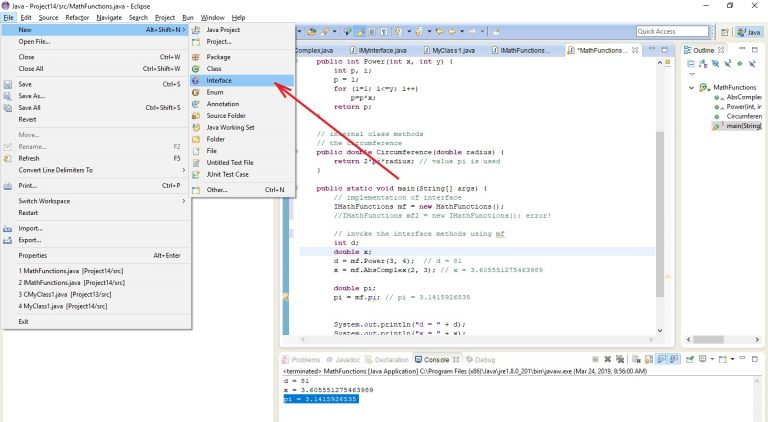

# Интерфейсы. Особенности использования в сочетании с классами. Преимущества применения интерфейсов. Ключевые слова interface, implements. Примеры

## 1. Для чего используются интерфейсы? Преимущества применения интерфейсов

Интерфейсы используются для создания _полностью абстрактных, классов_ которые вообще не содержат реализации. Интерфейсы 
не содержат реализации. Таким образом, интерфейсы предназначены для _описания_ того, что может быть реализовано 
классами, которые реализуют эти интерфейсы. Иными словами, интерфейсы указывают классам которые их реализуют, что может 
быть реализовано, но не как это должно быть реализовано. Интерфейсы описывают форму а не реализацию. 

В интерфейсе указываются имена методов, списки аргументов и типы значений, которые возвращаются, но не тела (реализации)
этих методов.

Использование интерфейсов дает следующие взаимосвязанные **преимущества**:

+ интерфейс фактически определяет «_протокол_» взаимодействия между классами;
+ объединение интерфейсов и классов позволяет четко отделить объявление общедоступных методов от их реализации;
+ интерфейсы изолируют определение одного или нескольких методов от иерархии наследования. В результате классы, которые
не связаны между собой иерархически, могут реализовать один и тот же интерфейс;
+ любой метод, который использует интерфейс, знает только о том, какие методы интерфейса будут вызваны и не больше. 
Реализация методов осуществляется в классах, которые реализуют этот интерфейс и остается скрытой;
+ сочетание возможностей интерфейсов и классов является эффективным в случае реализации разнообразных шаблонов 
проектирования (_patterns_);
+ интерфейсы позволяют частично реализовать так называемое «_множественное наследование_», которое было реализовано в 
суперсложном _C++_ (хотя эта парадигма и приводила к путанице и появлению многочисленных сложноуловимых ошибок в 
программировании).

**2. Общая форма объявления интерфейса. Ключевое слово `interface`**

Общая форма объявления интерфейса имеет следующий вид:

```java
access_modifier interface Name {
    return_type method_name1(parameters1);
    return_type method_name2(parameters2);

    // ...

    type var_name1 = value1;
    type var_name2 = value2;

    // ...
    return_type method_nameN(parametersN);
    type var_nameN = valueN;
}
```

здесь

+ `interface` – ключевое слово, которое определяет, что объявляемый элемент языка Java есть интерфейсом;
+ `access_modifier` – один из модификаторов доступа `public` или `abstract`;
+ `Name` – имя интерфейса;
+ `return_type` – некоторый тип, который возвращает метод с именем _method_name1, method_name2, method_nameN_;
+ `parameters1`, `parameters2`, `parametersN` – параметры методов _method_name1, method_name2, method_nameN_;
+ `type` – тип переменной, объявленной в интерфейсе;
+ `var_name1`, `var_name2`, `var_nameN` – имена переменных, которые объявлены в интерфейсе. Любая переменная, 
объявленная в интерфейсе объявляется с модификаторами `final` и `static`. Эта переменная должна быть инициализирована. 
В классе, который реализует интерфейс нельзя изменить значение переменной.

**3. Какая общая форма реализации интерфейса в классе? Ключевое слово `implements`**

Если интерфейс определен, то его можно реализовать в классе. Общая форма реализации интерфейса в классе имеет вид:

```java
class SomeClass implements SomeInterface {
    // реализация методов интерфейса и других методов класса
    // ...
}
```

здесь `SomeClass` – имя класса, реализующего интерфейс `SomeInterface`.

**4. Что нужно обязательно выполнить (реализовать) в классе, который реализует заданный интерфейс?**

Если класс реализует интерфейс, то для данного класса устанавливаются следующие обязательства:

+ класс обязательно должен содержать _реализацию_ методов, объявленных в этом интерфейсе;
+ сигнатура методов интерфейса должна _совпадать_ с сигнатурой этих же методов, реализованных в классе;
+ методы, которые реализуют элементы интерфейса, обязательно должны быть _объявлены_ в классе как `public`;
+ в классе _запрещено_ изменять значения переменных, объявленных в интерфейсе.
   ⇑
**5. Примеры объявление интерфейсов и классов, которые их реализуют**

**Пример 1**. В примере демонстрируется:

+ объявление методов в интерфейсе;
+ объявление переменной в интерфейсе;
+ реализация интерфейса в классе;
+ использование ссылки на интерфейс для доступа к методам.

Пусть в пределах пакета в файле `IMathFunctions.java` объявлен интерфейс с именем `IMathFunctions` как показано ниже

```java
// интерфейс, который содержит объявления математических функций
public interface IMathFunctions {
    double pi=3.1415926535; // переменная, число Пи
    int Power(int x, int y); // x в степени y
    double AbsComplex(double real, double imag); // модуль комплексного числа
}
```

В интерфейсе указываются следующие объявления:

+ переменная `pi`, которая определяет число Пи. Эта переменная неявно объявлена как `final` и `static`. Если некоторый 
класс реализует этот интерфейс, то изменять значения этой переменной нельзя;
+ математическая функция `Power()`, предназначенная для возведения числа в степень;
+ математическая функция `AbsComplex()`, возвращающая модуль комплексного числа.

После объявления интерфейса объявляется класс, который должен _реализовать_ методы этого интерфейса. В нашем случае 
объявляется класс `MathFunctions`

```java
// класс, который реализует интерфейс IMathFuncitons
public class MathFunctions implements IMathFunctions {
    // Реализация методов интерфейса IMathFunctions
    // 1. Модуль комплексного числа
    public double AbsComplex(double real, double imag) {
        double abs;
        abs = Math.sqrt(real*real+imag*imag);
        return abs;
    }

    // 2. Возведение в степень целочисленных значений
    public int Power(int x, int y) {
        int p, i;
        p = 1;
        for (i=1; i<=y; i++)
            p=p*x;
        return p;
    }

    // Внутренние методы класса
    // Определение длины окружности
    public double Circumference(double radius) {
        return 2*pi*radius; // используется переменная pi из интерфейса
    }
}
```

Использование интерфейса в классе может быть, например, следующим

```java
// использование интерфейса
IMathFunctions mf = new MathFunctions(); // объявить экземпляр класса MathFunctions
//IMathFunctions mf2 = new IMathFunctions(); ошибка - запрещено объявлять экземпляр интерфейса

// вызов интерфейсных методов через экземпляр mf
int d;
double x;
d = mf.Power(3, 4); // d = 81
x = mf.AbsComplex(2, 3); // x = 3.605551275463989

double pi;
pi = mf.pi; // pi = 3.1415926535
```

В вышеприведенном коде сначала объявляется ссылка `mf` на интерфейс `IMathFunctions`. Затем для этой ссылки `mf`
создается экземпляр класса `MathFuncions`. Такая реализация работает, поскольку класс `MathFunctions` реализует 
(`implements`) интерфейс `IMathFunctions`. С помощью ссылки `mf` можно вызвать методы интерфейса.

**Пример 2**. В примере демонстрируется использование интерфейса _IStrings_, объявляющего методы обработки строки:

+ метод `GetNSymbols()`, подсчитывающий количество символов в строке;
+ метод `ConvertOdd()`, возвращающий строку, состоящую из символов лежащих на нечетных позициях.

Класс _ProcessStrings_ реализует интерфейс _IStrings_.

Реализация интерфейса помещается в файле _IStrings.java_ и имеет следующий вид:

```java
public interface IStrings {
    // подсчитывает количество заданных символов в строке
    int GetNSymbols(char c, String s);

    // образовывает строку, состоящую из символов строки s,
    // которые размещены на нечетных позициях: 1, 3, 5, ...
    String ConvertOdd(String s);
}
```

Реализация класса описывается в файле _ProcessStrings.java_ и имеет следующий вид

```java
// класс, реализующий интерфейс IStrings
public class ProcessStrings implements IStrings {
    // реализация методов, которые объявлены в интерфейсе
    // вычислить количество символов в строке s, может быть public-метод
    public int GetNSymbols(char c, String s) {
        int i;
        int k = 0;
        for (i=0; i<s.length(); i++)
            if (c==s.charAt(i))
                k++;
        return k;
    }

    // образовывает строку, состоящую из символов строки s,
    // которые размещены на нечетных позициях: 1, 3, 5, ...
    public String ConvertOdd(String s) {
        String s2="";
        int i;
        for (i=0; i<s.length(); i++) {
            if (i%2==1) // если нечетная позиция
                s2=s2+s.charAt(i);
        }
        return s2;
    }

    public static void main(String[] args) {
        // демонстрация работы с интерфейсом IStrings
        IStrings obj = new ProcessStrings();
        String s1 = "bestprog.net";
        String s2;
        int k;

        s2 = obj.ConvertOdd(s1); // s2 = "etrgnt"
        k = obj.GetNSymbols('t', s1); // k = 2

        System.out.println("s2 = " + s2);
        System.out.println("k = " + k);
    }
}
```

Как видно из кода, в классе _ProcessStrings_ помещаются реализации методов `GetNSymbols()` и `ConvertOdd()`. 
Статическая функция _main()_ класса `ProcessStrings` есть точкой входа в программу. В результате выполнения функции 
_main()_, будет выведен следующий результат:

```bash
s2 = etrgnt
k = 2
```

**6. Можно ли создать экземпляр (объект) интерфейса?**

Поскольку, интерфейс содержит только объявление без реализации, то создать экземпляр интерфейса _запрещено_. Однако, 
ссылку на интерфейс объявить можно. Но при выделении памяти оператором `new` должен указываться _конструктор_ класса, 
который реализует данный интерфейс.

   ⇑
**7. Во скольких классах может быть реализованн интерфейс?**

Интерфейс может быть реализован в _любом_ количестве классов. Например, в нижеследующем коде два разных класса с 
именами _SomeClass1_, _SomeClass2_ реализуют один интерфейс _SomeInterface_.

```java
// некоторый интерфейс
interface SomeInterface {
    // ...
    void method1(int d);
    double method2(double x);
}

// класс, который реализует интерфейс
class SomeClass1 implements SomeInterface {
    // ...
    void method1(int d) {
        // реализация метода
        // ...
    }

    double method2(double x) {
        // реализация метода
        // ...
    }
}

// другой класс, который реализует интерфейс
class SomeClass2 implements SomeInterface {
    // ...
    void method1(int d) {
        // реализация метода
        // ...
    }

    double method2(double x) {
        // реализация метода
        // ...
    }
}
```

**8. Сколько интерфейсов может реализовать один класс?**

Класс может реализовать _любое количество_ интерфейсов. В этом случае имена интерфейсов разделяются запятой. Например, 
в следующем коде

```java
class ClassName implements Interface1, Interface2, Interface3 {
    // ...
}
```

класс с именем _ClassName_ реализует интерфейсы с именами _Interface1, Interface2, Interface3_.

**9. Какой тип доступа обязательно должны иметь методы, объявленные в интерфейсе?**

Методы, объявленные в интерфейсе, должны быть _общедоступными_, то есть должны иметь тип доступа `public`.

   ⇑
**10. Какой тип доступа по умолчанию имеют методы, объявленные в интерфейсе?**

Если не указан тип доступа в объявлении метода, то эти методы имеют тип доступа `public`. Например, в нижеследующем коде

```java
interface SomeInterface {
    public void method1(int d);
    int method2(int x, int y);
}
```

оба метода `method1()` и `method2()` имеют тип доступа `public`.

**11. Как вызвать методы класса с помощью ссылок на интерфейсы?**

Последовательность шагов следующая (см. пример с п. 5):

1. Объявить ссылку на интерфейс
2. Выделить память для ссылки, указав конструктор класса, реализующий данный интерфейс.
3. Вызвать методы или переменные, объявленные в интерфейсе.

**Например**. Пусть задан интерфейс с именем _I_ и класс с именем _C._ В интерфейсе _I_ объявляется метод

```java
interface I {
    void method();
    int d = 5;
}

class C implements I {
    // ...
    // реализация метода интерфейса I
    public void method() {
        // ...
    }
}
```

Использование метода `method()` с учетом интерфейса _I_ может быть следующей:

```java
I obj;         // 1. Объявить ссылку
obj = new C(); // 2. Создать экземпляр, используя конструктор класса
obj.method();  // 3. Вызвать интерфейсный метод
int t = obj.d; // 3. Вызвать интерфейсную переменную
```

**12. Требования к объявлению переменных в интерфейсах**

В интерфейсе можно объявлять переменную. Любая переменная, объявленная в интерфейсе неявно объявляется с модификаторами
`final` и `static`. Эта переменная должна быть _инициализирована_. В классе, реализующем интерфейс, _нельзя_ изменить 
значение переменной.

**13. В каких случаях можно применять спецификатор доступа public в объявлении интерфейса?**

Спецификатор доступа `public` можно применять перед именем интерфейса только в случае, когда интерфейс определен в 
файле, который имеет то же имя. Если имя интерфейса не совпадает с именем файла, то спецификатор `public` нельзя 
использовать в объявлении интерфейса.

**Например**. Задан файл с именем _IMyInterface.java_. В этом файле можно объявить `public`-интерфейс с таким именем

```java
public interface MyInterface {
    // ...
}
```

**14. Как добавить объявление интерфейса в Java Eclipse?**

В системах, поддерживающих программирование на языке Java, добавление интерфейсов в проект реализовано с помощью 
специальных команд.

Чтобы добавить интерфейс в некоторый проект в системе программирования _Java Eclipse_ нужно выполнить следующие шаги.

**1**. Активировать проект, в который нужно добавить интерфейс (рис. 1).


Рис. 1. Активация проекта с именем _Project15_ в Java Eclipse

**2**. Вызвать команду создания интерфейса

```bash
File->New->Interface
```



Рис. 2. Команда добавления интерфейса к проекту

В результате откроется окно «_New Java Interface_» (рисунок 3).

**3**. В окне «_New Java Project_» нужно выполнить следующие действия (см. рисунок 3):

+ в поле «_Source folder_:» нужно проверить имя папки с проектом. В нашем случае имя папки с проектом «_Project15/src_».
По желанию можно установить другую папку;
+ в поле «_Name:_» нужно задать имя интерфейса, например, _MyInterface_.


Рис. 3. _Окно «New Java Interface_». Установление проекта _Project15_ и имени интерфейса _MyInterface_

**4**. После выбора кнопки _Finish_ интерфейс с именем `MyInterface` будет добавлен к проекту _Project15_ как показано 
на рисунке 4.


Рис. 4. Отображение интерфейса в окне _Package Explorer_ и окне _MyInterface.java_

Для интерфейса создается отдельный файл _MyInterface.java_. По всей видимости, имя файла интерфейса и имя интерфейса 
совпадают. Также интерфейс объявлен как `public` для того, чтобы он был доступным из других файлов, пакетов.
