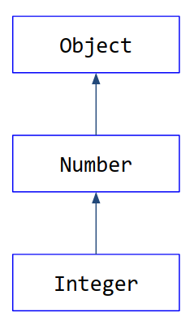
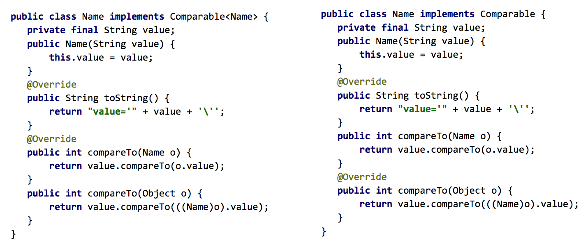

# Пришел, увидел, обобщил: погружаемся в Java Generics

**Java Generics** — это одно из самых значительных изменений за всю историю языка Java. «Дженерики», доступные с Java 5,
сделали использование Java Collection Framework проще, удобнее и безопаснее. Ошибки, связанные с некорректным 
использованием типов, теперь обнаруживаются на этапе компиляции. Да и сам язык Java стал еще безопаснее. Несмотря на 
кажущуюся простоту обобщенных типов, многие разработчики сталкиваются с трудностями при их использовании. В этом посте 
я расскажу об особенностях работы с Java Generics, чтобы этих трудностей у вас было поменьше. Пригодится, если вы не 
гуру в дженериках, и поможет избежать много трудностей при погружении в тему.

## Работа с коллекциями

Предположим, банку нужно подсчитать сумму сбережений на счетах клиентов. До появления «дженериков» метод вычисления 
суммы выглядел так:

```java
public long getSum(List accounts) {
   long sum = 0;

   for (int i = 0, n = accounts.size(); i < n; i++) {
       Object account = accounts.get(i);
       if (account instanceof Account) {
           sum += ((Account) account).getAmount();
       }
   }

   return sum;
}
```

Мы итерировались, пробегались по списку аккаунтов и проверяли, действительно ли элемент из этого списка является 
экземпляром класса `Account` — то есть счетом пользователя. Выполняли приведение типа нашего объекта класса `Account` и 
метод `getAmount`, который возвращал сумму на этом счете. Дальше все это суммировали и возвращали итоговую сумму. 
Требовалось выполнить два действия:

```java
if (account instanceof Account) { // (1)
    
    sum += ((Account) account).getAmount(); // (2)
```

Если не сделать проверку (`instanceof`) на принадлежность к классу `Account`, то на втором этапе возможен 
`ClassCastException` – то есть аварийное завершение программы. Поэтому такая проверка была обязательной.

С появлением _Generics_ необходимость в проверке и приведении типа отпала:

```java
public long getSum2(List<Account> accounts) {
   long sum = 0;

   for (Account account : accounts) {
       sum += account.getAmount();
   }

   return sum;
}
```

Теперь метод

    getSum2(List<Account> accounts)

принимает в качестве аргументов только список объектов класса Account. Это ограничение указано в самом методе, в его 
сигнатуре, программист просто не может передать никакой другой список — только список клиентских счетов.

Нам не нужно выполнять проверку типа элементов из этого списка: она подразумевается описанием типа у параметра метода

    List<Account> accounts

(можно прочитать как список объектов класса `Account`). И компилятор выдаст ошибку, если что-то пойдет не так — то есть 
если кто-то попробует передать в этот метод список объектов, отличных от класса `Account`.

Во второй строчке проверки необходимость тоже отпадала. Если потребуется, приведение типов (_casting_) будет сделано 
на этапе компиляции.

## Принцип подстановки

Принцип подстановки Барбары Лисков – специфичное определение подтипа в объектно-ориентированном программировании. 
Идея Лисков о «подтипе» дает определение понятия замещения: если _S_ является подтипом _T_, тогда объекты типа _T_ в 
программе могут быть замещены объектами типа _S_ без каких-либо изменений желательных свойств этой программы.


| **Тип**                          | **Подтип**                      |
|:---------------------------------|:--------------------------------|
| Number                           | Integer                         |
| List<E>                          | ArrayList<E>                    |
| Collection<E>                    | List<E>                         |
| Iterable<E>                      | Collection<E>                   |

_Примеры отношения тип/подтип_

Вот пример использования принципа подстановки в Java:

```java
Number n = Integer.valueOf(42);
List<Number> aList = new ArrayList<>();
Collection<Number> aCollection = aList;
Iterable<Number> iterable = aCollection;
```

`Integer` является подтипом `Number`, следовательно, переменной `n` типа `Number` можно присвоить значение, которое 
возвращает метод `Integer.valueOf(42)`.

## Ковариантность, контравариантность и инвариантность

Сначала немного теории. _Ковариантность_ — это сохранение иерархии наследования исходных типов в производных типах в 
том же порядке. Например, если Кошка — это подтип Животные, то Множество<Кошки> — это подтип Множество<Животные>. 
Следовательно, с учетом принципа подстановки можно выполнить такое присваивание:

_Множество<Животные>  = Множество<Кошки>_

_Контравариантность_ — это обращение иерархии исходных типов на противоположную в производных типах. Например, если 
_Кошка_ — это подтип `Животные`, то _Множество<Животные>_ — это подтип _Множество<Кошки>_. Следовательно,  с учетом 
принципа подстановки можно выполнить такое присваивание:

_Множество<Кошки> = Множество<Животные>_

_Инвариантность_ — отсутствие наследования между производными типами. Если _Кошка_ — это подтип _Животные_, то 
_Множество<Кошки>_ не является подтипом Множество<Животные> и Множество<Животные> не является подтипом Множество<Кошки>.

**Массивы в Java ковариантны**. Тип `S[]` является подтипом `T[]`, если `S` — подтип `T`. Пример присваивания:

```java
String[] strings = new String[] {"a", "b", "c"};
Object[] arr = strings;
```

Мы присвоили ссылку на массив строк переменной `arr`, тип которой – `«массив объектов»`. Если бы массивы не были 
ковариантными, нам бы это сделать не удалось. Java позволяет это сделать, программа скомпилируется и выполнится без 
ошибок.

```java
arr[0] = 42; // ArrayStoreException. Проблема обнаружилась на этапе выполнения программы
```

Но если мы попытаемся изменить содержимое массива через переменную `arr` и запишем туда число 42, то получим 
`ArrayStoreException` на этапе выполнения программы, поскольку 42 является не строкой, а числом. В этом недостаток 
ковариантности массивов Java: мы не можем выполнить проверки на этапе компиляции, и что-то может сломаться уже в 
рантайме.

**«Дженерики» инвариантны**. Приведем пример:

```java
List<Integer> ints = Arrays.asList(1,2,3);
List<Number> nums = ints; // compile-time error. Проблема обнаружилась на этапе компиляции
nums.set(2, 3.14);
assert ints.toString().equals("[1, 2, 3.14]");
```

Если взять список целых чисел, то он не будет являться ни подтипом типа `Number`, ни каким-либо другим подтипом. Он 
является только подтипом самого себя. То есть `List <Integer>` — это `List<Integer>` и ничего больше. Компилятор 
позаботится о том, чтобы переменная `ints`, объявленная как список объектов класса `Integer`, содержала только объекты 
класса `Integer` и ничего кроме них. На этапе компиляции производится проверка, и у нас в рантайме уже ничего не упадет.

## Wildcards

Всегда ли Generics инварианты? Нет. Приведу примеры:

```java
List<Integer> ints = new ArrayList<Integer>();
List<? extends Number> nums = ints;
```

Это _ковариантность_. `List<Integer>` — подтип `List<? extends Number>`

```java
List<Number> nums = new ArrayList<Number>();
List<? super Integer> ints = nums;
```

Это контравариантность. `List<Number>` является подтипом `List<? super Integer>`.

Запись вида "`? extends ...`" или "`? super ...`" — называется **wildcard** или символом подстановки, с верхней 
границей (`extends`) или с нижней границей (`super`). 
`List<? extends Number>` может содержать объекты, класс которых является `Number` или _наследуется_ от `Number`. 
`List<? super Number>` может содержать объекты, класс которых `Number` или у которых `Number` является _наследником_ 
(супертип от `Number`).



`extends B` — символ подстановки с указанием верхней границы

`super B` — символ подстановки с указанием нижней границы

где `B` — представляет собой границу

Запись вида `T2 <= T1` означает, что набор типов описываемых `T2` является подмножеством набора типов описываемых `T1`.

т.е. `Number <=? extends Object` : `? extends Number <= ? extends Object`

и `? super Object <= ? super Number`

`Более математическая интерпретация темы`

Пара задачек для проверки знаний:

1. Почему в примере ниже _compile-time error_? Какое значение можно добавить в список nums?

```java
List<Integer> ints = new ArrayList<Integer>();
ints.add(1);
ints.add(2);
List<? extends Number> nums = ints;
nums.add(3.14); // compile-time error
```

Ответ: Если контейнер объявлен с wildcard - `? extends`, то можно только _читать_ значения. В список нельзя ничего 
добавить, кроме `null` (компилятор не знает точный тип элементов в списке `nums`). Для того чтобы добавить объект в 
список нам нужен другой тип wildcard — `? super`.

Решение для добавления: Использовать `? super T`, который говорит: "список может содержать `T` или любой его 
`супертип`".

2. Почему нельзя получить элемент из списка ниже?

```java
public static <T> T getFirst(List<? super T> list) {
   return list.get(0); // compile-time error
}
```

Ответ: Нельзя прочитать элемент из контейнера с `wildcard ? super`, кроме объекта класса `Object` (только `Object`, так 
как `Object` является супертипом для всех ссылочных типов).
(компилятор знает, что список содержит `T` или любой супертип `T`, но не знает точно какой)

```java
public static <T> Object getFirst(List<? super T> list) {
   return list.get(0);  // OK
}
```

Решения для получения: если нужно получить именно тип `T`, нужно использовать `bounded wildcard` с кастингом (но это 
небезопасно).

```java
public static <T> T getFirst(List<? super T> list) {
   return (T) list.get(0); // Небезопасно, возможен ClassCastException
}
```

## The Get and Put Principle или PECS (Producer Extends Consumer Super)

Особенность _wildcard_ с верхней и нижней границей дает дополнительные фичи, связанные с безопасным использованием 
типов. Из одного типа переменных можно только читать, в другой — только вписывать (исключением является возможность 
записать `null` для `extends` и прочитать `Object` для `super`). Чтобы было легче запомнить, когда какой `wildcard` 
использовать, существует принцип **PECS — Producer Extends Consumer Super**.

+ Если мы объявили` wildcard с extends`, то это `producer`. Он только «продюсирует», предоставляет элемент из контейнера, 
а сам ничего не принимает.
+ Если же мы объявили `wildcard с super` — то это `consumer`. Он только принимает, а предоставить ничего не может.

Рассмотрим использование `Wildcard` и принципа **PECS** на примере метода copy в классе `java.util.Collections`.

```java
public static <T> void copy(List<? super T> dest, List<? extends T> src) {
…
}
```

Метод осуществляет копирование элементов из исходного списка _src_ в список _dest_. _src_ — объявлен с 
`wildcard ? extends` и является _продюсером_, а _dest_ — объявлен с `wildcard ? super` и является _потребителем_. 
Учитывая ковариантность и контравариантность wildcard, можно скопировать элементы из списка _ints_ в список _nums_:

```java
List<Number> nums = Arrays.<Number>asList(4.1F, 0.2F);
List<Integer> ints = Arrays.asList(1,2);
Collections.copy(nums, ints);
```

Если же мы по ошибке перепутаем параметры метода `copy` и попытаемся выполнить копирование из списка `nums` в список 
`ints`, то компилятор не позволит нам это сделать:

```java
Collections.copy(ints, nums); // Compile-time error
```
Компилятор не может найти тип` T`, который удовлетворял бы обоим условиям:

+ `Integer` должен быть супертипом `T` (из первого параметра)
+ `Number` должен быть подтипом `T` (из второго параметра)

## <?> и Raw типы

Ниже приведен `wildcard` с неограниченным символом подстановки. Мы просто ставим `<?>`, без ключевых слов `super` или 
`extends`:

```java
static void printCollection(Collection<?> c) {
   // a wildcard collection
   for (Object o : c) {
       System.out.println(o);
   }
}
```

На самом деле такой «неограниченный» `wildcard` все-таки ограничен, сверху.
```bash
Collection<?>   — это тоже символ подстановки, как и `? extends Object`. 
```
Запись вида `Collection<?>` равносильна `Collection<? extends Object>` , а значит — коллекция может содержать объекты 
_любого_ класса, так как все классы в Java наследуются от `Object` – поэтому подстановка называется _неограниченной_.

Если мы опустим указание типа, например, как здесь:

```java
    ArrayList arrayList = new ArrayList();
```

то, говорят, что `ArrayList` — это _Raw_ тип параметризованного `ArrayList<T>`. Используя _Raw_ типы, мы возвращаемся 
в эру до дженериков и сознательно отказываемся от всех фич, присущих параметризованным типам.

Если мы попытаемся вызвать параметризованный метода у _Raw_ типа, то компилятор выдаст нам предупреждение 
`«Unchecked call»`. Если мы попытаемся выполнить присваивание ссылки на параметризованный тип `Raw` типу, то компилятор 
выдаст предупреждение `«Unchecked assignment»`. Игнорирование этих предупреждений, как мы увидим позже, может привести 
к ошибкам во время выполнения нашего приложения.

```java
ArrayList<String> strings = new ArrayList<>();
ArrayList arrayList = new ArrayList();
arrayList = strings; // Ok
strings = arrayList; // Unchecked assignment
arrayList.add(1); //unchecked call
```

## Wildcard Capture

Попробуем теперь реализовать метод, выполняющий перестановку элементов списка в обратном порядке.

```java
public static void reverse(List<?> list);

// Ошибка!
public static void reverse(List<?> list) {
  List<Object> tmp = new ArrayList<Object>(list);
  for (int i = 0; i < list.size(); i++) {
    list.set(i, tmp.get(list.size()-i-1)); // compile-time error
  }
}
```

Ошибка компиляции возникла, потому что в методе `reverse` в качестве аргумента принимается список с _неограниченным_ 
символом подстановки `<?>`.

`<?>` означает то же что и `<? extends Object>`. Следовательно, согласно принципу **PECS**, `list` – это _producer_. А 
`producer` только _продюсирует_ элементы. А мы в цикле `for` вызываем метод `set()`, т.е. пытаемся записать в `list`. И 
поэтому упираемся в защиту Java, что не позволяет установить какое-то значение по индексу.

Что делать? Нам поможет паттерн **Wildcard Capture**. Здесь мы создаем _обобщенный_ метод `rev`. Он объявлен с 
переменной типа `T`. Этот метод принимает список типов `T`, и мы можем сделать сет.

```java
public static void reverse(List<?> list) { 
  rev(list); 
}

private static <T> void rev(List<T> list) {
  List<T> tmp = new ArrayList<T>(list);
  for (int i = 0; i < list.size(); i++) {
    list.set(i, tmp.get(list.size()-i-1));
  }
}
```

Теперь у нас все скомпилируется. Здесь произошел захват символа подстановки (_wildcard capture_). При вызове метода 
`reverse(List<?> list)` в качестве аргумента передается список каких-то объектов (например, строк или целых чисел). 
Если мы можем захватить тип этих объектов и присвоить его переменной типа `X`, то можем заключить, что `T` является` X`.

## Вывод

Если необходимо _читать_ из контейнера, то используйте `wildcard` с верхней границей "`? extends`". 
Если необходимо _писать_ в контейнер, то используйте _wildcard_ с нижней границей "`? super`". 
_Не используйте_ wildcard, если нужно производить _и запись, и чтение_.

Не используйте _Raw_ типы! Если аргумент типа не определен, то используйте `wildcard <?>`.

## Переменные типа

Когда мы записываем при объявлении класса или метода идентификатор в угловых скобках, например `<T>` или `<E>`, то 
создаем _переменную типа_. **Переменная типа** — это неквалифицированный идентификатор, который можно использовать в 
качестве типа в теле класса или метода. Переменная типа может быть ограничена сверху.

```java
public static <T extends Comparable<T>> T max(Collection<T> coll) {
  T candidate = coll.iterator().next();
  for (T elt : coll) {
    if (candidate.compareTo(elt) < 0) candidate = elt;
  }
  return candidate;
}
```

В этом примере выражение `T extends Comparable<T>` определяет `T` (переменную типа), ограниченную сверху типом 
`Comparable<T>`. В отличие от _wildcard_, переменные типа могут быть ограничены только сверху (только _extends_). 
Нельзя записать `super`. Кроме того, в этом примере `T` зависит от самого себя, это называется _recursive bound_ — 
рекурсивная граница.

Вот еще пример из класса Enum:

```java
public abstract class Enum<E extends Enum<E>>implements Comparable<E>, Serializable
```

Здесь класс `Enum` параметризован типом `E`, который является подтипом от `Enum<E>`.

## Multiple bounds (множественные ограничения)

`Multiple Bounds` – множественные ограничения. Записывается через символ "`&`", то есть мы говорим, что тип, 
представленный переменной типа `T`, должен быть ограничен сверху классом `Object` и интерфейсом `Comparable`.

```java
<T extends Object & Comparable<? super T>> T max(Collection<? extends T> coll)
```

Запись `Object & Comparable<? super T>` образует тип пересечения `Multiple Bounds`. Первое ограничение — в данном 
случае `Object` — используется для `erasure`, процесса затирания типов. Его выполняет компилятор на этапе компиляции.

### Вывод

Переменная типа может быть ограничена только _сверху_ одним или несколькими типами. В случае множественного ограничения
левая граница (первое ограничение) используется в процессе затирания (_Type Erasure_).

## Type Erasure

_Type Erasure_ представляет собой отображение типов (возможно, включая параметризованные типы и переменные типа) на 
типы, которые никогда не являются параметризованными типами или переменными типами. Мы записываем затирание типа `T` 
как `|T|`.

Отображение затирания определяется следующим образом:
+ Затиранием параметризованного типа `G<T1,...,Tn>` является `|G|`
+ Затиранием вложенного типа `T.C` является `|T|.C`
+ Затиранием типа массива `T[]` является `|T|[]`
+ Затиранием переменной типа является затирание ее левой границы
+ Затиранием любого иного типа является сам этот тип

В процессе выполнения _Type Erasure_ (затирания типов) компилятор производит следующие действия:
+ добавляет приведение типов для обеспечения _type safety_, если это необходимо
+ генерирует _Bridge_ методы для сохранения полиморфизма

| **T (Тип)**                                         | **`T (Затирание типа)`** |
|:----------------------------------------------------|:-------------------------|
| List< Integer>, List< String>, List< List< String>> | List                     |
| List< Integer>[]                                    | List[]                   |
| List                                                | List                     |
| int                                                 | int                      |
| Integer                                             | Integer                  |
| <T extends Comparable<T>>                           | Comparable               |
| <T extends Object & Comparable<? super T>>          | Object                   |
| LinkedCollection<E>.Node                            | LinkedCollection.Node    |

Эта таблица показывает, во что превращаются разные типы в процессе затирания, `Type Erasure`.

На скриншоте ниже два примера программы:



Разница между ними в том, что слева происходит `compile-time error`, а справа все компилируется без ошибок. Почему?

**Ответ**

В Java два разных метода не могут иметь одну и ту же сигнатуру. В процессе Type Erasure компилятор добавит 
bridge-метод `public int compareTo(Object o)`. Но в классе уже содержится метод с такой сигнатурой, что и вызовет 
ошибку во время компиляции.

Скомпилируем класс `Name`, удалив метод `compareTo(Object o)`, и посмотрим на получившийся байткод с помощью `javap`:

```bash
# javap Name.class 
Compiled from "Name.java"
public class ru.sberbank.training.generics.Name implements java.lang.Comparable<ru.sberbank.training.generics.Name> {
  public ru.sberbank.training.generics.Name(java.lang.String);
  public java.lang.String toString();
  public int compareTo(ru.sberbank.training.generics.Name);
  public int compareTo(java.lang.Object);
}
```

Видим, что класс содержит метод `int compareTo(java.lang.Object)`, хотя мы его удалили из исходного кода. Это и есть 
_bridge_ метод, который добавил компилятор.

## Reifiable типы

В Java мы говорим, что тип является `reifiable`, если информация о нем полностью доступна во время выполнения программы.

В `reifiable` типы входят:
+ Примитивные типы (`int, long, boolean`)
+ Непараметризованные (необобщенные) типы (`String, Integer`)
+ Параметризованные типы, параметры которых представлены в виде unbounded `wildcard` (неограниченных символов 
подстановки) (`List<?>, Collection<?>`)
+ Raw (несформированные) типы (`List, ArrayList`)
+ Массивы, компоненты которых — _Reifiable_ типы (`int[], Number[], List<?>[], List[`)

Почему информация об одних типах доступна, а о других нет? Дело в том, что из-за процесса затирания типов компилятором 
информация о некоторых типах может быть потеряна. Если она потерялась, то такой тип будет уже не _reifiable_. То есть 
она во время выполнения недоступна. Если доступна – соответственно, _reifiable_.

Решение не делать все обобщенные типы доступными во время выполнения — это одно из наиболее важных и противоречивых 
проектных решений в системе типов Java. Так сделали, в первую очередь, для _совместимости с существующим кодом_. За 
миграционную совместимость пришлось платить — полная доступность системы обобщенных типов во время выполнения 
невозможна.

Какие типы не являются _reifiable_:
+ Переменная типа (`T`)
+ Параметризованный тип с указанным типом параметра (`List<Number> ArrayList<String>, List<List<String>>`)
+ Параметризованный тип с указанной верхней или нижней границей (`List<? extends Number>`,`Comparable<? super String>`). 
+ Но здесь стоит оговориться: `List<? extends Object>` — _не reifiable_, а `List<?>` — _reifiable_

И еще одна **задачка**. Почему в примере ниже нельзя создать параметризованный Exception?

```java
class MyException<T> extends Exception { 
   T t;
}
```

**Ответ**

Каждое `catch` выражение в `try-catch` проверяет тип полученного исключения во время выполнения программы (что 
равносильно `instanceof`),  соответственно, тип должен быть `Reifiable`. Поэтому `Throwable` и его подтипы не могут 
быть параметризованы.

```java
class MyException<T> extends Exception {// Generic class may not extend ‘java.lang.Throwable’
   T t;
}
```

## Unchecked Warnings

Компиляция нашего приложения может выдать так называемый `Unchecked Warning` — предупреждение о том, что компилятор 
не смог корректно определить уровень безопасности использования наших типов. Это не ошибка, а предупреждение, так 
что его можно пропустить. Но желательно все-так исправить, чтобы избежать проблем в будущем.

## Heap Pollution

Как мы упомянули ранее, присваивание ссылки на `Raw` тип переменной параметризованного типа, приводит к предупреждению
«_Unchecked assignment_». Если мы проигнорируем его, то возможна ситуация под названием "_Heap Pollution_" (загрязнение
кучи). Вот пример:

```java
static List<String> t() {
   List l = new ArrayList<Number>();
   l.add(1);
   List<String> ls = l; // (1)
   ls.add("");
   return ls;
}
```

В строке (1) компилятор предупреждает об «_Unchecked assignment_».

Нужно привести и другой пример «_загрязнения кучи_» — когда у нас используются параметризованные объекты. Кусок кода 
ниже наглядно показывает, что недопустимо использовать параметризованные типы в качестве аргументов метода с 
использованием `Varargs`. В данном случае параметр метода `m` – это` List<String>…`, т.е. фактически, массив элементов 
типа `List<String>`. Учитывая правило отображения типов при затирании, тип `stringLists` превращается в массив `raw` 
списков (`List[]`), т.е. можно выполнить присваивание `Object[] array = stringLists`; и после записать в `array` объект,
отличный от списка строк (1), что вызовет `ClassCastException` в строке (2).

```java
static void m(List<String>... stringLists) {
   Object[] array = stringLists;
   List<Integer> tmpList = Arrays.asList(42);
   array[0] = tmpList; // (1)
   String s = stringLists[0].get(0); // (2)
}
```

Рассмотрим еще один пример:

```java
ArrayList<String> strings = new ArrayList<>();
ArrayList arrayList = new ArrayList();
arrayList = strings; // (1) Ok
arrayList.add(1); // (2) unchecked call
```

Java разрешает выполнить присваивание в строке (1). Это необходимо для обеспечения обратной совместимости. Но если мы 
попытаемся выполнить метод add в строке (2), то получим предупреждение `Unchecked call` — компилятор предупреждает нас о 
возможной ошибке. В самом деле, мы же пытаемся в список строк добавить целое число.

## Reflection

Хотя при компиляции параметризованные типы подвергаются процедуре стирания (_type erasure_), кое-какую информацию мы 
можем получить с помощью _Reflection_.
+ Все _reifiable_ доступны через механизм _Reflection_
+ Информация о типе полей класса, параметров методов и возвращаемых ими значений доступна через _Reflection_.

Если мы хотим через _Reflection_ получить информацию о типе объекта и этот тип не _Reifiable_, то у нас ничего не 
получится. Но, если, например, этот объект нам вернул какой-то метод, то мы можем получить тип возвращаемого этим 
методом значения:

```java
java.lang.reflect.Method.getGenericReturnType()
```

С появлением _Generics_ класс `java.lang.Class` стал _параметризованным_. Рассмотрим вот этот код:

```java
List<Integer> ints = new ArrayList<Integer>();
Class<? extends List> k = ints.getClass();
assert k == ArrayList.class;
```

Переменная `ints` имеет тип `List<Integer>` и она содержит ссылку на объект типа `ArrayList< Integer>`. Тогда 
`ints.getClass()` вернёт объект типа `Class<ArrayLis>`, так как` List<Integer>` затирается в `List`. Объект типа 
`Class<ArrayList>` можно присвоить переменной `k` типа `Class<? extends List>`, согласно ковариантности символов 
подстановки `? extends`. А `ArrayList.class` возвращает объект типа `Class<ArrayList>`.

## Вывод

Если информация о типе доступна во время выполнения программы, то такой тип называется _Reifiable_. К _Reifiable_ типам 
относятся: _примитивные_ типы, _непараметризованные_ типы, _параметризованные_ типы с _неограниченным_ символом 
подстановки, _Raw_ типы и _массивы_, элементы которых являются _reifiable_.

Игнорирование _Unchecked Warnings_ может привести к «_загрязнению кучи_» и _ошибкам_ во время выполнения программы.

_Reflection_ не позволяет получить информацию о типе объекта, если он не _Reifiable_. Но _Reflection_ позволяет 
получить информацию о типе возвращаемого методом значения, о типе аргументов метода и о типе полей класса.

## Type Inference

Термин можно перевести как «_Вывод типа_». Это возможность компилятора _определять_ (_выводить_) тип из контекста. Вот 
пример кода: 

```java
List<Integer> list = new ArrayList<Integer>();
```

С появлением даймонд-оператора в Java 7 мы можем _не указывать_ тип у `ArrayList`:

```java
List<Integer> list = new ArrayList<>();
```

Компилятор выведет тип `ArrayList` из контекста – `List<Integer>`. Этот процесс и называется _type inference_.

В Java 8 сильно усовершенствовали механизм выведения типа благодаря JEP 101.

В общем случае процесс получения информации о неизвестных типах именуется выводом типа _Type Inference_. На верхнем 
уровне вывод типа можно разделить на три _процесса_:
+ Приведение (reduction)
+ Объединение (incorporation)
+ Разрешение (resolution)

Эти процессы тесно взаимодействуют: приведение может запустить объединение, объединение может привести к дальнейшему 
приведению, а разрешение — к дальнейшему объединению.

Детальное описание механизма выведения типа доступно в спецификации языка, где ему посвящена целая глава. Мы же 
вернемся к JEP 101 и рассмотрим какие цели он преследовал.

Предположим у нас есть вот такой класс, который описывает связный список:

```java
class List<E> {
   static <Z> List<Z> nil() { ... };
   static <Z> List<Z> cons(Z head, List<Z> tail) { ... };
   E head() { ... }
}
```

Результат обобщенного метода `List.nil()` может быть выведен из правой части:

```java
List<String> ls = List.nil();
```

Механизм выбора типа компилятором показывает, что аргумент типа для вызова `List.nil()` действительно `String` — это 
работает в JDK 7, все хорошо.

Выглядит разумно, что компилятор также должен иметь возможность вывести тип, когда результат такого вызова обобщенного 
метода передается другому методу в качестве аргумента, например:

```java
List.cons(42, List.nil()); //error: expected List<Integer>, found List<Object>
```

В JDK 7 мы получили бы _compile-time error_. А в JDK 8 _скомпилируется_. Это и есть первая часть JEP-101, его первая 
цель — _вывод типа в позиции аргумента_. Единственная возможность осуществить это в версиях до JDK 8 — использовать явный 
аргумент типа при вызове обобщенного метода:

```java
List.cons(42, List.<Integer>nil());
```

Вторая часть JEP-101 говорит о том, что неплохо бы выводить тип в цепочке вызовов обобщенных методов, например:

```java
String s = List.nil().head(); //error: expected String, found Object
```

Но данная задача не решена до сих пор, и вряд ли в ближайшее время появится такая функция. Возможно, в будущих версиях 
JDK необходимость в этом исчезнет, но пока нужно указывать аргументы вручную:

```java

String s = List.<String>nil().head();
```

После выхода JEP 101 на StackOverflow появилось множество вопросов по теме. Программисты спрашивают, почему код, 
который выполнялся на 7-й версии, на 8-й выполняется иначе – или вообще не компилируется? Вот пример такого кода:

```java
class Test {
   static void m(Object o) {
       System.out.println("one");
   }

   static void m(String[] o) {
       System.out.println("two");
   }

   static <T> T g() {
       return null;
   }

   public static void main(String[] args) {
       m(g());
   }
}
```

Посмотрим на байт-код после компиляции на JDK1.8:

```java
  public static void main(java.lang.String[]);
    descriptor: ([Ljava/lang/String;)V
    flags: ACC_PUBLIC, ACC_STATIC
    Code:
      stack=1, locals=1, args_size=1
         0: invokestatic  #6                  // Method g:()Ljava/lang/Object;
         3: checkcast     #7                  // class "[Ljava/lang/String;"
         6: invokestatic  #8                  // Method m:([Ljava/lang/String;)V
         9: return
      LineNumberTable:
        line 15: 0
        line 16: 9
```

Инструкция под номером 0 выполняет вызов метода `g:()Ljava/lang/Object;` Метод возвращает `java.lang.Object`. Далее, 
инструкция 3 производит приведение типа («кастинг») объекта, полученного на предыдущем шаге к типу массива 
`java.lang.String`, и инструкция 6 выполняет метод `m:([Ljava/lang/String;)`, что и напечатает в консоли «_two_».

А теперь байт-код после компиляции на JDK1.7 – то есть на Java 7:

```java
  public static void main(java.lang.String[]);
    flags: ACC_PUBLIC, ACC_STATIC
    Code:
      stack=1, locals=1, args_size=1
         0: invokestatic  #6                  // Method g:()Ljava/lang/Object;
         3: invokestatic  #7                  // Method m:(Ljava/lang/Object;)V
         6: return        
      LineNumberTable:
        line 15: 0
        line 16: 6
```

Мы видим, что здесь _нет инструкции checkcast_, которую добавила Java 8, так что вызовется метод 
`m:(Ljava/lang/Object;)`, а в консоли напечатается «one». `Checkcast` – результат нового выведения типа, который был 
усовершенствован в  Java 8.

Чтобы избежать таких проблем, Oracle выпустил руководство по переходу с JDK1.7 на JDK 1.8 в котором описаны проблемы, 
которые могут возникнуть при переходе на новую версию Java, и то, как эти проблемы можно решить.

Например если вы хотите, чтобы в коде выше после компиляции на Java 8 все работало так же, как и на Java 7, сделайте 
приведение типа вручную:

```java
public static void main(String[] args) {
   m((Object)g());
}
```

## Заключение

На этом мой рассказ о Java Generics подходит к концу. Вот другие источники, которые помогут вам в освоении темы:

Naftalin, Maurice; Wadler, Philip. Java Generics and Collections. O'Reilly Media. ISBN-13: 978-0596527754
https://docs.oracle.com/javase/specs/jls/se8/html/index.html

Язык программирования Java SE 8. Addison-Wesley. ISBN: 978-5-8459-1875-8

Bloch, Joshua. Effective Java. Third Edition. Addison-Wesley. ISBN-13: 978-0-13-468599-1

Пост является кратким пересказом одноименного доклада, на котором мы разбираем особенности работы с Java Generic
