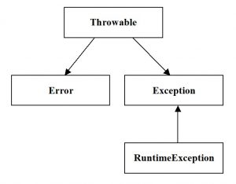

# Классы Java для обработки исключительных ситуаций из пакета java.lang. Методы класса Throwable. Примеры

## 1. Типы исключений, которые поддерживаются системой обработки исключений Java

В языке программирования Java разработан эффективный механизм обработки исключений. В основе этого механизма лежат 
классы образующие иерархию. Для всех классов исключений Java базовым классом есть класс `Throwable`.

Из класса `Throwable` унаследованы два основных класса:
+ `Exception` – предназначен для задания исключительных условий, которые перехватываются программой. Если нужно объявить 
собственный класс (тип) исключений, то этот класс может быть унаследован от класса `Exception`;
+ `Error` – класс, который предназначен для описания исключений (ошибок) возникающих в самой среде Java. Такие 
исключения не оговариваются во время нормального выполнения прикладной программы. Примеры системных ошибок: недостаточно
памяти, переполнение стека.

Схема верхнего уровня иерархии классов Java приведена на рисунке



Рисунок. Вершина иерархии классов исключений Java

## 2. Классификация исключений по признаку наличия в операторе throws. Непроверяемые исключения. Проверяемые исключения

Как известно, метод может генерировать исключения, которые могут быть перехвачены в других методах высших уровней. При 
этом, метод должен указывать перечень обрабатываемых исключений в операторе `throws`.

Если тип сгенерированного исключения есть подклассом стандартного класса `RuntimeException`, то не обязательно 
указывать этот тип в перечне оператора `throws` метода. Такое исключение называется непроверяемым исключением. В этом 
случае компилятор не проверяет обрабатываются или генерируются такие исключения в некотором месте программы.

Если тип сгенерированного исключения не является подклассом стандартного класса `RuntimeException`, то это исключение 
называется проверяемое исключение. В случае генерирования такого типа исключения, его нужно обязательно включать в 
оператор `throws`.

## 3. Перечень подклассов непроверяемых исключений из пакета java.lang

Среди всего разнообразия классов и интерфейсов пакет `java.lang` содержит мощный арсенал классов для обработки 
исключений. Эти классы и интерфейсы составляют основу всех программ на Java. Пакет `java.lang` автоматически 
импортируется во все программы.

Ниже приведен перечень подклассов _непроверяемых_ исключений производными от класса `RuntimeException` и которые 
определены в пакете `java.lang`:

+ `ArithmeticException` – арифметическая ошибка (например, деление на ноль);
+ `ArrayIndexOutOfBoundsException` – индекс за пределами массива;
+ `ArrayStoreException` – присваивание элементу массива объекта несовместимого типа;
+ `ClassCastException` – неправильное приведение типов;
+ `EnumConstantNotPresent` – попытка воспользоваться неопределенным значением перечисления;
+ `IllegalArgumentException` – недопустимый аргумент при вызове метода;
+ `IllegalMonitorStateException` – недопустимая контрольная операция;
+ `IllegalStateException` – неверное состояние среды или приложения;
+ `IllegalThreadStateException` – несовместимость запрашиваемой операции с текущим состоянием потока выполнения;
+ `IndexOutOfBoundsException` – выход индекса некоторого типа за допустимые границы;
+ `NegativeArraySizeException` – создание массива отрицательного размера;
+ `NullPointerException` – неправильное использование пустой ссылки;
+ `NumberFormatException` – неправильное преобразование символьной строки в числовой формат;
+ `SecurityException` – попытка нарушения безопасности;
+ `StringIndexOutOfBounds` – попытка доступа по индексу за пределами символьной строки;
+ `TypeNotPresentException` – тип не найден;
+ `UnsupportedOperationException` – найдена неподдерживаемая операция.

## 4. Проверяемые исключения из пакета java.lang

Если тип сгенерированного исключения _не является_ подклассом стандартного класса `RuntimeException`, то это исключение 
называется _проверяемым_ исключением. В случае генерирования такого типа исключения, его обязательно нужно включать в 
оператор `throws` метода.

В языке Java в пакете `java.lang` реализован ряд проверяемых исключений. Ниже приведен их перечень:

+ `ClassNotFoundException` – класс не найден;
+ `CloneNotSupportedException` – попытка клонировать объект из класса, который не реализует интерфейс Cloneable;
+ `IllegalAccessException` – запрещен доступ к классу;
+ `InstantiationException` – попытка создать объект абстрактного класса или интерфейса;
+ `InterruptedException` – один поток выполнения прерван другим потоком;
+ `NoSuchFieldException` – запрашиваемое поле не существует;
+ `NoSuchMethodException` – запрашиваемый метод не существует;
+ `ReflectiveOperationException` – суперкласс исключений, связанных с рефлексией.

Также, в перечень исключений оператора `throws` обязательно нужно включать собственноручно разработанные классы 
исключений для их проверки.

## 5. Какое назначение класса Throwable? Методы класса Throwable

Класс `Throwable` есть базовым для всех стандартных классов исключений Java. Этот класс предоставляет ряд методов, 
которые можно использовать или переопределять в собственных классах обработки исключений. Эти классы должны быть 
унаследованы от класса `Exception`, который унаследован от класса `Throwable` (см. рисунок). Класс `Exception` не 
содержит методов.

Ниже приведен перечень методов класса `Throwable`.

1. Метод

`final void addSuppressed(Throwable исключение)`

добавляет заданное исключение в список подавляемых исключений. Этот список связывается с вызывающим (данным) 
исключением. Метод используется для применения в операторе `try` с ресурсами.

2. Метод

`Throwable fillInStackTrace()`

возвращает объект класса `Throwable`, содержащий полную трассировку стека. Этот объект может быть сгенерирован повторно.


3. Метод

`Throwable getCause()`

возвращает исключение, лежащее в основе текущего исключения. Метод возвращает `null` в случае, если такое исключение 
отсутствует. Этот метод используется при создании цепочек исключений – он вызывает исключение, вызывающее текущее 
исключение.

4. Метод

`String getLocalizedMessage()`

возвращает локализованное описание исключения.

5. Метод

`String getMessage()`

возвращает описание исключения.


6. Метод

`StackTraceElement[] getStackTrace()`

возвращает массив, содержащий поэлементную трассировку стека в виде объектов класса `StackTraceElement`.

7. Метод

`final Throwable[] getSuppressed()`

получает подавленные исключения, связанные с вызывающим исключением, и возвращает массив, который содержит результат. 
Подавленные исключения генерируются в операторе `try` с ресурсами.

8. Метод

`Throwable initCause(Throwable причина_исключения)`

связывает входной параметр _причина_исключения_ с вызывающим исключением, указывая его как причину этого вызывающего 
исключения. Возвращает ссылку на исключение. Метод используется при создании цепочек исключений.

9. Метод

`printStackTrace();`

выводит трассировку стека.

10. Метод `printStackTrace()` имеет еще две перегруженных реализации

`void printStackTrace(PrintStream поток_вывода)`

`void printStackTrace(PrintWriter поток_вывода)`

Метод направляет трассировку стека в заданный _поток_вывода_.

11. Метод

`void setStackTrace(StackTraceElement элементы[])`

устанавливает трассировку стека для заданных элементов.

12. Метод

`String toString()`

возвращает объект типа `String` содержащий описание исключения. Этот метод можно вызвать из метода `println()` при 
выводе объекта типа `Throwable`.

## 6. Пример использования некоторых методов класса Throwable. Разработка собственного класса исключения

В примере демонстрируется использование некоторых методов класса `Throwable`:
+ `getLocalizedMessage()`;
+ `getMessage()`;
+ `toString()`;
+ `getStackTrace()`;
+ `fillInStackTrace()`.

Объявляется класс `MyException`, унаследованный от класса `Exception`. В иерархии классов исключений Java класс 
`Exception` унаследован от класса `Throwable`. Поэтому, класс `MyException` может использовать и переопределять методы 
класса `Throwable`.

Текст программы следующий:

```java
import java.util.Scanner;

// собственный класс исключения, унаследован от Exception
class MyException extends Exception {
  // переопределенная функция getLocalizedMessage()
  public String getLocalizedMessage()
  {
    return "MyException.getLocalizedMessage()";
  }
}

// класс, содержащий функцию main()
public class Train04 {
  // функция main() тестирует работу класса MyException
  public static void main(String[] args) {
    // Ввести число x. Если число за пределами [0..100],
    // то сгенерировать исключение MyException
    int x;
    Scanner sc = new Scanner(System.in);
    System.out.print("x = ");
    x = sc.nextInt(); // ввести x

    try {
      // сгенерировать исключение (создать объект типа MyException),
      // если x за пределами [0..100]
      if ((x<0)||(x>100))
        throw new MyException();
      System.out.println("OK!");
    }
    catch(MyException e)
    {
      // обработка исключения типа MyException,
      // демонстрация некоторых методов класса Throwable
      System.out.println("Return from getLocalizedMessage(): " + e.getLocalizedMessage());
      System.out.println("Return from getMessage(): " + e.getMessage());
      System.out.println("Method printStackTrace(): ");
      e.printStackTrace();
      System.out.println("Method toString(): " + e.toString());
      System.out.println("------------------------");
      System.out.println("Method getStackTrace(). Stack trace: ");
      StackTraceElement[] stE;

      stE = e.getStackTrace(); // метод getStackTrace()

      for (int i=0;i<stE.length;i++)
        System.out.println(stE[i].toString());

      System.out.println("-------------------------");
      System.out.println("Method fillStackTrace(). Stack trace: ");

      Throwable tA = e.fillInStackTrace();
      StackTraceElement[] stE2 = tA.getStackTrace();

      for (int i=0; i<stE2.length; i++)
        System.out.println(stE[i].toString());
      System.out.println("-------------------------");
    }
  }
}
```
Объясним некоторые фрагменты кода.

С целью демонстрации в классе `MyException` переопределяется метод `getLocalizedMessage()`. При вызове этого метода 
выводится сообщение из этого переопределенного метода. По данному примеру можно переопределять другие методы класса 
`Throwable`.

В функции `main()` продемонстрировано использование методов класса `Throwable`. Вводится переменная `x`, которая 
проверяется на допустимые значения в пределах то 0 до 100. Если значение x меньше 0 или больше 100, то генерируется 
исключение типа `MyException`.

Результат работы программы

```bash
x = 200
Return from getLocalizedMessage(): MyException.getLocalizedMessage()
Return from getMessage(): null
Method printStackTrace():
Method toString(): MyException: MyException.getLocalizedMessage()
------------------------
Method getStackTrace(). Stack trace:
Train04.main(Train04.java:36)
-------------------------
Method fillStackTrace(). Stack trace:
Train04.main(Train04.java:36)
-------------------------
MyException: MyException.getLocalizedMessage()
```
