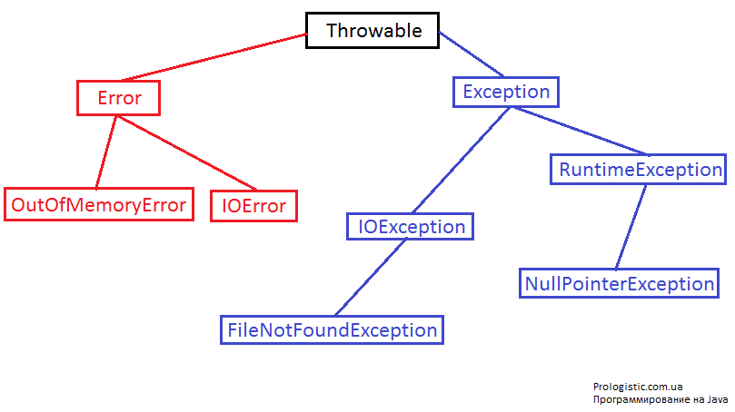

# Полное руководство по обработке исключений в Java

`_Исключение_` — ошибка, которая нарушает нормальную работу программы. Java обеспечивает надежный 
объектно-ориентированный способ обработки исключений. Именно его мы и будем изучать в этом руководстве. 

## Обработка исключений в Java. Краткий обзор

Исключение может возникнуть в разного рода ситуациях: неправильные входные данные, аппаратный сбой, сбоя сетевого 
соединения, ошибка при работе с базой данных и т.д. Именно поэтому любой Java программист должен уметь правильно 
обрабатывать исключения, понимать причины их появления и следовать лучшим практикам работы с исключениями даже в 
небольших проектах.

Java — объектно-ориентированный язык программирования, поэтому всякий раз, когда происходит ошибка при выполнении 
инструкции, создается **объект-исключение**, а затем нормальный ход выполнения программы останавливается и JRE пытается 
найти кого-то, кто может справиться (обработать) это исключение. **Объект-исключение** содержит много информации об 
отладке, а именно номер строки, где произошло исключение, тип исключения и т.д.

## Что и как происходит, когда появляется ошибка

Когда в методе происходит исключение, то **процесс создания объекта-исключения и передачи его в Runtime Environment 
называется «бросать исключение»**.

После создания исключения, Java Runtime Environment пытается найти **обработчик исключения**.

`**Обработчик исключения** — блок кода, который может обрабатывать объект-исключение.`

Логика нахождения обработчика исключений проста — прежде всего начинается поиск в методе, где возникла ошибка, если 
соответствующий обработчик не найден, то происходит переход к тому методу, который вызывает этот метод и так далее.

```
Пример

У нас есть 3 метода, каждый из которых вызывает друг-друга: А -> В -> С (А вызывает В, а В вызывает С). Если 
исключение появляется в методе C, то поиск соответствующего обработчика будет происходить в обратном порядке: 
С -> В -> А (сначала там, где было исключение — в С, если там нет обработчика, то идем в метод В — если тут тоже нет, 
то идем в А).
```

Если соответствующий обработчик исключений будет найден, то объект-исключение передаётся обработчику.

`Обработать исключение — значит «поймать исключение».`

Если обработчик исключений не был найден, то программа завершает работу и печатает информации об исключении.

Обратите внимание, что обработка исключений в Java — это фреймворк, который используется только для обработки ошибок 
времени выполнения. Ошибки компиляции не обрабатываются рамках обработки исключений.

## Основные элементы обработки исключений в Java

Мы используем определенные ключевые слова в для создания блока обработки исключений. Давайте рассмотрим их на примере. 
Также мы напишем простую программу для обработки исключений.

+ **Бросить исключение (throw) — ключевое слово, которое используется для того, чтобы бросить исключение во время 
выполнения**. Мы знаем, что Java Runtime начинает поиск обработчика исключений как только оно будет брошено, но часто 
нам самим нужно генерировать исключение в нашем коде, например, в программе авторизации, если какое-то поле `null`. 
Именно для таких случаем и существует возможность **бросить исключение**.
+ `throws` — когда мы бросаем исключение в методе и не обрабатываем его, то мы должны использовать ключевое слово 
`throws` в сигнатуре метода для того, чтобы пробросить исключение для обработки в другом методе. Вызывающий метод может 
обработать это исключение или пробросить его еще дальше с помощью `throws` в сигнатуре метода. Следует отметить, что 
пробрасывать можно сразу несколько исключений.
+ Блок `try-catch` используется для обработки исключений в коде. Слово `try` — это начало блока обработки, `catch` — 
конец блока для обработки исключений. Мы можем использовать сразу несколько блоков `catch` при одном `try`. `catch` в 
качестве параметра принимает тип исключения для обработки.
+ `finally` — необязательная завершающая конструкция блока `try-catch`. Как только исключение остановило процесс 
исполнения программы, в `finally` мы можем безопасно освободить какие-то открытые ресурсы. Следует отметить, что 
`finally` блок выполняется всегда — не смотря на появление исключительной ситуации.

Давайте посмотрим простую программу обработки исключений в Java.

```java
package ua.com.prologistic;

import java.io.FileNotFoundException;
import java.io.IOException;

public class ExceptionHandling {

    // в методе main() пробрасывается сразу несколько исключений
    public static void main(String[] args) throws FileNotFoundException, IOException {
        // в блоке try-catch перехватываются сразу несколько исключений вызовом дополнительного catch(...) 
        try {
            testException(-5);
            testException(-10);
        } catch (FileNotFoundException e) {
            e.printStackTrace();
        } catch (IOException e) {
            e.printStackTrace();
        } finally {
            System.out.println("Необязательный блок, но раз уже написан, то выполнятся будет не зависимо от того было исключение или нет");
        }
        testException(15);
    }

    // тестовый метод создания, обработки и пробрасывания исключения
    public static void testException(int i) throws FileNotFoundException, IOException {
        if (i < 0) {
            FileNotFoundException myException = new FileNotFoundException("число меньше 0: " + i);
            throw myException;
        } else if (i > 10) {
            throw new IOException("Число должно быть в пределах от 0 до 10");
        }

    }

}
```

А в консоле эта программа напишет такое:

```bash
java.io.FileNotFoundException: число меньше 0: -5
    at ua.com.prologistic.ExceptionHandling.testException(ExceptionHandling.java:24)
    at ua.com.prologistic.ExceptionHandling.main(ExceptionHandling.java:10)
Необязательный блок, но раз уже написан, то выполнятся будет не зависимо от того было исключение или нет
Exception in thread "main" java.io.IOException: Число должно быть в пределах от 0 до 10
    at ua.com.prologistic.ExceptionHandling.testException(ExceptionHandling.java:27)
    at ua.com.prologistic.ExceptionHandling.main(ExceptionHandling.java:19)
```

Обратите внимание, что метод `testException()` бросает исключение, используя ключевое слово `throw`, а в сигнатуре 
метода используется ключевое слово `throws`, чтобы дать понять вызывающему методу тип исключений, которые может бросить 
`testException()`.

**Важные моменты в обработке исключений:**

+ Нельзя использовать блоки `catch` или `finally` без блока `try`.
+ Блок `try` также может быть использован только с `catch` блоком, или только с `finally` блоком, или с тем и другим 
блоком.
+ Мы можем использовать несколько блоков `catch` только с одним `try`.
+ `try-catch` блоки могут быть вложенными — этим они очень похожи на `if-else` конструкции.
+ Мы можем использовать только один, блок `finally` в одном `try-catch`.

## Иерархия исключений в Java

Java исключения являются иерархическими, а наследование используется для категоризации различных типов исключений. 
`Throwable` — родительский класс в иерархии Java исключений. Он имеет два дочерних объекта — `Error` и `Exception`. 
Исключения далее разделены на проверяемые исключения и исключения времени выполнения.

1. **`Error` — это тип ошибок, которые выходят за рамки вашей программы, их невозможно предвидеть или обработать.** Это 
может быть аппаратный сбой, «поломка» JVM или ошибка памяти. Именно для таких необычных ситуаций есть отдельная 
иерархия ошибок. Мы должны просто знать, что такие ошибки есть и не можем справиться с такими ситуациями. 
Примеры `Error: OutOfMemoryError` и `StackOverflowError`.

2. **Проверяемые исключения (Checked Exceptions)** — тип исключений, которые мы можем предвидеть в программе и 
попытаться обработать, например, **FileNotFoundException**. Мы должны поймать это исключение и написать внятное и 
полезное сообщение пользователю о том, что произошло (также желательно логировать ошибки). Exception — родительский 
класс всех проверяемых исключений (Checked Exceptions). Если мы бросили проверяемое исключение, то должны поймать его 
в том же методе или должны пробросить его с помощью ключевого слова throws.

3. **Runtime Exception** — это ошибки программиста. Например, пытаясь получить элемент из массива, мы должны проверить 
длину массива, прежде чем пытаться получить элемент — в противном случае это может быть брошен 
`ArrayIndexOutOfBoundException`. `RuntimeException` — родительский класс для всех `Runtime` исключений. Если мы сами 
бросаем `Runtime Exception` в методе, то не обязательно указывать в сигнатуре метода ключевое слово `throws`.

На рисунке 1 представлена иерархия исключений в Java:



Рисунок 1 — Иерархия исключений в Java

## Полезные методы в обработке исключений

Класс `Exception` и все его подклассы не содержат какие-либо методы для обработки исключений. Все предоставляемые 
методы находятся в базовом классе `Throwable`. Подклассы класса `Exception` созданы для того, чтобы определять различные 
виды исключений. Именно поэтому при обработке исключений мы можем легко определить причину и обработать исключение в 
соответствии с его типом.

Полезные методы класса `Throwable`:

1. **public String getMessage()** — этот метод возвращает сообщение, которое было создано при создании исключения 
через конструктор.
2. **public String getLocalizedMessage()** — метод, который переопределяют подклассы для локализации конкретное 
сообщение об исключении. В реализации `Throwable` класса этот метод просто использует метод `getMessage()`, чтобы 
вернуть сообщение об исключении (`Throwable` на вершине иерархии — ему нечего локализировать, поэтому он вызывает 
`getMessage()`).
3. **public synchronized Throwable getCause()** — этот метод возвращает причину исключения или идентификатор в виде 
`null`, если причина неизвестна.
4. **public String toString()** — этот метод возвращает информацию о `Throwable` в формате `String`.
5. **public void printStackTrace()** — этот метод выводит информацию трассировки стека в стандартный поток ошибок, 
этот метод перегружен и мы можем передать `PrintStream` или `PrintWriter` в качестве аргумента, чтобы написать 
информацию трассировки стека в файл или поток.

## Автоматическое управление ресурсами и улучшения блока перехвата ошибок в Java 7

Если вам нужно перехватывать много исключений в одном блоке `try-catch`, то блок перехвата будет выглядеть очень 
некрасиво и в основном будет состоять из избыточного кода. Именно поэтому в Java 7 это было значительно улучшено и 
теперь мы можем перехватывать несколько исключений в одном блоке catch.

Это выглядит следующим образом:

```java
catch(IOException | SQLException | Exception ex){
     //что-то сделать с перехваченной ошибкой...
}
```

Как видим, здесь блок `catch` перехватывает сразу несколько исключений — это очень красиво, компактно и удобно.

В большинстве случаев мы используем блок `finally` для того, чтобы закрыть открытые потоки, подключения или освободить 
другие ресурсы. Очень часто мы забываем закрыть и получаем `runtime` исключения. Такие исключения трудно отлаживать. 
Поэтому в Java 7 был введен `try` с ресурсами, где мы можем открыть ресурс в самом `try` и использовать его внутри блока 
`try-catch`. Когда программа заканчивает выполнение блока `try-catch`, то среда выполнения автоматически закрывает эти 
ресурсы. Вот пример `try-catch` блока с ресурсами:

```java
// try c ресурсами
try (MyResource mr = new MyResource()) {
            System.out.println("Красивый и компактный код в try c ресурсами");
        } catch (Exception e) {
            e.printStackTrace();
        }
```

## Создание своих классов исключений

Java предоставляет много классов исключений, но иногда нам может понадобиться создать свои «кастомные» классы 
исключений. Это может понадобиться для того, чтобы уведомить абонента о конкретном типе исключения с соответствующим 
сообщением. Например, мы напишем метод для обработки только текстовых файлов, поэтому мы можем написать свой класс 
исключений и передавать соответствующий код ошибки, когда кто-то передает неподходящий тип файла в качестве входных 
данных.

Вот пример своего класса исключений и его использование:

```java
package ua.com.prologistic;
 
// наследуемся от класс Exception
public class MyException extends Exception {
 
    private String errorCode = "Unknown_Exception";
     
    public MyException(String message, String errorCode){
        super(message);
        this.errorCode = errorCode;
    }
     
    public String getErrorCode(){
        return this.errorCode;
    }
}
```

А теперь проверим в работе наш класс MyException:

```java
package ua.com.prologistic;
 
import java.io.FileInputStream;
import java.io.FileNotFoundException;
import java.io.IOException;
import java.io.InputStream;
 
public class CustomExceptionExample {
 
    public static void main(String[] args) throws MyException {
        try {
            processFile("file.txt");
        } catch (MyException e) {
            processErrorCodes(e);
        }
     
    }
 
    // метод для обработки ошибок
    private static void processErrorCodes(MyException e) throws MyException {
        // здесь мы ищем указанный при выбросе исключения код ошибки и сообщаем пользователю что произошло
        switch(e.getErrorCode()){
        case "BAD_FILE_TYPE":
            System.out.println("Неподходящий тип файла");
            throw e;
        case "FILE_NOT_FOUND_EXCEPTION":
            System.out.println("Файл не найден");
            throw e;
        case "FILE_CLOSE_EXCEPTION":
            System.out.println("Ошибка при закрытии файла");
            break;
        default:
            System.out.println("Произошла неизвестная ошибка " + e.getMessage());
            e.printStackTrace();
        }
    }
 
    // метод для работы с файлом, который пробрасывает наш тип исключений
    private static void processFile(String file) throws MyException {       
        InputStream fis = null;
        try {
            fis = new FileInputStream(file);
        } catch (FileNotFoundException e) {
            // здесь мы бросаем исключение с указанием кода ошибки 
            throw new MyException(e.getMessage(),"FILE_NOT_FOUND_EXCEPTION");
        }finally{
            try {
                if(fis !=null)fis.close();
            } catch (IOException e) {
                // здесь мы бросаем исключение с указанием кода ошибки 
                throw new MyException(e.getMessage(),"FILE_CLOSE_EXCEPTION");
            }
        }
    }
}
```

## Полезные советы по обработке исключений в Java

1. **Не используйте для перехвата исключений класс `Exception`**. В иерархии исключений есть множество классов на все 
случаи жизни вашей программы, которые не только эффективно обработают конкретную ошибку, но и предоставят полезную для 
пользователя и отладки информацию.
2. **Бросайте исключение как можно раньше**. Это является хорошей практикой программирования на Java.
3. Ловите исключения только тогда, когда сможете **эффективно для пользователя и отладки их обработать**.
4. **Освобождайте ресурсы**. Перехватывая исключение всегда закрывайте открытые ресурсы. Еще проще и эффективнее это 
делать с Java 7. Используйте `try` с ресурсами для лаконичного и красивого кода.
5. **Логируйте исключения**. Логируйте сообщения, которые предоставляет исключение. В большинстве случаев это даст вам 
четкое понимание причин и поможет в отладке. Не оставляйте пустым блок `catch`, иначе он будет просто поглощать 
исключение без каких-либо значимых деталей для отладки.
6. **Один `catch` для нескольких исключений**. Используйте преимущества Java 7 для удобства и красоты вашего кода.
7. **Используйте свои исключения**. Это позволит вам лучше чувствовать свою программу и эффективнее с ней работать.
8. Соглашения об именовании. Когда вы создать свои классы исключений, следите за тем, что из самого названия класса 
будет ясно, что это исключение.
9. **Используйте исключения с умом**. Бросить исключение — достаточно дорогостоящая в Java операция. Возможно, в некоторых 
случаях будем уместно не бросать исключений, а вернуть, например, логическую переменную, которая обозначала успешное 
или не успешное выполнение метода.
10. **Документируйте исключения**. Желательно писать `javadoc @throws` для ваших исключений. Это будет особенно полезно 
в тех случаях, когда ваша программа предоставляет интерфейс для работы с другими приложениями.

Вот и все, что нужно знать об обработке исключений в Java.
