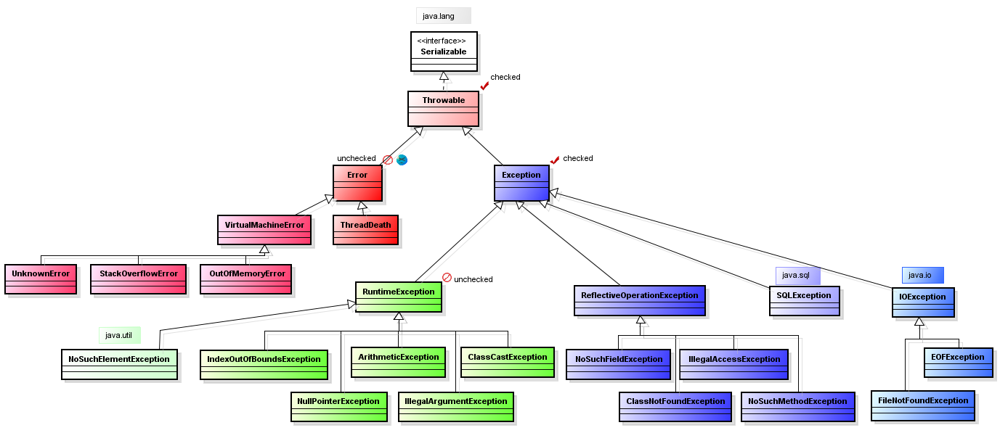
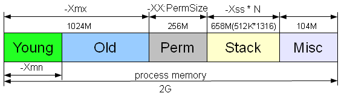

# Собеседование по Java — исключения (exceptions) (вопросы и ответы)

## Вопросы

1. Дайте определение понятию “исключение”

2. Какова иерархия исключений.

3. Можно/нужно ли обрабатывать ошибки jvm?

4. Какие существуют способы обработки исключений?

5. О чем говорит ключевое слово throws?

6. В чем особенность блока finally? Всегда ли он исполняется?

7. Может ли не быть ни одного блока catch при отлавливании исключений?

8. Могли бы вы придумать ситуацию, когда блок finally не будет выполнен?

9. Может ли один блок catch отлавливать несколько исключений (с одной и разных веток наследований)?

10. Что вы знаете об обрабатываемых и не обрабатываемых (checked/unchecked) исключениях?

11. В чем особенность RuntimeException?

12. Как написать собственное (“пользовательское”) исключение? Какими мотивами вы будете руководствоваться при выборе типа исключения: checked/unchecked?

13. Какой оператор позволяет принудительно выбросить исключение?

14. Есть ли дополнительные условия к методу, который потенциально может выбросить исключение?

15. Может ли метод main выбросить исключение во вне и если да, то где будет происходить обработка данного исключения?

16. Если оператор return содержится и в блоке catch и в finally, какой из них “главнее”?

17. Что вы знаете о OutOfMemoryError?

18. Что вы знаете о SQLException? К какому типу checked или unchecked оно относится, почему?

19. Что такое Error? В каком случае используется Error. Приведите пример Error’а.

20. Какая конструкция используется в Java для обработки исключений?

21. Предположим, есть блок try-finally. В блоке try возникло исключение и выполнение переместилось в блок finally. В блоке finally тоже возникло исключение. Какое из двух исключений “выпадет” из блока try-finally? Что случится со вторым исключением?

22. Предположим, есть метод, который может выбросить IOException и FileNotFoundException в какой последовательности должны идти блоки catch? Сколько блоков catch будет выполнено?

## Ответы

### 1. Дайте определение понятию “исключение”

**Исключение** — это проблема(ошибка) возникающая во время выполнения программы. Исключения могут возникать во многих 
случаях, например:
1. Пользователь ввел некорректные данные.
2. Файл, к которому обращается программа, не найден.
3. Сетевое соединение с сервером было утеряно во время передачи данных. И т.д.
 
Все исключения в Java являются объектами. Поэтому они могут порождаться не только автоматически при возникновении 
исключительной ситуации, но и создаваться самим разработчиком.

### 2. Какова иерархия исключений.



Иерархия Исключений Java

Исключения делятся на несколько классов, но все они имеют общего предка — класс `Throwable`. Его потомками являются 
подклассы `Exception` и `Error`.

Исключения (_Exceptions_) являются результатом проблем в программе, которые в принципе решаемы и предсказуемы. Например,
произошло деление на ноль в целых числах.

Ошибки (_Errors_) представляют собой более серьёзные проблемы, которые, согласно спецификации Java, не следует пытаться 
обрабатывать в собственной программе, поскольку они связаны с проблемами уровня JVM. Например, исключения такого рода 
возникают, если закончилась память, доступная виртуальной машине. Программа дополнительную память всё равно не сможет 
обеспечить для JVM.

В Java все исключения делятся на два типа: _контролируемые исключения_ (_checked_) и _неконтролируемые исключения_ 
(_unchecked_), к которым относятся ошибки (_Errors_) и исключения времени выполнения (_RuntimeExceptions_, потомок 
класса _Exception_).

_Контролируемые исключения_ представляют собой ошибки, которые можно и нужно _обрабатывать_ в программе, к этому типу 
относятся все потомки класса `Exception` (но не `RuntimeException`).

### 3. Можно/нужно ли обрабатывать ошибки jvm?

Обрабатывать можно, но делать этого _не стоит_. Разработчику не предоставлены инструменты для обработки ошибок системы 
и виртуальной машины.

### 4. Какие существуют способы обработки исключений?

В Java есть пять ключевых слов для работы с исключениями:

1. **try** — данное ключевое слово используется для отметки начала блока кода, который потенциально может привести к 
ошибке.
2. **catch** — ключевое слово для отметки начала блока кода, предназначенного для перехвата и обработки исключений.
3. **finally** — ключевое слово для отметки начала блока кода, которой является дополнительным. Этот блок помещается 
после последнего блока ‘`catch`’. Управление обычно передаётся в блок ‘`finally`’ в любом случае.
4. **throw** — служит для генерации исключений.
5. **throws** — ключевое слово, которое прописывается в сигнатуре метода, и обозначающее что метод потенциально может 
выбросить исключение с указанным типом.
6. 
Общий вид конструкции для «поимки» исключительной ситуации выглядит следующим образом:

```java
try{ 
    //здесь код, который потенциально может привести к ошибке 
} 
catch(SomeException e ){ //в скобках указывается класс конкретной ожидаемой ошибки  
    //здесь описываются действия, направленные на обработку исключений 
} 
finally{ 
    //выполняется в любом случае ( блок finally  не обязателен) 
}
```

### 5. О чем говорит ключевое слово throws?

`throws` — ключевое слово, которое прописывается в сигнатуре метода, и обозначающее что метод потенциально может 
выбросить исключение с указанным типом.

### 6. В чем особенность блока finally? Всегда ли он исполняется?

Когда исключение передано, выполнение метода направляется по нелинейному пути. Это может стать источником проблем. 
Например, при входе метод открывает файл и закрывает при выходе. Чтобы закрытие файла не было пропущено из-за обработки 
исключения, был предложен механизм `finally`.

Ключевое слово `finally` создаёт блок кода, который будет выполнен после завершения блока `try/catch`, но перед кодом, 
следующим за ним. Блок будет выполнен, независимо от того, передано исключение или нет. Оператор `finally` не 
обязателен, однако каждый оператор `try` требует наличия либо `catch`, либо `finally`. Код в блоке `finally` будет 
выполнен всегда.

### 7. Может ли не быть ни одного блока catch при отлавливании исключений?

Такая запись допустима, если имеется связка `try{} finally {}`. Но смысла в такой записи не так много, всё же лучше 
иметь блок `catch` в котором будет обрабатываться необходимое исключение.

```java

String x = "z";
try {
   x="234";
} finally {
    x = "Finally";
}
```

### 8. Могли бы вы придумать ситуацию, когда блок finally не будет выполнен?

Блок finally выполняется не всегда, например в такой ситуации:

```java
try { 
    System.exit(0); 
} catch(Exception e) { 
    e.printStackTrace(); 
} finally { }
```

Здесь `finally` недостижим, так как происходит системный выход из программы. Общими словами: когда jvm умирает, ей не 
до `finally` (отсюда можете придумать другие примеры как убить jvm и ответить на вопрос в заголовке).

### 9. Может ли один блок `catch` отлавливать несколько исключений (с одной и разных веток наследований)?

В Java 7 стала доступна новая конструкция, с помощью которой можно перехватывать несколько исключений одним блоком 
`catch`:

```java
try {  
 ... 
} catch( IOException | SQLException ex ) {  
  logger.log(ex); 
  throw ex; 
}
```

### 10. Что вы знаете об обрабатываемых и не обрабатываемых (checked/unchecked) исключениях?

Все исключительные ситуации делятся на «_проверяемые_» (_checked_) и «_непроверяемые_» (_unchecked_) (смотрите картинку 
в начале статьи). Это свойство присуще «корневищу» (_Throwable_, _Error_, _Exception_, _RuntimeException_) и передается 
по наследству. Никак не видимо в исходном коде класса исключения.

В дальнейших примерах просто учтите, что— _Throwable_ и _Exception_ и все их наследники (за исключением наследников 
_Error-а_ и _RuntimeException-а_) — **checked**

— _Error_ и _RuntimeException_ и все их наследники — **unchecked**

_checked exception_ = проверяемое исключение, проверяемое компилятором.

Тема достаточно обширная для того, чтобы уместить ее в одном ответе.

1. _Checked_ исключения, это те, которые должны обрабатываться блоком _catch_ или описываться в сигнатуре метода. 
_Unchecked_ могут не обрабатываться и не быть описанными.
2. _Unchecked_ исключения в Java — наследованные от _RuntimeException_, _checked_ — от _Exception_ (не включая 
_unchecked_).

_Checked_ исключения отличаются от _Unchecked_ исключения в Java, тем что:

1) Наличие\обработка Checked исключения проверяются **на этапе компиляции**. 
2) Наличие\обработка Unchecked исключения происходит **на этапе выполнения**.

### 11. В чем особенность RuntimeException?

`public class RuntimeException extends Exception` — базовый класс для ошибок во время выполнения. Относится к 
необрабатываемым исключениям (_uncatched\unchecked_). Как сказано в описании класса — это суперкласс, исключения 
которого могут быть выброшены во время нормальной работы JVM.

### 12. Как написать собственное (“пользовательское”) исключение? Какими мотивами вы будете руководствоваться при выборе типа исключения: checked/unchecked?

Необходимо унаследоваться от базового класса требуемого типа исключений (например от `Exception` или `RuntimeException`).

```java
public class ExcClass extends Exception {

    private String someString;

    public ExcClass (String string) {
        this.someString = string;
        System.out.println("Exception ExcClass");
    }

    public void myOwnExceptionMsg() {
        System.err.println("This is exception message for string: " + someString);
    }
}

public class TestExc {

    public static void main(String[] args) {
        try {
            String s = "SomeString";
            throw new ExcClass(s);
        } catch (ExcClass ex) {
            ex.myOwnExceptionMsg();
        }
    }
}
//Вывод
Exception ExcClass
This is exception message for string: SomeString
```

Руководствоваться нужно определением типа исключения. В зависимости от того, что вы хотите обрабатывать или видеть 
нужно и наследоваться от нужного класса.

### 13. Какой оператор позволяет принудительно выбросить исключение?

`throw new Exception();`

### 14. Есть ли дополнительные условия к методу, который потенциально может выбросить исключение?

Если это проверяемое исключение, то оно должно быть задекларировано в сигнатуре метода.

```java
 public void someMethod() throws Exception {
    }
```

### 15. Может ли метод main выбросить исключение во вне и если да, то где будет происходить обработка данного исключения?

Может и оно будет передано в виртуальную машину Java (JVM).

### 16. Если оператор return содержится и в блоке catch и в finally, какой из них “главнее”?

Вернется из блока `finally`.

```java
    public static void main(String[] args) {
       String what =  method();
        System.out.println(what);
    }

    public static String method() {
        try {
            return "SomeString";
        } catch(Exception ex) {
            return "Catch message";
        } finally {
            return "Finally message";
        }
    }
//Вывод
Finally message
```

### 17. Что вы знаете о OutOfMemoryError?

OutOfMemoryError выбрасывается, когда виртуальная машина Java не может выделить (разместить) объект из-за нехватки памяти, а сборщик мусора не может высвободить ещё.

Область памяти, занимаемая java процессом, состоит из нескольких частей. Тип OutOfMemoryError зависит от того, в какой из них не хватило места.



1. `java.lang.OutOfMemoryError: Java heap space`

Не хватает места в куче, а именно, в области памяти в которую помещаются объекты, создаваемые программно в вашем 
приложении. Размер задается параметрами `-Xms` и `-Xmx`. Если вы пытаетесь создать объект, а места в куче не осталось, 
то получаете эту ошибку. Обычно проблема кроется в утечке памяти, коих бывает великое множество, и интернет просто 
пестрит статьями на эту тему.

2. `java.lang.OutOfMemoryError: PermGen space`

Данная ошибка возникает при нехватке места в _Permanent_ области, размер которой задается параметрами -`XX:PermSize` и 
`-XX:MaxPermSize.`

3. `java.lang.OutOfMemoryError: GC overhead limit exceeded`

Данная ошибка может возникнуть как при переполнении первой, так и второй областей. Связана она с тем, что памяти 
осталось мало и _GC_ постоянно работает, пытаясь высвободить немного места. Данную ошибку можно отключить с помощью 
параметра `-XX:-UseGCOverheadLimit`, но, конечно же, её надо не отключать, а либо решать проблему утечки памяти, либо 
выделять больше объема, либо менять настройки _GC_.

4. `java.lang.OutOfMemoryError: unable to create new native thread`

Выбрасывается, когда нет возможности создать еще потоки.

### 18. Что вы знаете о `SQLException`? К какому типу `checked` или `unchecked` оно относится, почему?

`SQLException` предоставляет информацию об ошибках доступа к базе данных или других ошибках связанных с работой с 
базами данных.

`SQLException` относится к `checked` исключениям, а значит проверяется на этапе компиляции.

Споры об этом типе исключения идут о том, что разработчику приходится постоянно обрабатывать это исключение в коде, 
хотя большая часть ошибок возникает во время выполнения программы, т.е., по мнению многих, лучше бы отнести его к 
`unchecked runtime` исключениям.

```java
try {
    // make some SQL call(s)
} catch {SQLException e) { 
    // log the exception
    return; // and give up
}
```

Аргумент Joshua Bloch из Effective Java Second Edition такой: сделав `SQLException` проверяемым — это попытка заставить 
разработчиков обработать исключение и обернуть его в новом уровне абстракции.

### 19. Что такое _Error_? В каком случае используется _Error_. Приведите пример _Error’а_.

Ошибки (_Errors_) представляют собой более серьёзные проблемы, которые, согласно спецификации Java, не следует пытаться 
обрабатывать в собственной программе, поскольку они связаны с проблемами уровня JVM. Например, исключения такого рода 
возникают, если закончилась память, доступная виртуальной машине.

За примером посмотрите картинку иерархии исключений в начале статьи. Как пример — `OutOfMemoryError`.

### 20. Какая конструкция используется в Java для обработки исключений?

Можно использовать `try-catch-finally` и c 7й `Java try-with-resources`. 

**Первый способ**:

```java
try{ 
//здесь код, который потенциально может привести к ошибке 
} 
catch(SomeException e ){ //в скобках указывается класс конкретной ожидаемой ошибки  
//здесь описываются действия, направленные на обработку исключений 
} 
finally{ 
//выполняется в любом случае ( блок finally  не обязателен) 
}
```

**Try с ресурсами:**

```java
try(открываем файл и т.п. здесь){
 //...
}
//после блока файл закроется автоматически.
```

Пример: 

```java
// Старый способ 

BufferedReader br = new BufferedReader(new FileReader(path));
   try {
       return br.readLine();
   } finally {
        if (br != null) {
            br.close();
        }
   }

// JDK 7

 try (BufferedReader br =
                   new BufferedReader(new FileReader(path)) ) {
        return br.readLine();
    }
```

Так же смотрите ответ к «Какие существуют способы обработки исключений?»

### 21. Предположим, есть блок try-finally. В блоке try возникло исключение и выполнение переместилось в блок finally. В блоке finally тоже возникло исключение. Какое из двух исключений “выпадет” из блока try-finally? Что случится со вторым исключением?

Ответ аналогичный случаю с двумя `return` — будет обработано в `finally` блоке. Если было выброшено два исключения — одно 
в `try`, второе в `finally`, то исключение в `finally` «проглотит» исключение выше (см. пример). Если до блока `finally`
исключение было обработано, то мы можем получить информацию об исключении в блоке `try` и тем самым не потерять 
исключение, которое впоследствии может быть перезаписано в finally другим исключением.

```java
public class TestExc {

    public static void main(String[] args) {
        Exception ex = twoExceptionsMethod();
        System.out.println(ex.getClass());

        String s = twoExceptionsMethod2();
        System.out.println(s);
    }

    public static Exception twoExceptionsMethod() {
        try {
            return new IndexOutOfBoundsException();
        } finally {
            return new NullPointerException();
        }
    }

    public static String twoExceptionsMethod2() {
        try {
            throw new NullPointerException();
        }catch (NullPointerException ex) {
            System.out.println(ex.getMessage()+ " catchBlock");;
        }
        finally {
            Exception ex2 = new Exception();
            return ex2.getMessage() + "finallyBlock";
        }
    }
}
//Вывод
class java.lang.NullPointerException
null catchBlock
null finallyBlock
```

### 22. Предположим, есть метод, который может выбросить IOException и FileNotFoundException в какой последовательности должны идти блоки catch? Сколько блоков catch будет выполнено?

_Общее правило_ — обрабатывать исключения нужно от _«младшего» к старшему_. Т.е. нельзя поставить в первый блок 
`catch(Exception e) {}`, иначе все дальнейшие блоки `catch()` уже ничего не смогут обработать, т.к. любое исключение 
будет попадать под `ExceptionName extends Exception`.

Таким образом _сначала_ нужно обработать` public class FileNotFoundException extends IOException`, а _затем_ уже 
`IOException`.

```java
    public static void ioExcAndFileNotFoundEx() {
        try {
            //TODO: some code
            String x = "abc";
            if (x.equals("abc")) {
                throw new IOException();
            } else {
                throw new FileNotFoundException();
            }
        } catch (FileNotFoundException e) {
            e.printStackTrace();
        } catch (IOException e) {
            e.getMessage();
        }
    }
```
