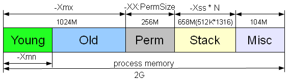

# Какие бывают типы OutOfMemoryError или из каких частей состоит память java процесса

Если вы словили `OutOfMemoryError`, то это вовсе не значит, что ваше приложение создает много объектов, которые не 
могут почиститься сборщиком мусора и заполняют всю память, выделенную вами с помощью параметра `-Xmx`. Я, как минимум, 
могу придумать два других случая, когда вы можете увидеть эту ошибку. Дело в том, что память java процесса не 
ограничивается областью `-Xmx`, где ваше приложение программно создает объекты.

image

Область памяти, занимаемая java процессом, состоит из _нескольких_ частей. Тип `OutOfMemoryError` зависит от того, в 
какой из них не хватило места.

## 1. java.lang.OutOfMemoryError: Java heap space

Не хватает место в куче, а именно, в области памяти в которую помещаются объекты, создаваемые программно в вашем 
приложении. Размер задается параметрами `-Xms` и `-Xmx`. Если вы пытаетесь создать объект, а места в куче не осталось, 
то получаете эту ошибку. Обычно проблема кроется в утечке памяти, коих бывает великое множество, и интернет просто 
пестрит статьями на эту тему.

## 2. java.lang.OutOfMemoryError: PermGen space

Данная ошибка возникает при нехватке места в _Permanent области_, размер которой задается параметрами `-XX:PermSize` и 
`-XX:MaxPermSize`. Что там лежит и как бороться с `OutOfMemoryError` возникающей там, я уже описал подробнейшим образом 
тут.

## 3. java.lang.OutOfMemoryError: GC overhead limit exceeded

Данная ошибка может возникнуть как при переполнении первой, так и второй областей. Связана она с тем, что памяти 
осталось мало и GC постоянно работает, пытаясь высвободить немного места. Данную ошибку можно отключить с помощью 
параметра `-XX:-UseGCOverheadLimit`, но, конечно же, её надо не отключать, а либо решать проблему утечки памяти, либо 
выделять больше объема, либо менять настройки GC.

## 4. java.lang.OutOfMemoryError: unable to create new native thread

Впервые я столкнулся с данной ошибкой несколько лет назад, когда занимался нагрузочным тестированием и пытался выяснить 
максимальное количество пользователей, которые могут работать с нашим веб-приложением. Я использовал специальную тулзу, 
которая позволяла логинить пользователей и эмулировать их стандартные действия. На определенном количестве клиентов, я 
начал получать `OutOfMemoryError`. Не особо вчитываясь в текст сообщения и думая, что мне не хватает памяти на создание 
сессии пользователя и других необходимых объектов, я увеличил размер кучи приложения (`-Xmx`). Каково же было мое 
удивление, когда после этого количество пользователей одновременно работающих с системой только уменьшилось. Давайте 
подробно разберемся как же такое получилось.

На самом деле это очень просто воспроизвести на windows на 32-битной машине, так как там процессу выделяется не больше 2Гб.

Допустим у вас есть приложение с большим количеством одновременно работающих пользователей, которое запускается с 
параметрами `-Xmx1024M -XX:MaxPermSize=256M -Xss512K`. Если всего процессу доступно 2G, то остается свободным еще коло 
768M. Именно в данном остатке памяти и создаются стеки потоков. Таким образом, примерно вы можете создать не больше 
_768*(1024/512)=1536_ (у меня при таких параметрах получилось создать _1316_) нитей (см. рисунок в начале статьи), 
после чего вы получите `OutOfMemoryError`. Если вы увеличиваете `-Xmx`, то количество потоков, которые вы можете 
создать соответственно уменьшается. Вариант с уменьшением `-Xss`, для возможности создания большего количества потоков, 
не всегда выход, так как, возможно, у вас существуют в системе потоки требующие довольно больших стеков. Например, поток
инициализации или какие-нибудь фоновые задачи. Но все же выход есть. Оказывается при программном создании потока, можно 
указать размер стека: `Thread(ThreadGroup group, Runnable target, String name,long stackSize)`. Таким образом вы можете 
выставить `-Xss` довольно маленьким, а действия требующие больших стеков, выполнять в отдельных потоках, созданных с 
помощью упомянутого выше конструктора.

Конечно, вам может показаться данная проблема слегка надуманной, так как большинство серверов нынче крутиться на 
64-битной архитектуре, но все же считаю данный пример весьма полезным, так как он помогает разобраться из каких частей 
состоит память java-процесса.
